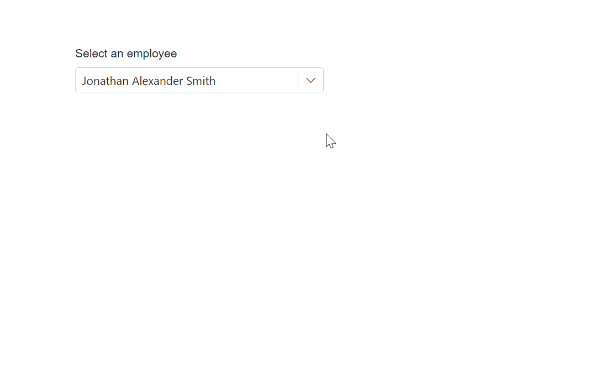
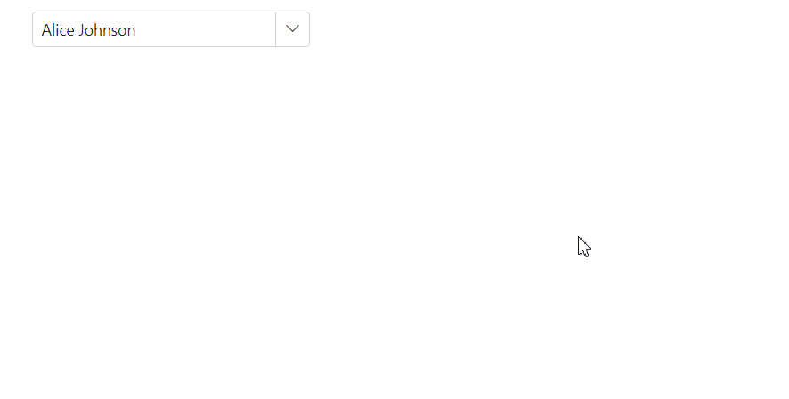

# Configuring the Columns

## TextWrap for a Column

The TextWrap feature in the Blazor MultiColumn ComboBox ensures proper wrapping of text within a specific column’s header or content. By enabling the [EnableTextWrap](https://help.syncfusion.com/cr/blazor/Syncfusion.Blazor.MultiColumnComboBox.SfMultiColumnComboBox-2.html#Syncfusion_Blazor_MultiColumnComboBox_SfMultiColumnComboBox_2_EnableTextWrap) property, text that exceeds the available space is wrapped for improved readability.

**Key features**

* **[TextWrapElement](https://help.syncfusion.com/cr/blazor/Syncfusion.Blazor.MultiColumnComboBox.SfMultiColumnComboBox-2.html#Syncfusion_Blazor_MultiColumnComboBox_SfMultiColumnComboBox_2_TextWrapElement)**: An enum (`Header`, `Content`, `Both`) that defines the element where text wrapping is applied.

* **[TextOverflowMode](https://help.syncfusion.com/cr/blazor/Syncfusion.Blazor.MultiColumnComboBox.SfMultiColumnComboBox-2.html#Syncfusion_Blazor_MultiColumnComboBox_SfMultiColumnComboBox_2_TextOverflowMode)**: An enum (`Ellipsis`, `EllipsisWithTooltip`) that defines how cell content is truncated when it overflows its area.

The following example enables text wrapping for a particular column in the Blazor MultiColumn ComboBox, ensuring that longer text is properly displayed without overflowing.










## Setting the Text Alignment

The MultiColumn ComboBox supports auto-generating columns, which automatically creates columns from the data source. Additionally, you can customize the column header text to reflect specific data, adjust the column [Width](https://help.syncfusion.com/cr/blazor/Syncfusion.Blazor.MultiColumnComboBox.MultiColumnComboboxColumn.html#Syncfusion_Blazor_MultiColumnComboBox_MultiColumnComboboxColumn_Width) for optimal display, and set the [TextAlign](https://help.syncfusion.com/cr/blazor/Syncfusion.Blazor.MultiColumnComboBox.MultiColumnComboboxColumn.html#Syncfusion_Blazor_MultiColumnComboBox_MultiColumnComboboxColumn_TextAlign) (left, center, or right) to enhance readability.









## Setting the Column Template

The MultiColumn ComboBox supports [Template](https://help.syncfusion.com/cr/blazor/Syncfusion.Blazor.MultiColumnComboBox.MultiColumnComboboxColumn.html#Syncfusion_Blazor_MultiColumnComboBox_MultiColumnComboboxColumn_Template) within the column, allowing you to define a column template that renders a customized element in each cell.|

In the following sample, it demonstrates how to use Template inside the column.







## Header Template

The [HeaderTemplate](https://help.syncfusion.com/cr/blazor/Syncfusion.Blazor.MultiColumnComboBox.MultiColumnComboboxColumn.html#Syncfusion_Blazor_MultiColumnComboBox_MultiColumnComboboxColumn_HeaderTemplate) of the MultiColumn ComboBox component is used to customize the header element of a column. With this property, you can render custom HTML elements or Blazor components in the header. This feature allows you to add more functionality to the header, such as sorting or filtering indicators.

The following sample demonstrates how to use `HeaderTemplate`.









## Displaying Values as Checkboxes

The MultiColumn ComboBox component allows you to render boolean values as checkboxes in columns. This can be achieved by using the [DisplayAsCheckBox](https://help.syncfusion.com/cr/blazor/Syncfusion.Blazor.MultiColumnComboBox.MultiColumnComboboxColumn.html#Syncfusion_Blazor_MultiColumnComboBox_MultiColumnComboboxColumn_DisplayAsCheckBox) property. This property is useful when you have a boolean column in your MultiColumn ComboBox and you want to display the values as checkboxes instead of the default text representation of **true** or **false**.

To enable the rendering of boolean values as checkboxes, set the `DisplayAsCheckBox` property to **true**.









## Setting Custom Attributes

You can customize the appearance of the column headers in the MultiColumn ComboBox using the [CustomAttributes](https://help.syncfusion.com/cr/blazor/Syncfusion.Blazor.MultiColumnComboBox.MultiColumnComboboxColumn.html#Syncfusion_Blazor_MultiColumnComboBox_MultiColumnComboboxColumn_CustomAttributes) property.

Set the `CustomAttributes` property of the target column to a dictionary that defines CSS attributes (for example, a class). The specified CSS is applied to the header cell of that column.

```cshtml
<MultiColumnComboboxColumn Field="Name" Width="200px" CustomAttributes="@(new Dictionary<string, object>() { { "class", "customcss" } })"></MultiColumnComboboxColumn>
```

The following example demonstrates how to customize the appearance of MultiColumn ComboBox columns using custom attributes.









## Setting the Format

Use the [Format](https://help.syncfusion.com/cr/blazor/Syncfusion.Blazor.MultiColumnComboBox.MultiColumnComboboxColumn.html#Syncfusion_Blazor_MultiColumnComboBox_MultiColumnComboboxColumn_Format) property on a column of the `SfMultiColumnComboBox` to apply a standard or custom format string that matches the column's data type. For example, you can apply currency formatting to a price field by using the format `"C2"`.

Supported format types include:
- Numeric: `C` (currency), `N` (number with separators), `P` (percent), `D` (decimal).
- Date/time: `d`, `D`, `M`, `Y`, `t`, `T`, and custom patterns.
- Custom strings for specific cultures.

In the following example, the `Price` column uses `"C2"` to display values in a currency format.





 
