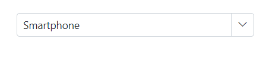
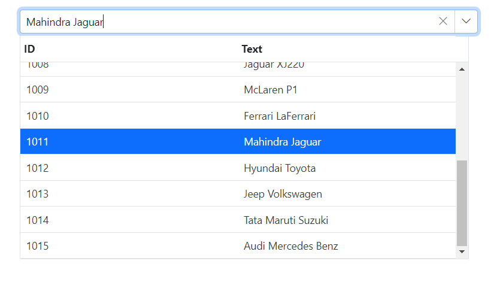
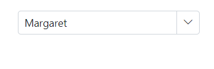
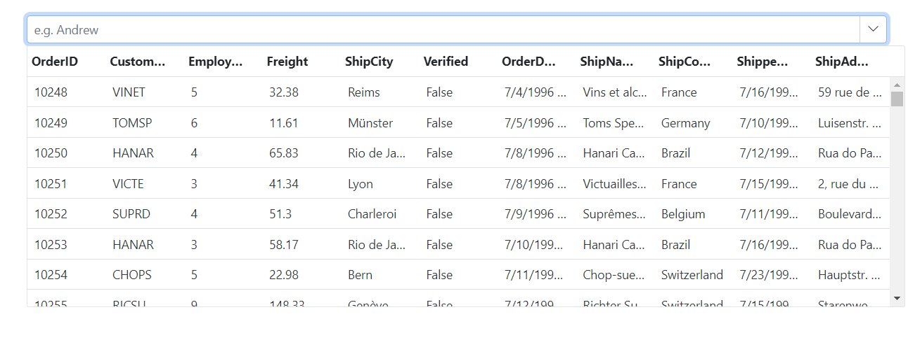
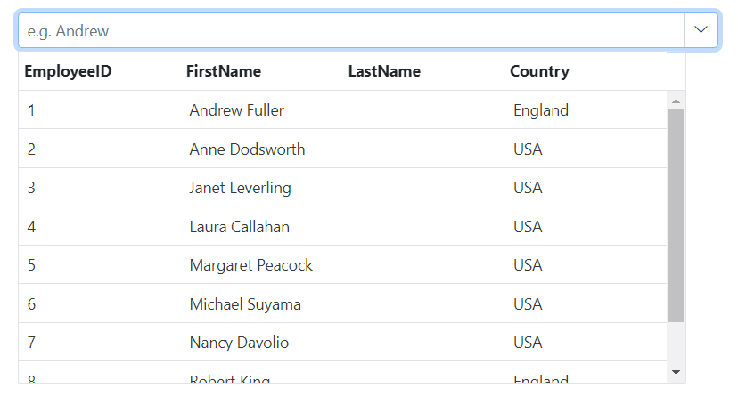

# Data Binding in Blazor MultiColumn ComboBox Component

The MultiColumn ComboBox can retrieve data from either local data sources or remote data services. To connect local data, use the [DataSource](https://help.syncfusion.com/cr/blazor/Syncfusion.Blazor.MultiColumnComboBox.SfMultiColumnComboBox-2.html#Syncfusion_Blazor_MultiColumnComboBox_SfMultiColumnComboBox_2_DataSource) property. For remote data binding, utilize the [DataManager](https://help.syncfusion.com/cr/blazor/Syncfusion.Blazor.DataManager.html).

* **TItem** - Specifies the type of the datasource of the MultiColumn ComboBox component.

## Binding local data

The MultiColumn ComboBox loads the data from local data sources through the [DataSource](https://help.syncfusion.com/cr/blazor/Syncfusion.Blazor.MultiColumnComboBox.SfMultiColumnComboBox-2.html#Syncfusion_Blazor_MultiColumnComboBox_SfMultiColumnComboBox_2_DataSource) property. It supports the data type of `Array of primitive type`, `Array of object`, `List of primitive type`,`List of object`, `Observable Collection`, `ExpandoObject`, `DynamicObject`.









## Index value binding

Index value binding can be accomplished with the `bind-Index` attribute, which supports both integer and nullable integer types. This attribute allows you to bind values according to their corresponding index.

```cshtml

@using Syncfusion.Blazor.MultiColumnComboBox

<SfMultiColumnComboBox TItem="Product" TValue="string" @bind-Index="@ComboIndex" DataSource="@Products" PopupWidth="600px" ValueField="Name" TextField="Name" Placeholder="Select any product"></SfMultiColumnComboBox>

@code {

     public class Product
    {
        public string Name { get; set; }
        public decimal Price { get; set; }
        public string Availability { get; set; }
        public string Category { get; set; }
        public double Rating { get; set; }
    }
    private List<Product> Products = new List<Product>();
    private int? ComboIndex { get; set; } = 2;
    protected override Task OnInitializedAsync()
    {
        Products = new List<Product>
        {
            new Product { Name = "Laptop", Price = 999.99m, Availability = "In Stock", Category = "Electronics", Rating = 4.5 },
            new Product { Name = "Smartphone", Price = 599.99m, Availability = "Out of Stock", Category = "Electronics", Rating = 4.3 },
            new Product { Name = "Tablet", Price = 299.99m, Availability = "In Stock", Category = "Electronics", Rating = 4.2 },
            new Product { Name = "Headphones", Price = 49.99m, Availability = "In Stock", Category = "Accessories", Rating = 4.0 },
            new Product { Name = "Smartwatch", Price = 199.99m, Availability = "Limited Stock", Category = "Wearables", Rating = 4.4 },
            new Product { Name = "Monitor", Price = 129.99m, Availability = "In Stock", Category = "Electronics", Rating = 4.6 },
            new Product { Name = "Keyboard", Price = 39.99m, Availability = "In Stock", Category = "Accessories", Rating = 4.1 },
            new Product { Name = "Mouse", Price = 19.99m, Availability = "Out of Stock", Category = "Accessories", Rating = 4.3 },
        };
        return base.OnInitializedAsync();
    }
}
```

<!-- ### DataBound event

The [DataBound]() event triggers when the data source is populated in the popup list.








### Complex data type

The MultiColumn ComboBox can generate its list items through an array of complex data. For this, the appropriate columns should be mapped to the [TextField](https://help.syncfusion.com/cr/blazor/Syncfusion.Blazor.MultiColumnComboBox.SfMultiColumnComboBox-2.html#Syncfusion_Blazor_MultiColumnComboBox_SfMultiColumnComboBox_2_TextField) and [ValueField](https://help.syncfusion.com/cr/blazor/Syncfusion.Blazor.MultiColumnComboBox.SfMultiColumnComboBox-2.html#Syncfusion_Blazor_MultiColumnComboBox_SfMultiColumnComboBox_2_ValueField) property.

In the following example, the `Code.ID` column and `Country.CountryID` column from complex data have been mapped to the [TextField](https://help.syncfusion.com/cr/blazor/Syncfusion.Blazor.MultiColumnComboBox.SfMultiColumnComboBox-2.html#Syncfusion_Blazor_MultiColumnComboBox_SfMultiColumnComboBox_2_TextField) and [ValueField](https://help.syncfusion.com/cr/blazor/Syncfusion.Blazor.MultiColumnComboBox.SfMultiColumnComboBox-2.html#Syncfusion_Blazor_MultiColumnComboBox_SfMultiColumnComboBox_2_ValueField) property respectively.







 -->

### Expando object binding

Bind the [ExpandoObject](https://learn.microsoft.com/en-us/dotnet/api/system.dynamic.expandoobject?view=net-5.0) data to the MultiColumn ComboBox component. In the following example, the `ExpandoObject` is bound to the collection of vehicles data.









<!-- ### Observable collection binding

Bind the [ObservableCollection](https://blazor.syncfusion.com/documentation/common/data-binding/data-updates#observable-collection) data to the MultiColumn ComboBox component. In the following example, the `Observable Data` is bound to a collection of colors data.







 -->

### Dynamic object binding

Bind the [DynamicObject](https://learn.microsoft.com/en-us/dotnet/api/system.dynamic.dynamicobject?view=net-5.0) data to the MultiColumn ComboBox component. In the following example, the `DynamicObject` is bound to the collection of customer data.









### ValueTuple data binding

Bind the [ValueTuple](https://learn.microsoft.com/en-us/dotnet/api/system.valuetuple-2?view=net-5.0) data to the MultiColumn ComboBox component. The following code helps you to get a string value from the enumeration data by using `ValueTuple`








## Binding remote data 

The MultiColumn ComboBox loads the data from remote data services through the [DataSource](https://help.syncfusion.com/cr/blazor/Syncfusion.Blazor.MultiColumnComboBox.SfMultiColumnComboBox-2.html#Syncfusion_Blazor_MultiColumnComboBox_SfMultiColumnComboBox_2_DataSource) property. 

The MultiColumn ComboBox supports the retrieval of data from the remote data services with the help of the [DataManager](https://blazor.syncfusion.com/documentation/data/getting-started) control. The [Query](https://help.syncfusion.com/cr/blazor/Syncfusion.Blazor.DropDowns.SfDropDownBase-1.html#Syncfusion_Blazor_DropDowns_SfDropDownBase_1_Query) property is used to fetch data from the database and bind it to the MultiColumn ComboBox.

* [DataManager.Url](https://help.syncfusion.com/cr/blazor/Syncfusion.Blazor.DataManager.html#Syncfusion_Blazor_DataManager_Url) - Defines the service endpoint to fetch data.
* [DataManager.Adaptor](https://help.syncfusion.com/cr/blazor/Syncfusion.Blazor.DataManager.html#Syncfusion_Blazor_DataManager_Adaptor) - Defines the adaptor option. By default, the [ODataAdaptor](https://blazor.syncfusion.com/documentation/data/adaptors#odata-adaptor) is used for remote binding. The adaptor is responsible for processing responses and requests from or to the service endpoint. 
* [Syncfusion.Blazor.Data](https://www.nuget.org/packages/Syncfusion.Blazor.Data/) package provides some predefined adaptors that are designed to interact with particular service endpoints.

### OnActionBegin event

The [OnActionBegin](https://help.syncfusion.com/cr/blazor/Syncfusion.Blazor.MultiColumnComboBox.SfMultiColumnComboBox-2.html#Syncfusion_Blazor_MultiColumnComboBox_SfMultiColumnComboBox_2_OnActionBegin) event triggers before fetching data from the remote server.







<!-- ### OnActionComplete event

The [OnActionComplete](https://help.syncfusion.com/cr/blazor/Syncfusion.Blazor.MultiColumnComboBox.SfMultiColumnComboBox-2.html#Syncfusion_Blazor_MultiColumnComboBox_SfMultiColumnComboBox_2_OnActionComplete) event triggers after data is fetched successfully from the remote server.





 -->

### OnActionFailure event

The [OnActionFailure](https://help.syncfusion.com/cr/blazor/Syncfusion.Blazor.MultiColumnComboBox.SfMultiColumnComboBox-2.html#Syncfusion_Blazor_MultiColumnComboBox_SfMultiColumnComboBox_2_OnActionFailure) event triggers when the data fetch request from the remote server fails.







### OData v4 services

The [OData v4 Adaptor](https://blazor.syncfusion.com/documentation/data/adaptors#odatav4-adaptor) provides the ability to consume and manipulate data from OData v4 services. The following sample displays the first six customer details from `Customers` table of the `Northwind` Data Service.









### Web API adaptor

The [Web API Adaptor](https://blazor.syncfusion.com/documentation/data/adaptors#web-api-adaptor) is used to interact with Web API created under OData standards. The `WebApiAdaptor` is extended from the [ODataAdaptor](https://blazor.syncfusion.com/documentation/data/adaptors#odata-adaptor). Hence to use the `WebApiAdaptor`, the endpoint should understand the OData formatted queries sent along with the request. 









<!-- ### Custom adaptor

The [SfDataManager](https://help.syncfusion.com/cr/aspnetcore-blazor/Syncfusion.Blazor.Data.SfDataManager.html) has custom adaptor support which allows you to perform manual operations on the data. This can be utilized for implementing customize data binding and editing operations in the MultiColumn ComboBox component.

For implementing custom data binding in the MultiColumn ComboBox, the `DataAdaptor` class is used. This abstract class acts as a base class for the custom adaptor.

The `DataAdaptor` abstract class has both synchronous and asynchronous method signatures, which can be overridden in the custom adaptor. Following are the method signatures present in this class.

```csharp
public abstract class DataAdaptor
{
    /// <summary>   
    /// Performs data Read operation synchronously.
    /// </summary>
    public virtual object Read(DataManagerRequest dataManagerRequest, string key = null)

    /// <summary>
    /// Performs data Read operation asynchronously.
    /// </summary>
    public virtual Task<object> ReadAsync(DataManagerRequest dataManagerRequest, string key = null)
}
```

In custom Adaptor, the data binding operation can be performed in the MultiColumn ComboBox component by providing the custom adaptor class and overriding the Read or ReadAsync method of the DataAdaptor abstract class.

The following sample code demonstrates implementing custom data binding using custom adaptor.





 -->

### Offline mode

To avoid post back for every action, set the MultiColumn ComboBox to load all data on initialization and make the actions process on the client-side. To enable this behavior, use the `Offline` property of `DataManager`.

The following example is for remote data binding and enabled offline mode.








### Entity Framework

Follow these steps to consume data from the [Entity Framework](https://blazor.syncfusion.com/documentation/common/data-binding/bind-entity-framework) in the MultiColumn ComboBox component.

#### Create DBContext class

The first step is to create a DBContext class called `OrderContext` to connect to a Microsoft SQL Server database.

```csharp
using Microsoft.EntityFrameworkCore;
using System;
using System.Collections.Generic;
using System.Linq;
using System.Threading.Tasks;
using EFDropDown.Shared.Models;

namespace EFDropDown.Shared.DataAccess
{
    public class OrderContext : DbContext
    {
        public virtual DbSet<Shared.Models.Order> Orders { get; set; }

        protected override void OnConfiguring(DbContextOptionsBuilder optionsBuilder)
        {
            if (!optionsBuilder.IsConfigured)
            {
                optionsBuilder.UseSqlServer(@"Data Source=(LocalDB)\MSSQLLocalDB;AttachDbFilename=D:\Blazor\DropDownList\EFDropDown\Shared\App_Data\NORTHWND.MDF;Integrated Security=True;Connect Timeout=30");
            }
        }
    }
}
```

#### Create data access layer to perform data operation

Now, create a class named `OrderDataAccessLayer`, which act as data access layer for retrieving the records from the database table.

```csharp
using Microsoft.EntityFrameworkCore;
using System;
using System.Collections.Generic;
using System.Linq;
using System.Threading.Tasks;
using EFDropDown.Shared.Models;

namespace EFDropDown.Shared.DataAccess
{
    public class OrderDataAccessLayer
    {
        OrderContext db = new OrderContext();

        //To Get all Orders details
        public DbSet<Order> GetAllOrders()
        {
            try
            {
                return db.Orders;
            }
            catch
            {
                throw;
            }
        }
    }
}
```

#### Creating web API controller

 A Web API Controller has to be created, which allows the MultiColumn ComboBox to directly consume data from the Entity Framework.

```csharp
using EFDropDown.Shared.DataAccess;
using EFDropDown.Shared.Models;
using Microsoft.AspNetCore.Mvc;
using Microsoft.Extensions.Primitives;
using System;
using System.Collections.Generic;
using System.Linq;
using System.Threading.Tasks;
using System.Web;
using Microsoft.AspNetCore.Http;

namespace EFDropDown.Controllers
{
    [Route("api/[controller]")]
    [ApiController]
    //TreeGrid
    public class DefaultController : ControllerBase
    {
        OrderDataAccessLayer db = new OrderDataAccessLayer();
        [HttpGet]
        public object Get()
        {
            IQueryable<Order> data = db.GetAllOrders().AsQueryable();
            var count = data.Count();
            var queryString = Request.Query;
            if (queryString.Keys.Contains("$inlinecount"))
            {
                StringValues Skip;
                StringValues Take;
                int skip = (queryString.TryGetValue("$skip", out Skip)) ? Convert.ToInt32(Skip[0]) : 0;
                int top = (queryString.TryGetValue("$top", out Take)) ? Convert.ToInt32(Take[0]) : data.Count();
                return new { Items = data.Skip(skip).Take(top), Count = count };
            }
            else
            {
                return data;
            }
         }
    }
}
```

### Configure MultiColumn ComboBox component using Web API adaptor

Now, configure the MultiColumn ComboBox using the [SfDataManager](https://blazor.syncfusion.com/documentation/data/getting-started) to interact with the created Web API and consume the data appropriately. To interact with web API, use the [WebApiAdaptor](https://blazor.syncfusion.com/documentation/data/adaptors#web-api-adaptor).







<!-- ## Adding new items

Add the new item in the popup with the help of [AddItemsAsync]() public method. This method will add a mentioned item in the MultiColumn ComboBox popup without affecting the data source items.







 -->
