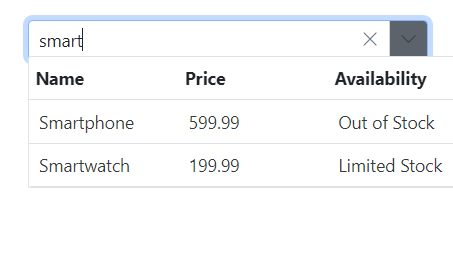
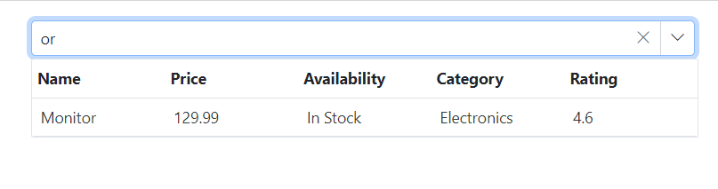

# Filtering in Blazor MultiColumn ComboBox Component

The MultiColumn ComboBox offers built-in functionality for filtering data items when the [AllowFiltering](https://help.syncfusion.com/cr/blazor/Syncfusion.Blazor.MultiColumnComboBox.SfMultiColumnComboBox-2.html#Syncfusion_Blazor_MultiColumnComboBox_SfMultiColumnComboBox_2_AllowFiltering) option is enabled. Filtering begins as the user types in the input field. By default, the AllowFiltering property is set to `false`.

## Local data

The following code demonstrates the filtering functionality with local data in the MultiColumn ComboBox component.









## Remote data

For remote data, every key press and filter action request is processed on the server side.

The following code illustrates the filtering capabilities using the [ODataAdaptor](https://blazor.syncfusion.com/documentation/data/adaptors#odata-adaptor) in the MultiColumn ComboBox component, utilizing the [Query](https://help.syncfusion.com/cr/blazor/Syncfusion.Blazor.Data.Query.html) property.









## Filter type

Use the [FilterType](https://help.syncfusion.com/cr/blazor/Syncfusion.Blazor.MultiColumnComboBox.SfMultiColumnComboBox-2.html#Syncfusion_Blazor_MultiColumnComboBox_SfMultiColumnComboBox_2_FilterType) property to specify how the input text is matched during filtering. The available filter types are:

FilterType     | Description
------------ | -------------
  [StartsWith](https://help.syncfusion.com/cr/blazor/Syncfusion.Blazor.MultiColumnComboBox.FilterType.html#Syncfusion_Blazor_MultiColumnComboBox_FilterType_StartsWith)       | Checks whether a value begins with the specified text.
  [EndsWith](https://help.syncfusion.com/cr/blazor/Syncfusion.Blazor.MultiColumnComboBox.FilterType.html#Syncfusion_Blazor_MultiColumnComboBox_FilterType_EndsWith)     | Checks whether a value ends with the specified text.
  [Contains](https://help.syncfusion.com/cr/blazor/Syncfusion.Blazor.MultiColumnComboBox.FilterType.html#Syncfusion_Blazor_MultiColumnComboBox_FilterType_Contains)      | Checks whether a value contains the specified text.

In the following example, the `EndsWith` filter type is assigned to the `FilterType` property.









<!-- ## Minimum filter length

When filtering list items, you can specify a character count limit to trigger a remote request and retrieve filtered data for the DropDownList. This can be achieved through manual validation using the [Filtering event arguments](https://help.syncfusion.com/cr/blazor/Syncfusion.Blazor.MultiColumnComboBox.FilteringEventArgs.html) within the [Filtering](https://help.syncfusion.com/cr/blazor/Syncfusion.Blazor.MultiColumnComboBox.SfMultiColumnComboBox-2.html#Syncfusion_Blazor_MultiColumnComboBox_SfMultiColumnComboBox_2_Filtering) event handler.

In the following example, the remote request does not fetch the search data until the search key contains three characters.





 -->

<!-- ## Multi column filtering

To enable multi-column support in the built-in Syncfusion Blazor theme files, simply add the `e-multi-column` class to the [CssClass]() property.







You can achieve multiple column(field) filtering by passing the List of [predicates](https://help.syncfusion.com/cr/blazor/Syncfusion.Blazor.Data.WhereFilter.html#Syncfusion_Blazor_Data_WhereFilter_predicates) to the [And](https://help.syncfusion.com/cr/blazor/Syncfusion.Blazor.Data.WhereFilter.html#Syncfusion_Blazor_Data_WhereFilter_And_Syncfusion_Blazor_Data_WhereFilter_) or [Or](https://help.syncfusion.com/cr/blazor/Syncfusion.Blazor.Data.WhereFilter.html#Syncfusion_Blazor_Data_WhereFilter_Or_Syncfusion_Blazor_Data_WhereFilter_) methods of [WhereFilters](https://help.syncfusion.com/cr/blazor/Syncfusion.Blazor.Data.WhereFilter.html#Syncfusion_Blazor_Data_WhereFilter__ctor).







<!-- ## Case sensitive filtering

The Data items can be filtered with or without case sensitivity using the [DataManager](https://help.syncfusion.com/cr/blazor/Syncfusion.Blazor.Data.SfDataManager.html). This can be done by passing the fourth optional parameter [IgnoreCase](https://help.syncfusion.com/cr/blazor/Syncfusion.Blazor.Data.WhereFilter.html#Syncfusion_Blazor_Data_WhereFilter_IgnoreCase) of the [Where clause](https://help.syncfusion.com/cr/blazor/Syncfusion.Blazor.Data.Query.html#Syncfusion_Blazor_Data_Query_Where_Syncfusion_Blazor_Data_WhereFilter_).

The following example shows how to perform case-sensitive filter.





 -->

## Custom filtering

The MultiColumn ComboBox allows you to customize filter queries using the [`Filtering`](https://help.syncfusion.com/cr/blazor/Syncfusion.Blazor.MultiColumnComboBox.SfMultiColumnComboBox-2.html#Syncfusion_Blazor_MultiColumnComboBox_SfMultiColumnComboBox_2_Filtering) event. Multiple-column filtering can be implemented by composing predicates and applying them with the `FilterAsync` method in combination with the `Filtering` event.

In the following example, the filter is configured to search based on both the `Name` and `Category` fields. The `Filtering` event uses a [Predicate](https://help.syncfusion.com/cr/blazor/Syncfusion.Blazor.Data.WhereFilter.html#Syncfusion_Blazor_Data_WhereFilter_Condition) with an `or` condition to allow filtering across these fields.

For instance, if a data source item has a `Name` of "Smartwatch" and a `Category` of "Wearables," typing either "S" or "W" will filter and display the "Smartwatch" item (from the Name field) in the dropdown popup.

> The `FilterAsync` method support is available for the MultiColumnComboBox component starting from version 27.1.57.









## Prevent popup opening when filtering

To prevent the MultiColumn ComboBox popup from opening while filtering is in progress, use the [PopupOpeningEventArgs.Cancel](https://help.syncfusion.com/cr/blazor/Syncfusion.Blazor.MultiColumnComboBox.PopupOpeningEventArgs.html#Syncfusion_Blazor_MultiColumnComboBox_PopupOpeningEventArgs_Cancel) argument exposed in the [PopupOpeningEventArgs](https://help.syncfusion.com/cr/blazor/Syncfusion.Blazor.MultiColumnComboBox.PopupOpeningEventArgs.html#properties). Set `Cancel` to `true` to stop the popup from opening, or `false` to allow it.

In the following example, the `isTyped` flag tracks whether filtering is occurring. The `OnFiltering` method sets the flag to `true` when filtering starts, and the popup-opening handler (for example, `OnBeforeOpen`) cancels opening if the flag is `true`. The handler then resets the flag to `false` for the next interaction.

> This approach prevents the popup from opening during filtering while still allowing users to filter items through the input field.







