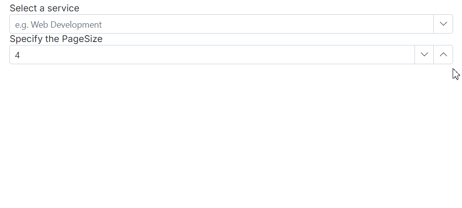
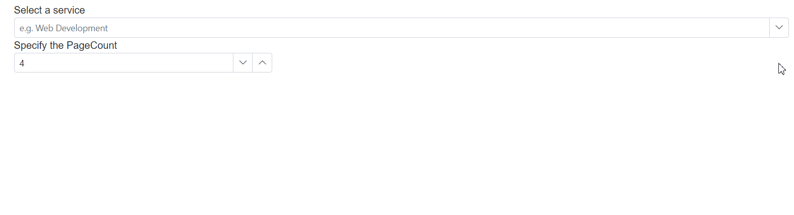

# Paging in Blazor MultiColumn ComboBox component

Paging provides an option to display data in segmented pages, making it easier to navigate through large datasets. This feature is particularly useful when dealing with extensive data sets.

To enable paging, you need to set the [AllowPaging](https://help.syncfusion.com/cr/blazor/Syncfusion.Blazor.MultiColumnComboBox.SfMultiColumnComboBox-2.html#Syncfusion_Blazor_MultiColumnComboBox_SfMultiColumnComboBox_2_AllowPaging) property to **true**. This property determines whether paging is enabled or disabled for the MultiColumn ComboBox. When paging is enabled, a pager component rendered at the bottom of the MultiColumn ComboBox popup, allowing you to navigate through different pages of data.

## Customize the pager options

Customizing the pager options in the Syncfusion&reg; MultiColumn ComboBox allows you to tailor the pagination control according to your specific requirements. You can customize the pager to display the number of pages using the  [PageCount](https://help.syncfusion.com/cr/blazor/Syncfusion.Blazor.MultiColumnComboBox.SfMultiColumnComboBox-2.html#Syncfusion_Blazor_MultiColumnComboBox_SfMultiColumnComboBox_2_PageCount)  property and display the number of records in the MultiColumn ComboBox using the [PageSize](https://help.syncfusion.com/cr/blazor/Syncfusion.Blazor.MultiColumnComboBox.SfMultiColumnComboBox-2.html#Syncfusion_Blazor_MultiColumnComboBox_SfMultiColumnComboBox_2_PageSize) property.

### Change the page size

The Syncfusion&reg; MultiColumn ComboBox allows you to control the number of records displayed per page, providing you with flexibility in managing your data. This feature is particularly useful when you want to adjust the amount of data visible to you at any given time. To achieve this, you can utilize the [PageSize](https://help.syncfusion.com/cr/blazor/Syncfusion.Blazor.MultiColumnComboBox.SfMultiColumnComboBox-2.html#Syncfusion_Blazor_MultiColumnComboBox_SfMultiColumnComboBox_2_PageSize) property. This property is used to specify the initial number of records to display on each page. The default value of pageSize property is 12.

The following example demonstrates how to change the page size of a MultiColumn ComboBox using an external button click based on **NumericTextBox** input.









### Change the page count

The Syncfusion&reg; MultiColumn ComboBox allows you to adjust the number of pages displayed in the pager container. This is useful when you want to manage the number of pages you see while navigating through extensive datasets. The default value of **PageCount** property is 8.

To change the page count in the Syncfusion&reg; MultiColumn ComboBox, you can utilize the [PageCount](https://help.syncfusion.com/cr/blazor/Syncfusion.Blazor.MultiColumnComboBox.SfMultiColumnComboBox-2.html#Syncfusion_Blazor_MultiColumnComboBox_SfMultiColumnComboBox_2_PageCount) property, which defines the number of pages displayed in the pager container.

The following example demonstrates how to change the page count of a Grid using an external button click based on **NumericTextBox** input.









