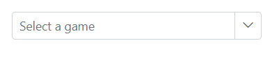
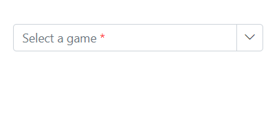
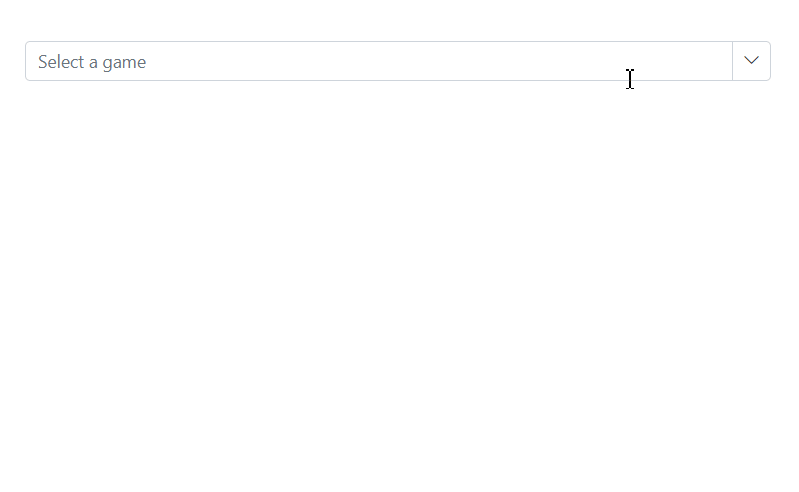

# Placeholder and Float Label in MultiColumn ComboBox

## Placeholder

Utilize the [Placeholder](https://help.syncfusion.com/cr/blazor/Syncfusion.Blazor.MultiColumnComboBox.SfMultiColumnComboBox-2.html#Syncfusion_Blazor_MultiColumnComboBox_SfMultiColumnComboBox_2_Placeholder) property to show a brief description of the expected input value. In the example below, assign `Select a game` to the `Placeholder` property, which will update the `Placeholder` attribute of the input element in the DOM accordingly.









<!-- ## Color of the placeholder text

You can change the color of the placeholder by targeting its CSS class `input.e-input::placeholder`, which indicates the placeholder text, and set the desired color using the `color` property.





 -->

## Add mandatory indicator using placeholder

The mandatory indicator `*` can be applied to the placeholder by targeting its CSS class `.e-float-text::after` using the `content` style.









 

## Floating label

Use the [FloatLabelType]() property to define how the floating label behaves in the DropDownList, allowing the `Placeholder` text to float above the TextBox. This functionality is relevant only when a `Placeholder` is present. The `FloatLabelType` depends on the `Placeholder` setting, with its default value being `Never`.

The floating label supports the types of actions as follow.

Type     | Description
------------ | -------------
  [Auto](https://help.syncfusion.com/cr/blazor/Syncfusion.Blazor.Inputs.FloatLabelType.html#Syncfusion_Blazor_Inputs_FloatLabelType_Auto)       | The floating label will float above the input after focusing, or entering a value in the input.
  [Always](https://help.syncfusion.com/cr/blazor/Syncfusion.Blazor.Inputs.FloatLabelType.html#Syncfusion_Blazor_Inputs_FloatLabelType_Always)     | The floating label will always float above the input.
  [Never](https://help.syncfusion.com/cr/blazor/Syncfusion.Blazor.Inputs.FloatLabelType.html#Syncfusion_Blazor_Inputs_FloatLabelType_Never)      | By default, never float the label in the input when the placeholder is available.

The `FloatLabelType` as  `Auto` is demonstrated in the following code sample.









<!-- ## Customizing the float label element’s focusing color

You can change the text color of the floating label when it is focused by targeting its CSS classes `.e-input-focus` and `.e-float-text.e-label-top`. These classes indicate the floating label text while it is focused state and set the desired color using the `color` property.





 -->