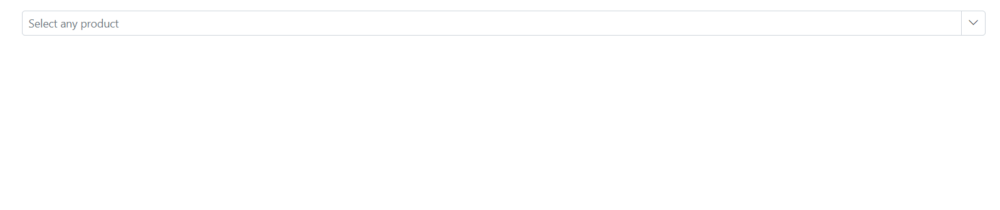

# Popup Setting in MultiColumn ComboBox

## Change the popup width

Customize the width of the popup using the [PopupWidth](https://help.syncfusion.com/cr/blazor/Syncfusion.Blazor.MultiColumnComboBox.SfMultiColumnComboBox-2.html#Syncfusion_Blazor_MultiColumnComboBox_SfMultiColumnComboBox_2_PopupWidth) property. If popup width unspecified, it sets based on the width of the MultiColumn ComboBox component.

In the following sample, the `PopupWidth` is set as `600px`.









## Change the popup height

Customize the height of the popup using the [PopupHeight](https://help.syncfusion.com/cr/blazor/Syncfusion.Blazor.MultiColumnComboBox.SfMultiColumnComboBox-2.html#Syncfusion_Blazor_MultiColumnComboBox_SfMultiColumnComboBox_2_PopupHeight) property.

In the following sample, the `PopupHeight` is set as `500px`.









## Change the popup z-index

Customize the [z-index](https://help.syncfusion.com/cr/blazor/Syncfusion.Blazor.MultiColumnComboBox.SfMultiColumnComboBox-2.html#Syncfusion_Blazor_MultiColumnComboBox_SfMultiColumnComboBox_2_ZIndex) value of the component popup element.

Defaults to `1000`

## Show popup on initial loading

You can achieve this by using [ShowPopupAsync()](https://help.syncfusion.com/cr/blazor/Syncfusion.Blazor.MultiColumnComboBox.SfMultiColumnComboBox-2.html#Syncfusion_Blazor_MultiColumnComboBox_SfMultiColumnComboBox_2_ShowPopupAsync) in the [Created](https://help.syncfusion.com/cr/blazor/Syncfusion.Blazor.DropDowns.ComboBoxEvents-2.html#Syncfusion_Blazor_DropDowns_ComboBoxEvents_2_Created) Event.







## Preventing opening and closing

Prevent the popup open and close in the event argument like [PopupOpeningEventArgs.cancel](https://help.syncfusion.com/cr/blazor/Syncfusion.Blazor.MultiColumnComboBox.PopupOpeningEventArgs.html#Syncfusion_Blazor_MultiColumnComboBox_PopupOpeningEventArgs_Cancel) and [PopupClosingEventArgs.cancel](https://help.syncfusion.com/cr/blazor/Syncfusion.Blazor.MultiColumnComboBox.PopupClosingEventArgs.html#Syncfusion_Blazor_MultiColumnComboBox_PopupClosingEventArgs_Cancel) as `true`. It is achieved by the [PopupOpening](https://help.syncfusion.com/cr/blazor/Syncfusion.Blazor.MultiColumnComboBox.SfMultiColumnComboBox-2.html#Syncfusion_Blazor_MultiColumnComboBox_SfMultiColumnComboBox_2_PopupOpening) and [PopupClosing](https://help.syncfusion.com/cr/blazor/Syncfusion.Blazor.MultiColumnComboBox.SfMultiColumnComboBox-2.html#Syncfusion_Blazor_MultiColumnComboBox_SfMultiColumnComboBox_2_PopupClosing) events. 









The following events are used to trigger when opening and closing popup.

### PopupOpening event

The [PopupOpening](https://help.syncfusion.com/cr/blazor/Syncfusion.Blazor.MultiColumnComboBox.SfMultiColumnComboBox-2.html#Syncfusion_Blazor_MultiColumnComboBox_SfMultiColumnComboBox_2_PopupOpening) event triggers when the popup is opened. If you cancel this event, the popup remains closed.









### PopupOpened event

The [PopupOpened](https://help.syncfusion.com/cr/blazor/Syncfusion.Blazor.MultiColumnComboBox.SfMultiColumnComboBox-2.html#Syncfusion_Blazor_MultiColumnComboBox_SfMultiColumnComboBox_2_PopupOpened) event triggers when the popup opens.

### PopupClosing event

The [PopupClosing](https://help.syncfusion.com/cr/blazor/Syncfusion.Blazor.MultiColumnComboBox.SfMultiColumnComboBox-2.html#Syncfusion_Blazor_MultiColumnComboBox_SfMultiColumnComboBox_2_PopupClosing) event triggers before the popup is closed. If you cancel this event, the popup will remain open.









### PopupClosed event

The [PopupClosed](https://help.syncfusion.com/cr/blazor/Syncfusion.Blazor.MultiColumnComboBox.SfMultiColumnComboBox-2.html#Syncfusion_Blazor_MultiColumnComboBox_SfMultiColumnComboBox_2_PopupClosed) event triggers after the popup has been closed.









## Popup height based on available space

You can achieve this by binding the `resize` event in window and update the height of the popup based on the window height.














