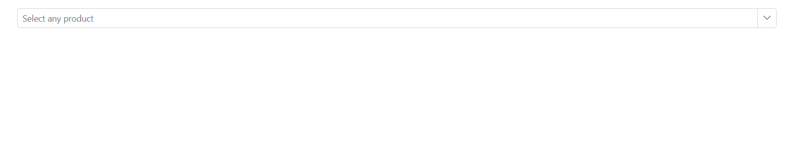

# Popup Setting in Blazor MultiColumn ComboBox

## Change the Popup Width

Customize the popup width using the [PopupWidth](https://help.syncfusion.com/cr/blazor/Syncfusion.Blazor.MultiColumnComboBox.SfMultiColumnComboBox-2.html#Syncfusion_Blazor_MultiColumnComboBox_SfMultiColumnComboBox_2_PopupWidth) property. If `PopupWidth` is not specified, the popup width matches the Blazor MultiColumn ComboBox input width.

In the following example, `PopupWidth` is set to `600px`.









## Change the Popup Height

Customize the popup height using the [PopupHeight](https://help.syncfusion.com/cr/blazor/Syncfusion.Blazor.MultiColumnComboBox.SfMultiColumnComboBox-2.html#Syncfusion_Blazor_MultiColumnComboBox_SfMultiColumnComboBox_2_PopupHeight) property.

In the following example, `PopupHeight` is set to `500px`.









## Change the Popup Z-Index

Customize the [ZIndex](https://help.syncfusion.com/cr/blazor/Syncfusion.Blazor.MultiColumnComboBox.SfMultiColumnComboBox-2.html#Syncfusion_Blazor_MultiColumnComboBox_SfMultiColumnComboBox_2_ZIndex) value to control the popup's stacking order relative to other overlays. The default `ZIndex` is `1000`. Increase it if the popup needs to appear above dialogs or other positioned elements.



<SfMultiColumnComboBox TValue="string" TItem="string" ZIndex="2000" Placeholder="Select an item"></SfMultiColumnComboBox>



## Show Popup on Initial Loading

Show the popup automatically when the component is initialized by calling [ShowPopupAsync](https://help.syncfusion.com/cr/blazor/Syncfusion.Blazor.MultiColumnComboBox.SfMultiColumnComboBox-2.html#Syncfusion_Blazor_MultiColumnComboBox_SfMultiColumnComboBox_2_ShowPopupAsync) in the [Created](https://help.syncfusion.com/cr/blazor/Syncfusion.Blazor.DropDowns.ComboBoxEvents-2.html#Syncfusion_Blazor_DropDowns_ComboBoxEvents_2_Created) event. Use a component reference to access the method.







## Prevent Opening and Closing

Prevent the popup from opening or closing by setting the event argument properties [PopupOpeningEventArgs.Cancel](https://help.syncfusion.com/cr/blazor/Syncfusion.Blazor.MultiColumnComboBox.PopupOpeningEventArgs.html#Syncfusion_Blazor_MultiColumnComboBox_PopupOpeningEventArgs_Cancel) and [PopupClosingEventArgs.Cancel](https://help.syncfusion.com/cr/blazor/Syncfusion.Blazor.MultiColumnComboBox.PopupClosingEventArgs.html#Syncfusion_Blazor_MultiColumnComboBox_PopupClosingEventArgs_Cancel) to `true` in the corresponding [PopupOpening](https://help.syncfusion.com/cr/blazor/Syncfusion.Blazor.MultiColumnComboBox.SfMultiColumnComboBox-2.html#Syncfusion_Blazor_MultiColumnComboBox_SfMultiColumnComboBox_2_PopupOpening) and [PopupClosing](https://help.syncfusion.com/cr/blazor/Syncfusion.Blazor.MultiColumnComboBox.SfMultiColumnComboBox-2.html#Syncfusion_Blazor_MultiColumnComboBox_SfMultiColumnComboBox_2_PopupClosing) events. This is useful to enforce conditions (for example, read-only state or validation in progress).









The following events are used to trigger when opening and closing popup.

## Render popup in a custom container

Use the `AppendTo` property to render the MultiColumn ComboBox popup inside a specific container instead of the default `document.body`. This is useful when the component is placed inside dialogs, side panels, containers with overflow restrictions, or custom stacking contexts.

Specify a valid CSS selector in the `AppendTo` property. When the selector matches an element, the popup is appended to that element. If the selector is null, empty, or no matching element is found, the popup is rendered in the default location.



@using Syncfusion.Blazor.MultiColumnComboBox

    <SfMultiColumnComboBox @bind-Value="@Value" AppendTo="@AppendTarget" DataSource="@Products" ValueField="Name" TextField="Name" Placeholder="Select any product"></SfMultiColumnComboBox>

@code {
    private string AppendTarget = "#popupHost";
    public class Product
    {
        public string Name { get; set; }
        public decimal Price { get; set; }
        public string Availability { get; set; }
        public string Category { get; set; }
        public double Rating { get; set; }
    }
    private List<Product> Products = new List<Product>();
    private string Value { get; set; } = "Smartphone";
    protected override Task OnInitializedAsync ()
    {
        Products = new List<Product>
        {
            new Product { Name = "Laptop", Price = 999.99m, Availability = "In Stock", Category = "Electronics", Rating = 4.5 },
            new Product { Name = "Smartphone", Price = 599.99m, Availability = "Out of Stock", Category = "Electronics", Rating = 4.3 },
            new Product { Name = "Tablet", Price = 299.99m, Availability = "In Stock", Category = "Electronics", Rating = 4.2 },
            new Product { Name = "Headphones", Price = 49.99m, Availability = "In Stock", Category = "Accessories", Rating = 4.0 }
        };
        return base.OnInitializedAsync();
    }
}



> The `AppendTo` property accepts a CSS selector such as `#elementId` or `.container`. If the specified element is not found, the popup element will be appended to `document.body`.

### PopupOpening Event

The [PopupOpening](https://help.syncfusion.com/cr/blazor/Syncfusion.Blazor.MultiColumnComboBox.SfMultiColumnComboBox-2.html#Syncfusion_Blazor_MultiColumnComboBox_SfMultiColumnComboBox_2_PopupOpening) event triggers just before the popup opens. Cancel this event to keep the popup closed.









### PopupOpened Event

The [PopupOpened](https://help.syncfusion.com/cr/blazor/Syncfusion.Blazor.MultiColumnComboBox.SfMultiColumnComboBox-2.html#Syncfusion_Blazor_MultiColumnComboBox_SfMultiColumnComboBox_2_PopupOpened) event triggers after the popup has opened. 

### PopupClosing Event

The [PopupClosing](https://help.syncfusion.com/cr/blazor/Syncfusion.Blazor.MultiColumnComboBox.SfMultiColumnComboBox-2.html#Syncfusion_Blazor_MultiColumnComboBox_SfMultiColumnComboBox_2_PopupClosing) event triggers just before the popup closes. Cancel this event to keep the popup open.









### PopupClosed Event

The [PopupClosed](https://help.syncfusion.com/cr/blazor/Syncfusion.Blazor.MultiColumnComboBox.SfMultiColumnComboBox-2.html#Syncfusion_Blazor_MultiColumnComboBox_SfMultiColumnComboBox_2_PopupClosed) event triggers after the popup has closed. Use this event to run cleanup logic, such as resetting filters or releasing transient state.









## Popup Height Based on Available Space

Adjust the popup height dynamically based on available viewport space by handling the window `resize` event and updating the popup height accordingly. Place the script in a layout or host page and ensure the element IDs in the script match the component instance.













