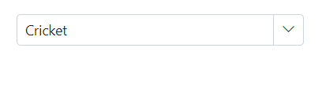
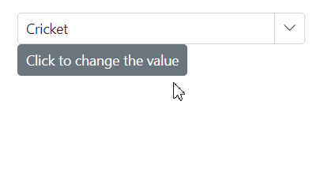
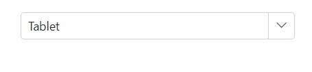
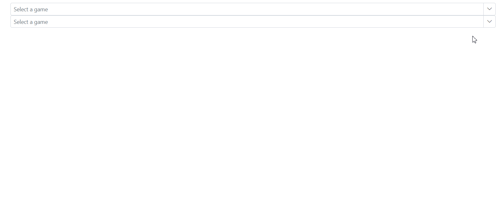

# Selection in MultiColumn ComboBox

## Get selected value

Retrieve the selected value from the Blazor MultiColumn ComboBox during the [ValueChange](https://help.syncfusion.com/cr/blazor/Syncfusion.Blazor.MultiColumnComboBox.SfMultiColumnComboBox-2.html#Syncfusion_Blazor_MultiColumnComboBox_SfMultiColumnComboBox_2_ValueChange) event by using the [ValueChangeEventArgs.Value](https://help.syncfusion.com/cr/blazor/Syncfusion.Blazor.MultiColumnComboBox.ValueChangeEventArgs-2.html#Syncfusion_Blazor_MultiColumnComboBox_ValueChangeEventArgs_2_Value) property. This event also provides both the current and previous values.









Retrieve the full data object corresponding to the selected value in the [ValueChange](https://help.syncfusion.com/cr/blazor/Syncfusion.Blazor.MultiColumnComboBox.SfMultiColumnComboBox-2.html#Syncfusion_Blazor_MultiColumnComboBox_SfMultiColumnComboBox_2_ValueChange) event by using the [ValueChangeEventArgs.ItemData](https://help.syncfusion.com/cr/blazor/Syncfusion.Blazor.MultiColumnComboBox.ValueChangeEventArgs-2.html#Syncfusion_Blazor_MultiColumnComboBox_ValueChangeEventArgs_2_ItemData) property.









## Preselected value on OnInitializedAsync

Preselect a value by binding the component using [@bind-Value](https://help.syncfusion.com/cr/blazor/Syncfusion.Blazor.MultiColumnComboBox.SfMultiColumnComboBox-2.html#Syncfusion_Blazor_MultiColumnComboBox_SfMultiColumnComboBox_2_Value). Set the bound value in [OnInitializedAsync](https://learn.microsoft.com/aspnet/core/blazor/components/lifecycle?view=aspnetcore-8.0#component-initialization-oninitializedasync). Ensure `TValue` aligns with the type of the bound model property.









## Programmatically change the selected value

Change the component's value either programmatically or externally via the component instance using the [@ref](https://learn.microsoft.com/en-us/aspnet/core/mvc/views/razor?view=aspnetcore-7.0#ref) attribute. The following example illustrates how to update the component's value when a button is clicked.









### ValueChange event

The [ValueChange](https://help.syncfusion.com/cr/blazor/Syncfusion.Blazor.MultiColumnComboBox.SfMultiColumnComboBox-2.html#Syncfusion_Blazor_MultiColumnComboBox_SfMultiColumnComboBox_2_ValueChange) event triggers when the value of the Blazor MultiColumn ComboBox changes and returns the necessary arguments, including the current and previously selected values and the selected item data.









### OnValueSelect event 

The [OnValueSelect](https://help.syncfusion.com/cr/blazor/Syncfusion.Blazor.MultiColumnComboBox.SfMultiColumnComboBox-2.html#Syncfusion_Blazor_MultiColumnComboBox_SfMultiColumnComboBox_2_OnValueSelect) event is raised when a value is chosen in the Blazor MultiColumn ComboBox. Access the selected data via [ValueSelectEventArgs.ItemData](https://help.syncfusion.com/cr/blazor/Syncfusion.Blazor.MultiColumnComboBox.ValueSelectEventArgs-2.html#Syncfusion_Blazor_MultiColumnComboBox_ValueSelectEventArgs_2_ItemData). To prevent selection, set [ValueSelectEventArgs.Cancel](https://help.syncfusion.com/cr/blazor/Syncfusion.Blazor.MultiColumnComboBox.ValueSelectEventArgs-2.html#Syncfusion_Blazor_MultiColumnComboBox_ValueSelectEventArgs_2_Cancel) to `true`.









## Preselect value with index

Bind the pre-selected value to the component using the [@bind-Index](https://help.syncfusion.com/cr/blazor/Syncfusion.Blazor.MultiColumnComboBox.SfMultiColumnComboBox-2.html#Syncfusion_Blazor_MultiColumnComboBox_SfMultiColumnComboBox_2_Value) attribute. It binds the respective value present in the specified index position of the datasource.

The following sample shows how to bind the index on initial rendering.









<!-- ## Autofill the selected value

The [Autofill]() property determines if the component's input field will automatically suggest and complete the first matching item as the user types, drawing from the component's data source. If there are no matches, the input field will remain unchanged, and no further action will take place. By default, the `Autofill` setting is set to `false`.





  -->

<!-- ## Get selected item by value

Get the entire object belonging to the value selected in the component using the [GetDataByValue]() method.





 -->

## Focus the next component on selection

Programmatically move focus using the [FocusAsync](https://help.syncfusion.com/cr/blazor/Syncfusion.Blazor.MultiColumnComboBox.SfMultiColumnComboBox-2.html#Syncfusion_Blazor_MultiColumnComboBox_SfMultiColumnComboBox_2_FocusAsync) method. This sets focus to the Blazor MultiColumn ComboBox when invoked.







<!-- ## Programmatically clear the selected value

To programmatically reset the value of the MultiColumn ComboBox, you can utilize the [ClearAsync]() method. This method removes any selected values from the SfComboBox<TValue, TItem> component and sets both the [Value](https://help.syncfusion.com/cr/blazor/Syncfusion.Blazor.MultiColumnComboBox.SfMultiColumnComboBox-2.html#Syncfusion_Blazor_MultiColumnComboBox_SfMultiColumnComboBox_2_Value) and [Index](https://help.syncfusion.com/cr/blazor/Syncfusion.Blazor.MultiColumnComboBox.SfMultiColumnComboBox-2.html#Syncfusion_Blazor_MultiColumnComboBox_SfMultiColumnComboBox_2_Index) properties to null.





 -->

## Prevent reload on form submit

When using the Blazor MultiColumn ComboBox inside a form, prevent a full page reload by setting the button’s type to `"button"` through the `HTMLAttributes` configuration for that button. This ensures clicks do not submit the form unless explicitly intended.









<!-- ## Programmatically trigger onChange event

Trigger the [ValueChange](https://help.syncfusion.com/cr/blazor/Syncfusion.Blazor.MultiColumnComboBox.SfMultiColumnComboBox-2.html#Syncfusion_Blazor_MultiColumnComboBox_SfMultiColumnComboBox_2_ValueChange) event manually by using the instance (taken from @ref attribute) of the component. In the following example, the `ValueChange` event is invoked inside the `Created` event handler. As per the following code, it will trigger once the component is created or rendered on the page.





 -->

<!-- ## Programmatically focus in and focus out the component

In order to trigger the `FocusAsync(https://help.syncfusion.com/cr/blazor/Syncfusion.Blazor.MultiColumnComboBox.SfMultiColumnComboBox-2.html#Syncfusion_Blazor_MultiColumnComboBox_SfMultiColumnComboBox_2_FocusAsync)` and `FocusOutAsync()` methods using the instance of the MultiColumn ComboBox, you can use buttons. You can bind the click event of the button to the `FocusAsync(https://help.syncfusion.com/cr/blazor/Syncfusion.Blazor.MultiColumnComboBox.SfMultiColumnComboBox-2.html#Syncfusion_Blazor_MultiColumnComboBox_SfMultiColumnComboBox_2_FocusAsync)` and `FocusOutAsync()` methods. When the button is clicked, it triggers the corresponding method on the MultiColumn ComboBox.







While focusing and focus out the following event get triggered. -->

### Focus event

The [Focus](https://help.syncfusion.com/cr/blazor/Syncfusion.Blazor.MultiColumnComboBox.SfMultiColumnComboBox-2.html#Syncfusion_Blazor_MultiColumnComboBox_SfMultiColumnComboBox_2_Focus) event triggers when the component receives focus. 









### Blur event

The [Blur](https://help.syncfusion.com/cr/blazor/Syncfusion.Blazor.MultiColumnComboBox.SfMultiColumnComboBox-2.html#Syncfusion_Blazor_MultiColumnComboBox_SfMultiColumnComboBox_2_Blur) event triggers when focus moves out of the component.







