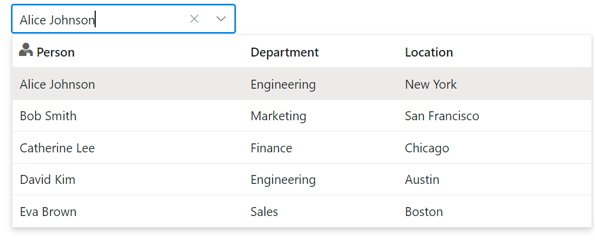

# Templates in Blazor MultiColumn ComboBox Component

The MultiColumn ComboBox has been provided with several options to customize each header elements.

## Header template

The header element is shown statically at the top of the popup list items within the ComboBox, and any custom element can be placed as a header element using the [HeaderTemplate](https://help.syncfusion.com/cr/blazor/Syncfusion.Blazor.DropDowns.SfComboBox-2.html) property.

In the following sample, the header of the first column includes the profile icon.









