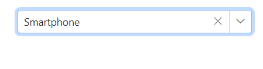

# Value Binding in MultiColumn ComboBox

Value binding is the process of passing values between a component and its parent. There are two methods for binding values.These are.

* bind-Value Binding 
* bind-Index Binding

## Bind value binding

Value binding can be accomplished using the [@bind-Value](https://help.syncfusion.com/cr/blazor/Syncfusion.Blazor.MultiColumnComboBox.SfMultiColumnComboBox-2.html#Syncfusion_Blazor_MultiColumnComboBox_SfMultiColumnComboBox_2_Value) attribute, which supports `string`, `int`, `enum`, `bool`, and `complex types`. When the component's value changes, it will impact all instances where the variable is bound using the `@bind-value` attribute. For the binding to function correctly, the value assigned to the `@bind-value` attribute should correspond to the [TextField](https://help.syncfusion.com/cr/blazor/Syncfusion.Blazor.MultiColumnComboBox.SfMultiColumnComboBox-2.html#Syncfusion_Blazor_MultiColumnComboBox_SfMultiColumnComboBox_2_TextField) and [ValueField](https://help.syncfusion.com/cr/blazor/Syncfusion.Blazor.MultiColumnComboBox.SfMultiColumnComboBox-2.html#Syncfusion_Blazor_MultiColumnComboBox_SfMultiColumnComboBox_2_ValueField) mapped to the component.

* **TValue** - Specifies the type of each list item on the suggestion list.









## Index value binding

The Index value binding is accomplished through the [@bind-Index]() attribute, which supports both integer and nullable integer types. This attribute allows you to bind values according to their corresponding index.









<!-- ## Object binding

Bind the Object data to the [@bind-Value](https://help.syncfusion.com/cr/blazor/Syncfusion.Blazor.MultiColumnComboBox.SfMultiColumnComboBox-2.html#Syncfusion_Blazor_MultiColumnComboBox_SfMultiColumnComboBox_2_Value) attribute of the MultiColumn ComboBox component, allowing you to associate the class name with `TValue`.

In the example provided, the `Name` column is linked to the [ValueField](https://help.syncfusion.com/cr/blazor/Syncfusion.Blazor.MultiColumnComboBox.SfMultiColumnComboBox-2.html#Syncfusion_Blazor_MultiColumnComboBox_SfMultiColumnComboBox_2_ValueField) property.





 -->

## Show or hide clear button

Utilize the [ShowClearButton](https://help.syncfusion.com/cr/blazor/Syncfusion.Blazor.MultiColumnComboBox.SfMultiColumnComboBox-2.html#Syncfusion_Blazor_MultiColumnComboBox_SfMultiColumnComboBox_2_ShowClearButton) property to control the visibility of the clear button. When the clear button is activated, the `Value`, `Text`, and `Index` properties will all revert to null.

N> If the TValue is a non-nullable type, pressing the clear button will reset it to the default value for that data type. Conversely, if TValue is a nullable type, pressing the clear button will set it to null. For instance, if TValue is defined as `int`, clearing it will assign a value of 0 to the component, whereas if TValue is defined as `int?`, it will assign a value of null.

The following example illustrates the use of `string` as the TValue. Therefore, when the clear button is used, the value will be set to null, as that is the default for that type.









## Dynamically change TItem

The `TItem` property can be modified dynamically by specifying the datasource type of the MultiColumn ComboBox component using the `@typeparam` directive. The sample demonstration below illustrates how to dynamically change the `TItem` with various types of datasources.

### Creating generic MultiColumn Combobox component

First, create a `MultiColumnComboBox.razor` file as a parent component in the `/Pages` folder. Also, add a Parameter property for a List as `<TItem>` and `TValue`.




@using Syncfusion.Blazor.MultiColumnComboBox

@typeparam TValue;
@typeparam TItem;

<SfMultiColumnComboBox TValue="TValue" Width="300px" TItem="TItem" @bind-Value="@ComboBoxValue" Placeholder="Please select a value" DataSource="@customData" ValueField="ID" TextField="Text">
</SfMultiColumnComboBox>

@code {
    [Parameter]
    public List<TItem> customData { get; set; }
    [Parameter]
    public TValue ComboBoxValue { get; set; }
    
    [Parameter]
    public EventCallback<TValue> ComboBoxValueChanged { get; set; }
}




### Usage of generic component with different type

Then, render the Generic MultiColumn ComboBox component with the required `TValue` and `TItem` in the respective razor components. 

Here, the MultiColumn ComboBox component with TValue as an int nullable type in the `/Index.razor` file.

**[Index.razor]**




<MultiColumnComboBox TValue="int?" TItem="Games" @bind-ComboBoxValue="@value" customData="@LocalData" >
</MultiColumnComboBox>

@code{
    public int? value { get; set; } = 3;
    public class Games
    {
        public int? ID { get; set; }
        public string Text { get; set; }
    }
    List<Games> LocalData = new List<Games> {
        new Games() { ID= 1, Text= "American Football" },
        new Games() { ID= 2, Text= "Badminton" },
        new Games() { ID= 3, Text= "Basketball" },
        new Games() { ID= 4, Text= "Cricket" },
        new Games() { ID= 5, Text= "Football" },
        new Games() { ID= 6, Text= "Golf" },
        new Games() { ID= 7, Text= "Hockey" },
        new Games() { ID= 8, Text= "Rugby"},
        new Games() { ID= 9, Text= "Snooker" },
        new Games() { ID= 10, Text= "Tennis"},
    };
}



