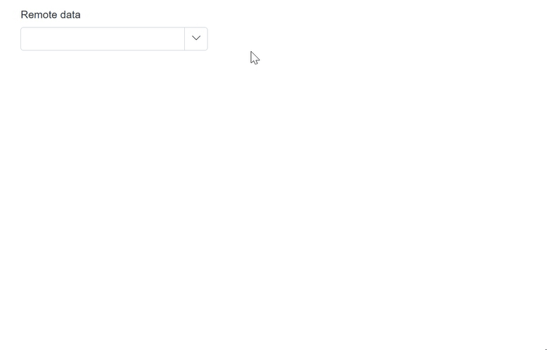

# Virtualization in Blazor MultiColumn ComboBox Component

The MultiColumn ComboBox component includes a virtual scrolling feature designed to enhance UI performance, particularly for handling large datasets. By enabling the [EnableVirtualization](https://help.syncfusion.com/cr/blazor/Syncfusion.Blazor.DropDowns.SfDropDownList-2.html#Syncfusion_Blazor_DropDowns_SfDropDownList_2_EnableVirtualization) option, the MultiColumn ComboBox intelligently manages data rendering, ensuring only a subset of items is initially loaded when the component is rendered. As you interact with the dropdown, additional items are dynamically loaded as you scroll, creating a smooth and efficient user experience.

This feature is applicable to both local and remote data scenarios, providing flexibility in its implementation. For instance, consider a case where the MultiColumn ComboBox is bound to a dataset containing 2000 items. Upon opening the dropdown, only a few items are loaded initially, based on the height of the popup. As you scroll through the list, additional items are fetched and loaded on-demand, allowing you to effortlessly explore the complete dataset.

## Local data









## Remote data









