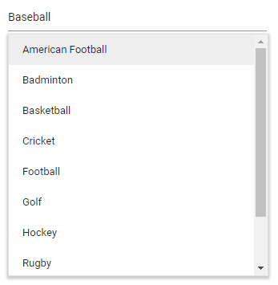

# Custom Value in Blazor MultiSelect Dropdown Component

The MultiSelect allows users to select and tag a typed custom value that is not present in the data source when [AllowCustomValue](https://help.syncfusion.com/cr/blazor/Syncfusion.Blazor.DropDowns.SfMultiSelect-2.html#Syncfusion_Blazor_DropDowns_SfMultiSelect_2_AllowCustomValue) as true. The selected custom value is added to the suggestion list alone. It will not affect the original data source. The `CustomValueSpecifier` event will trigger when you select or tag the typed custom value.

N> The `Value` field, `Text` field, and `Value` property must be of `string` type when custom value is enabled. For other types, provide the custom data for the typed custom value in the `CustomValueSpecifier` event. Find the details on [Value as non-string type](https://blazor.syncfusion.com/documentation/multiselect-dropdown/custom-value#value-as-non-string-type) section. 







## Value as non-string type

By default, the typed custom value is used for both the Value and Text fields of the custom data. If the `TValue` type is a non-`string` type, provide the custom data for the typed value in the `CustomValueSpecifier` event.

In the `CustomValueSpecifier` event, the typed custom text is available in the `Text` argument. Based on this text, construct the appropriate custom data and assign it to the event’s `NewData` argument.

The following sample demonstrates configuring custom value in the `CustomValueSpecifier` event.







## Limitation in Checkbox mode 

The MultiSelect component supports adding custom values in `Default`, `Box`, and `Delimiter` modes. In `Checkbox` mode, the input element is non-editable, preventing the addition of custom values. This limitation is due to the read-only nature of the parent input in Checkbox mode, so entering custom values is not supported and is the intended behavior of the component.