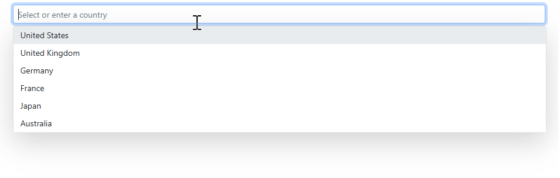

# Custom Value in Blazor MultiSelect Dropdown

The Syncfusion Blazor [MultiSelect Dropdown](https://blazor.syncfusion.com/documentation/multiselect-dropdown/getting-started) component provides the **custom value** feature, which enables users to add values that are not present in the predefined data source. This is particularly useful in tag selectors, skill pickers, keyword inputs, and any scenario where the selection set is not fully known in advance.

When a user types a value that does not match any existing item, the component creates a custom list item and places it at the top of the dropdown list. The user must then explicitly select this item from the dropdown to add it to the selection.



N> Custom values are not added to the original `DataSource`. They are tracked internally by the component. The original data source remains unmodified throughout the interaction.

## Enabling custom value

To enable custom value input, set the [AllowCustomValue](https://help.syncfusion.com/cr/blazor/Syncfusion.Blazor.DropDowns.SfMultiSelect-2.html#Syncfusion_Blazor_DropDowns_SfMultiSelect_2_AllowCustomValue) property to `true`.

**How custom value creation works:**

1. The user types text in the input field.
2. The component checks whether the text matches any existing item in the data source.
3. If no match is found, a new list item is created and inserted at the top of the dropdown list.
4. The user must **explicitly select** this custom item from the dropdown list to add it to the selection.
5. Only after the item is selected does it appear in the `Value` collection.

```razor
@using Syncfusion.Blazor.DropDowns

<SfMultiSelect TValue="string[]"
               TItem="string"
               DataSource="@Countries"
               AllowCustomValue="true"
               Placeholder="Select or enter a country">
</SfMultiSelect>

@code {
    private List<string> Countries = new List<string>
    {
        "United States", "United Kingdom", "Germany", "France", "Japan", "Australia"
    };
}
```


N> If the user types text and does not select the created custom item from the dropdown, the item is **not** added to the `Value` collection. Selecting the item from the list is mandatory to complete the addition.

## Custom value with complex object types

When the `TItem` is a complex class, custom values are handled by creating a new instance of the class and assigning the typed input to both the `Text` and `Value` field properties. All other properties of the class receive their default values.

Use the [CustomValueSpecifier](https://help.syncfusion.com/cr/blazor/Syncfusion.Blazor.DropDowns.SfMultiSelect-2.html#Syncfusion_Blazor_DropDowns_SfMultiSelect_2_CustomValueSpecifier) event to supply fully populated custom object instances, including any additional properties that matter for your application logic.

```razor
@using Syncfusion.Blazor.DropDowns

<SfMultiSelect TValue="int[]"
               TItem="Employee"
               DataSource="@Employees"
               AllowCustomValue="true"
               Placeholder="Select or add an employee">
    <MultiSelectFieldSettings Text="Name" Value="Id"></MultiSelectFieldSettings>
    <MultiSelectEvents TItem="Employee" TValue="int[]"
                       CustomValueSpecifier="@OnCustomValue">
    </MultiSelectEvents>
</SfMultiSelect>

@code {
    private int[] SelectedValues { get; set; }

    private List<Employee> Employees = new List<Employee>
    {
        new Employee { Id = 1, Name = "Alice Martin",   Department = "Engineering" },
        new Employee { Id = 2, Name = "Bob Johnson",    Department = "Marketing" },
        new Employee { Id = 3, Name = "Carol Williams", Department = "Finance" }
    };

    private async Task OnCustomValue(CustomValueEventArgs<Employee> args)
    {
        // Auto-generate a unique ID and assign defaults for new employees
        args.NewData = new Employee
        {
            Id         = Employees.Max(e => e.Id) + 1,
            Name       = args.Text,
            Department = "Pending Assignment"
        };
    }

    public class Employee
    {
        public int    Id         { get; set; }
        public string Name       { get; set; }
        public string Department { get; set; }
    }
}
```


N> The `Value` field, the `Text` field, and the `Value` property must be of type `string` when custom value is enabled and no `CustomValueSpecifier` event is used. For non-string value types (such as `int`), you must handle the `CustomValueSpecifier` event and manually set `args.NewData` with the correct typed value.

## CustomValueSpecifier event

The [CustomValueSpecifier](https://help.syncfusion.com/cr/blazor/Syncfusion.Blazor.DropDowns.MultiSelectEvents-2.html#Syncfusion_Blazor_DropDowns_MultiSelectEvents_2_CustomValueSpecifier) event fires when a user selects a custom item from the dropdown list. It provides a `CustomValueEventArgs<TItem>` argument that allows the handler to:

- Inspect the typed text via [`args.Text`](https://help.syncfusion.com/cr/blazor/Syncfusion.Blazor.DropDowns.CustomValueEventArgs-1.html#Syncfusion_Blazor_DropDowns_CustomValueEventArgs_1_Text).
- Override the created item by assigning a new value to [`args.NewData`](https://help.syncfusion.com/cr/blazor/Syncfusion.Blazor.DropDowns.CustomValueEventArgs-1.html#Syncfusion_Blazor_DropDowns_CustomValueEventArgs_1_NewData).
- Prevent the item from being added to the selection by setting [`args.Cancel = true`](https://help.syncfusion.com/cr/blazor/Syncfusion.Blazor.DropDowns.CustomValueEventArgs-1.html#Syncfusion_Blazor_DropDowns_CustomValueEventArgs_1_Cancel).

| Argument   | Type      | Description                                                             |
|------------|-----------|-------------------------------------------------------------------------|
| `Text`     | `string`  | The text typed by the user.                                             |
| `NewData`  | `TItem`   | The new data item being created. Can be replaced with a custom instance.|
| `Cancel`   | `bool`    | Set to `true` to prevent the custom value from being added. Default is `false`. |

### Validating custom input

The following example rejects any custom value shorter than three characters.

```razor
@using Syncfusion.Blazor.DropDowns

<SfMultiSelect TValue="string[]"
               TItem="Tag"
               DataSource="@Tags"
               AllowCustomValue="true"
               Placeholder="Add tags (min. 3 characters)">
    <MultiSelectFieldSettings Text="Label" Value="Label"></MultiSelectFieldSettings>
    <MultiSelectEvents TItem="Tag" TValue="string[]"
                       CustomValueSpecifier="@OnCustomValue">
    </MultiSelectEvents>
</SfMultiSelect>

@code {
    private List<Tag> Tags = new List<Tag>
    {
        new Tag { Label = "Blazor" },
        new Tag { Label = "CSharp" },
        new Tag { Label = "WebAssembly" }
    };

    private async Task OnCustomValue(CustomValueEventArgs<Tag> args)
    {
        if (args.Text.Length < 3)
        {
            // Reject entries shorter than 3 characters
            args.Cancel = true;
            return;
        }

        args.NewData = new Tag { Label = args.Text };
    }

    public class Tag
    {
        public string Label { get; set; }
    }
}
```



N> There is no built-in deduplication for custom values with identical text. If a user selects the same custom text multiple times, each occurrence is treated as a distinct addition. Use the `CustomValueSpecifier` event to implement uniqueness validation.

## Visual mode behavior

Custom values work in all visual modes except `CheckBox`. The display of selected custom values follows the same rendering rules as predefined selections.

### Default mode

Selected custom values are displayed as chips that collapse into an overflow indicator when the component loses focus.

```razor
<SfMultiSelect TValue="string[]"
               TItem="string"
               DataSource="@Skills"
               AllowCustomValue="true"
               Mode="VisualMode.Default"
               Placeholder="Select or add skills">
</SfMultiSelect>

@code {
    private List<string> Skills = new List<string>
    {
        "JavaScript", "TypeScript", "Blazor", "React", "Angular"
    };
}
```

### Box mode

Custom values appear as permanent box-style chips, always visible regardless of focus state.

```razor
<SfMultiSelect TValue="string[]"
               TItem="string"
               DataSource="@Skills"
               AllowCustomValue="true"
               Mode="VisualMode.Box"
               Placeholder="Select or add skills">
</SfMultiSelect>

@code {
    private List<string> Skills = new List<string>
    {
        "JavaScript", "TypeScript", "Blazor", "React", "Angular"
    };
}
```

### Delimiter mode

Selected custom values are rendered as delimiter-separated text, visually identical to predefined selections.

```razor
<SfMultiSelect TValue="string[]"
               TItem="string"
               DataSource="@Skills"
               AllowCustomValue="true"
               Mode="VisualMode.Delimiter"
               DelimiterChar=";"
               Placeholder="Select or add skills">
</SfMultiSelect>

@code {
    private List<string> Skills = new List<string>
    {
        "JavaScript", "TypeScript", "Blazor", "React", "Angular"
    };
}
```



N> Custom value is **automatically disabled** when [Mode](https://help.syncfusion.com/cr/blazor/Syncfusion.Blazor.DropDowns.SfMultiSelect-2.html#Syncfusion_Blazor_DropDowns_SfMultiSelect_2_Mode) is set to `VisualMode.CheckBox`. Setting `AllowCustomValue="true"` alongside `VisualMode.CheckBox` has no effect; the property is internally forced to `false`.

## Custom value with filtering

When [AllowFiltering](https://help.syncfusion.com/cr/blazor/Syncfusion.Blazor.DropDowns.SfMultiSelect-2.html#Syncfusion_Blazor_DropDowns_SfMultiSelect_2_AllowFiltering) is combined with `AllowCustomValue`, typing in the input field simultaneously filters existing items and creates a custom entry if no exact match is found. The custom item always appears at the top of the filtered list.

**Interaction sequence when both features are enabled:**

1. User types text — the list filters to show matching items.
2. If no exact match exists, a custom item appears at the top of the filtered results.
3. The user selects the custom item from the dropdown.

```razor
@using Syncfusion.Blazor.DropDowns

<SfMultiSelect TValue="string[]"
               TItem="string"
               DataSource="@Fruits"
               AllowCustomValue="true"
               AllowFiltering="true"
               Placeholder="Select or type a new fruit">
</SfMultiSelect>

@code {
    private List<string> Fruits = new List<string>
    {
        "Apple", "Banana", "Cherry", "Durian", "Elderberry", "Fig", "Grape"
    };
}
```

## Custom value with HideSelectedItem

When [HideSelectedItem](https://help.syncfusion.com/cr/blazor/Syncfusion.Blazor.DropDowns.SfMultiSelect-2.html#Syncfusion_Blazor_DropDowns_SfMultiSelect_2_HideSelectedItem) is `true`, selected custom values are hidden from the dropdown list, consistent with the behavior for predefined selected items.

- Before selection: The custom item is visible at the top of the dropdown.
- After selection: The custom item is hidden from the dropdown list.
- After deselection: The custom item reappears in the dropdown.

```razor
<SfMultiSelect TValue="string[]"
               TItem="string"
               DataSource="@Languages"
               AllowCustomValue="true"
               HideSelectedItem="true"
               Placeholder="Select or add a language">
</SfMultiSelect>

@code {
    private List<string> Languages = new List<string>
    {
        "English", "Spanish", "French", "German", "Mandarin"
    };
}
```

## Custom value with MaximumSelectionLength

Custom values count toward the [MaximumSelectionLength](https://help.syncfusion.com/cr/blazor/Syncfusion.Blazor.DropDowns.SfMultiSelect-2.html#Syncfusion_Blazor_DropDowns_SfMultiSelect_2_MaximumSelectionLength) limit. When the maximum is reached, the component prevents further selection, including custom items that appear in the dropdown list.

```razor
<SfMultiSelect TValue="string[]"
               TItem="string"
               DataSource="@Categories"
               AllowCustomValue="true"
               MaximumSelectionLength="3"
               Placeholder="Select up to 3 categories (custom allowed)">
</SfMultiSelect>

@code {
    private List<string> Categories = new List<string>
    {
        "Technology", "Health", "Finance", "Education", "Travel"
    };
}
```

## Custom value with virtualization

When [EnableVirtualization](https://help.syncfusion.com/cr/blazor/Syncfusion.Blazor.DropDowns.SfMultiSelect-2.html#Syncfusion_Blazor_DropDowns_SfMultiSelect_2_EnableVirtualization) is enabled, custom values receive special internal tracking to maintain their position at the top of the virtual list even as the user scrolls through a large dataset. Custom items are preserved in the component's internal virtual data collections and are not lost during scrolling.

```razor
@using Syncfusion.Blazor.DropDowns

<SfMultiSelect TValue="string[]"
               TItem="DataItem"
               DataSource="@LargeDataSet"
               AllowCustomValue="true"
               EnableVirtualization="true"
               Placeholder="Select or add items from a large list">
    <MultiSelectFieldSettings Text="Name" Value="Code"></MultiSelectFieldSettings>
</SfMultiSelect>

@code {
    private List<DataItem> LargeDataSet = Enumerable.Range(1, 10000).Select(i =>
        new DataItem { Code = $"ITEM{i:D5}", Name = $"Product {i}" }).ToList();

    public class DataItem
    {
        public string Code { get; set; }
        public string Name { get; set; }
    }
}
```

## Two-way binding with custom values

Custom values fully participate in two-way binding. After a custom item is selected, it is added to the bound `Value` property. Changes to the `Value` property from code also correctly reflect custom values in the UI.

```razor
@using Syncfusion.Blazor.DropDowns

<SfMultiSelect TValue="string[]"
               TItem="string"
               DataSource="@Technologies"
               AllowCustomValue="true"
               @bind-Value="@SelectedTechnologies"
               Placeholder="Select or add technologies">
</SfMultiSelect>

<p>Selected: @(SelectedTechnologies != null ? string.Join(", ", SelectedTechnologies) : "None")</p>

@code {
    private string[] SelectedTechnologies { get; set; }

    private List<string> Technologies = new List<string>
    {
        "Blazor", "ASP.NET Core", "Entity Framework", "SignalR", "gRPC"
    };
}
```
N> Empty or whitespace-only input does not create a custom item. The component ignores such input silently.

## Handling the ValueChange event with custom values

The `ValueChanged` or the [ValueChange](https://help.syncfusion.com/cr/blazor/Syncfusion.Blazor.DropDowns.MultiSelectEvents-2.html) event fires after a custom value is selected and added to the selection. The event arguments include both predefined and custom values in the `Value` collection without distinction.

```razor
@using Syncfusion.Blazor.DropDowns

<SfMultiSelect TValue="string[]"
               TItem="string"
               DataSource="@Hobbies"
               AllowCustomValue="true"
               Placeholder="Select or add hobbies">
    <MultiSelectEvents TItem="string" TValue="string[]"
                       ValueChange="@OnValueChange">
    </MultiSelectEvents>
</SfMultiSelect>

<p>Current selection count: @Count</p>

@code {
    private int Count { get; set; }

    private List<string> Hobbies = new List<string>
    {
        "Reading", "Cycling", "Cooking", "Gaming", "Hiking"
    };

    private void OnValueChange(MultiSelectChangeEventArgs<string[]> args)
    {
        Count = args.Value?.Length ?? 0;
        // args.Value contains both predefined and custom selected values
    }
}
```

## Keyboard interaction

The following keyboard interactions are supported when working with custom values:

| Key            | Behavior                                                                             |
|----------------|--------------------------------------------------------------------------------------|
| **Down Arrow** | Navigates to the custom item at the top of the dropdown list.                        |
| **Up Arrow**   | Navigates upward through the dropdown list.                                          |
| **Enter**      | Selects the currently highlighted item, including a custom item.                     |
| **Tab**        | Moves focus away from the component. The unselected custom item is abandoned.        |
| **Escape**     | Closes the popup without selecting the custom item.                                  |

N> If a user types a value but does not select the created custom item from the dropdown list, the `Value` property is not updated and the item is not added to the selection. Pressing Tab or Escape abandons the custom item.

## Type handling

### Primitive types

For primitive types such as `string`, `int`, and `bool`, the component attempts to convert the typed input text directly to the target type.

| Type     | Behavior                                        |
|----------|-------------------------------------------------|
| `string` | Input text is used directly as the value.       |
| `int`    | Input text is parsed to the integer type.       |
| `bool`   | Input text is converted to `true` or `false`.   |

N> For non-string primitive types, use the `CustomValueSpecifier` event to ensure correct type conversion and to provide a meaningful `NewData` value.

### Complex object types

For complex class types, the component creates a new instance of `TItem` and assigns the input text to both the `Fields.Text` and `Fields.Value` properties. All other properties default to their type's default values. The `CustomValueSpecifier` event should be used to populate additional properties.

N> If type conversion fails for a primitive `TItem` type during custom item creation, the item may be created with an unexpected default value. Use the `CustomValueSpecifier` event to handle such cases gracefully.

## See also

- [MultiSelect Dropdown — Getting Started](https://blazor.syncfusion.com/documentation/multiselect-dropdown/getting-started-webapp)
- [MultiSelect Dropdown — Data Binding](https://blazor.syncfusion.com/documentation/multiselect-dropdown/data-binding)
- [MultiSelect Dropdown — Filtering](https://blazor.syncfusion.com/documentation/multiselect-dropdown/filtering)
- [MultiSelect Dropdown — Virtualization](https://blazor.syncfusion.com/documentation/multiselect-dropdown/virtualization)
- [MultiSelect Dropdown — Templates](https://blazor.syncfusion.com/documentation/multiselect-dropdown/templates)
- [AllowCustomValue API Reference](https://help.syncfusion.com/cr/blazor/Syncfusion.Blazor.DropDowns.SfMultiSelect-2.html#Syncfusion_Blazor_DropDowns_SfMultiSelect_2_AllowCustomValue)
- [CustomValueSpecifier API Reference](https://help.syncfusion.com/cr/blazor/Syncfusion.Blazor.DropDowns.CustomValueEventArgs-1.html)
