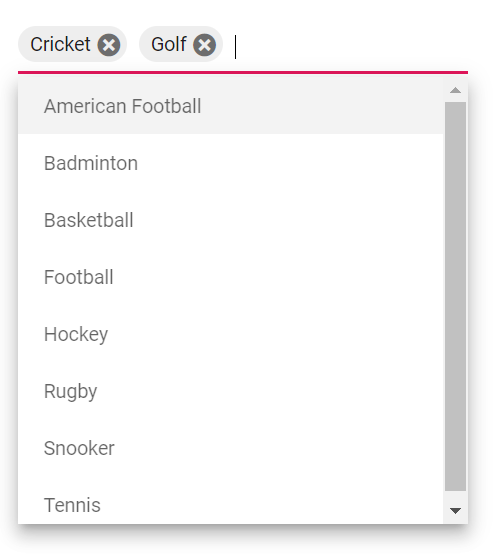
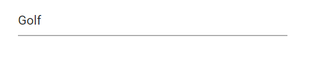

# Data Binding in Blazor MultiSelect Dropdown Component

Data binding can be achieved by using the `bind-Value` attribute and its supports string, int, Enum, DateTime, bool types. If component value has been changed, it will affect all the places where it is bound to the variable for the **bind-value** attribute.

```cshtml
@using Syncfusion.Blazor.DropDowns

@foreach (var SelectedValue in MultiVal)
{
    <p>MultiSelect value is:<strong>@SelectedValue</strong></p>
}

<SfMultiSelect Placeholder="e.g. Australia" @bind-Value="@MultiVal" DataSource="@Countries">
    <MultiSelectFieldSettings Value="Name"></MultiSelectFieldSettings>
</SfMultiSelect>

@code {

   public string[] MultiVal { get; set; } = new string[] { };

    public class Country
    {
        public string Name { get; set; }

        public string Code { get; set; }
    }

    List<Country> Countries = new List<Country>
{
        new Country() { Name = "Australia", Code = "AU" },
        new Country() { Name = "Bermuda", Code = "BM" },
        new Country() { Name = "Canada", Code = "CA" },
        new Country() { Name = "Cameroon", Code = "CM" },
    };
}
```

## Properties

### EnableChangeOnBlur

By default, the MultiSelect component fires the Change event while focus out the component.

If you want to fires the Change event on every value selection and remove, then disable the [EnabledChangeOnBlur](https://help.syncfusion.com/cr/blazor/Syncfusion.Blazor.DropDowns.SfMultiSelect-2.html#Syncfusion_Blazor_DropDowns_SfMultiSelect_2_EnableChangeOnBlur) property.

Default value of `EnableChangeOnBlur` is `true`.





 

### ID

Specifies the [ID](https://help.syncfusion.com/cr/blazor/Syncfusion.Blazor.DropDowns.SfMultiSelect-2.html#Syncfusion_Blazor_DropDowns_SfMultiSelect_2_ID) of the MultiSelect component.







### MaximumSelectionLength

Sets limitation to the value selection.

Based on the limitation, list selection will be prevented

Default value of [MaximumSelectionLength](https://help.syncfusion.com/cr/blazor/Syncfusion.Blazor.DropDowns.SfMultiSelect-2.html#Syncfusion_Blazor_DropDowns_SfMultiSelect_2_MaximumSelectionLength) is `1000`.









### Text

Selects the list item which maps the data [Text](https://help.syncfusion.com/cr/blazor/Syncfusion.Blazor.DropDowns.SfMultiSelect-2.html#Syncfusion_Blazor_DropDowns_SfMultiSelect_2_Text) field in the component.









### Value

Selects the list item which maps the data [Value](https://help.syncfusion.com/cr/blazor/Syncfusion.Blazor.DropDowns.SfMultiSelect-2.html#Syncfusion_Blazor_DropDowns_SfMultiSelect_2_Value) field in the component.








 
### ValueExpression

Specifies the expression for defining the value of the bound.

[Click to refer the code for ValueExpression](https://blazor.syncfusion.com/documentation/multiselect-dropdown/how-to/tooltip)

### GetDataByValueAsync(TValue)

Gets the array of data Object that matches the given array of values.

#### Declaration

> public Task<List<TItem>> GetDataByValueAsync(TValue dataValue)

#### Parameters

* dataValue	- Specifies the value(s).







### GetItemsAsync()

Gets all the list items bound on this component.

#### Declaration

> public Task<IEnumerable<TItem>> GetItemsAsync()








