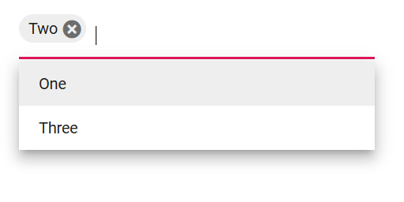

# Data Binding in Blazor MultiSelect Dropdown Component

The MultiSelect loads the data either from the local data sources or remote data services. Using the [DataSource](https://help.syncfusion.com/cr/blazor/Syncfusion.Blazor.DropDowns.SfDropDownBase-1.html#Syncfusion_Blazor_DropDowns_SfDropDownBase_1_DataSource) property,  bind the local data or using the [DataManager](https://help.syncfusion.com/cr/blazor/Syncfusion.Blazor.DataManager.html), bind the remote data.

* **TItem** - Specifies the type of the datasource of the multiselect component.

## Binding local data

The MultiSelect loads the data from local data sources through the [DataSource](https://help.syncfusion.com/cr/blazor/Syncfusion.Blazor.DropDowns.SfDropDownBase-1.html#Syncfusion_Blazor_DropDowns_SfDropDownBase_1_DataSource) property. It supports the data type of `Array of primitive type`, `Array of object`, `List of primitive type`,`List of object`, `Observable Collection`, `ExpandoObject`, `DynamicObject`.








### DataBound event

The [DataBound](https://help.syncfusion.com/cr/blazor/Syncfusion.Blazor.DropDowns.MultiSelectEvents-2.html#Syncfusion_Blazor_DropDowns_MultiSelectEvents_2_DataBound) event triggers when the data source is populated in the popup list.







### Primitive type

Bind the data to the MultiSelect as an array or list of the `string`, `int`, `double` and `bool` type items.

The following code demonstrates array of string values to the MultiSelect component.









The following code demonstrates array of integer values to the DropDownList component.








### Complex data type

The MultiSelect can generate its list items through an array of complex data. For this, the appropriate columns should be mapped to the [Fields](https://help.syncfusion.com/cr/blazor/Syncfusion.Blazor.DropDowns.MultiSelectFieldSettings.html) property.

In the following example, `Code.ID` column and `Country.CountryID` column from complex data have been mapped to the [Value](https://help.syncfusion.com/cr/blazor/Syncfusion.Blazor.DropDowns.MultiSelectFieldSettings.html#Syncfusion_Blazor_DropDowns_MultiSelectFieldSettings_Value) field and [Text](https://help.syncfusion.com/cr/blazor/Syncfusion.Blazor.DropDowns.MultiSelectFieldSettings.html#Syncfusion_Blazor_DropDowns_MultiSelectFieldSettings_Text) field, respectively.








### Expando object binding

Bind the [ExpandoObject](https://learn.microsoft.com/en-us/dotnet/api/system.dynamic.expandoobject?view=net-8.0) data to the MultiSelect component. In the following example, the `ExpandoObject` is bound to the collection of vehicles data.








### Observable collection binding

Bind the [ObservableCollection](https://blazor.syncfusion.com/documentation/common/data-binding/data-updates#observable-collection) data to the MultiSelect component. In the following example, the `Observable Data` is bound to a collection of colors data.








### Dynamic object binding

Bind the [DynamicObject](https://learn.microsoft.com/en-us/dotnet/api/system.dynamic.dynamicobject?view=net-8.0) data to the MultiSelect component. In the following example, the `DynamicObject` is bound to the collection of customer data.








### Enum data binding

Convert the Enum data into a list of strings and bind it to the [DataSource](https://help.syncfusion.com/cr/blazor/Syncfusion.Blazor.DropDowns.SfDropDownBase-1.html#Syncfusion_Blazor_DropDowns_SfDropDownBase_1_DataSource) property of the SfMultiSelect component to bind Enum types to the MultiSelect Dropdown component.








### ValueTuple data binding

Bind the [ValueTuple](https://learn.microsoft.com/en-us/dotnet/api/system.valuetuple-2?view=net-8.0) data to the MultiSelect component. The following code helps you to get a string value from the enumeration data by using [ValueTuple](https://learn.microsoft.com/en-us/dotnet/api/system.valuetuple-2?view=net-8.0).








## Binding remote data 

The MultiSelect supports the retrieval of data from the remote data services with the help of the [DataManager](https://blazor.syncfusion.com/documentation/data/getting-started) control. The [Query](https://help.syncfusion.com/cr/blazor/Syncfusion.Blazor.DropDowns.SfDropDownBase-1.html#Syncfusion_Blazor_DropDowns_SfDropDownBase_1_Query) property is used to fetch data from the database and bind it to the MultiSelect.

* [DataManager.Url](https://help.syncfusion.com/cr/blazor/Syncfusion.Blazor.DataManager.html#Syncfusion_Blazor_DataManager_Url) - Defines the service endpoint to fetch data.
* [DataManager.Adaptor](https://help.syncfusion.com/cr/blazor/Syncfusion.Blazor.DataManager.html#Syncfusion_Blazor_DataManager_Adaptor) - Defines the adaptor option. By default, the [ODataAdaptor](https://blazor.syncfusion.com/documentation/data/adaptors#odata-adaptor) is used for remote binding. The adaptor is responsible for processing responses and requests from or to the service endpoint. 
* [Syncfusion.Blazor.Data](https://www.nuget.org/packages/Syncfusion.Blazor.Data/) package provides some predefined adaptors that are designed to interact with particular service endpoints.

### OnActionBegin event

The [OnActionBegin](https://help.syncfusion.com/cr/blazor/Syncfusion.Blazor.DropDowns.MultiSelectEvents-2.html#Syncfusion_Blazor_DropDowns_MultiSelectEvents_2_OnActionBegin) event triggers before fetching data from the remote server.







### OnActionComplete event

The [OnActionComplete](https://help.syncfusion.com/cr/blazor/Syncfusion.Blazor.DropDowns.MultiSelectEvents-2.html#Syncfusion_Blazor_DropDowns_MultiSelectEvents_2_OnActionComplete) event triggers after data is fetched successfully from the remote server.







### OnActionFailure event

The [OnActionFailure](https://help.syncfusion.com/cr/blazor/Syncfusion.Blazor.DropDowns.MultiSelectEvents-2.html#Syncfusion_Blazor_DropDowns_MultiSelectEvents_2_OnActionFailure) event triggers when the data fetch request from the remote server fails.







### OData v4 services

The [OData v4 Adaptor](https://blazor.syncfusion.com/documentation/data/adaptors#odatav4-adaptor) provides the ability to consume and manipulate data from OData v4 services. The following sample displays the first six customer details from `Customers` table of the `Northwind` Data Service.








### Web API adaptor

The [Web API Adaptor](https://blazor.syncfusion.com/documentation/data/adaptors#web-api-adaptor) is used to interact with Web API created under OData standards. The `WebApiAdaptor` is extended from the [ODataAdaptor](https://blazor.syncfusion.com/documentation/data/adaptors#odata-adaptor). Hence to use the `WebApiAdaptor`, the endpoint should understand the OData formatted queries sent along with the request. 








### Custom adaptor

The [SfDataManager](https://help.syncfusion.com/cr/aspnetcore-blazor/Syncfusion.Blazor.Data.SfDataManager.html) has custom adaptor support which allows to perform manual operations on the data. This can be utilized for implementing custom data binding and editing operations in the MultiSelect component.

For implementing custom data binding in MultiSelect, the `DataAdaptor` class is used. This abstract class acts as a base class for the custom adaptor.

The `DataAdaptor` abstract class has both synchronous and asynchronous method signatures which can be overridden in the custom adaptor.

```csharp
public abstract class DataAdaptor
{
    /// <summary>
    /// Performs data Read operation synchronously.
    /// </summary>
    public virtual object Read(DataManagerRequest dataManagerRequest, string key = null)

    /// <summary>
    /// Performs data Read operation asynchronously.
    /// </summary>
    public virtual Task<object> ReadAsync(DataManagerRequest dataManagerRequest, string key = null)
}
```

The custom data binding can be performed in the MultiSelect component by providing the custom adaptor class and overriding the Read or ReadAsync method of the DataAdaptor abstract class.

The following sample code demonstrates implementing custom data binding using custom adaptor.







### Offline mode

To avoid post back for every action, set the MultiSelect to load all data on initialization and make the actions process in client-side. To enable this behaviour, use the `Offline` property of `DataManager`.

The following example is for remote data binding and enabled offline mode.








## Entity Framework

Follow these steps to consume data from the [Entity Framework](https://blazor.syncfusion.com/documentation/common/data-binding/bind-entity-framework) in the MultiSelect component.

#### Create DBContext class

The first step is to create a DBContext class called `OrderContext` to connect to a Microsoft SQL Server database.

```csharp
using Microsoft.EntityFrameworkCore;
using System;
using System.Collections.Generic;
using System.Linq;
using System.Threading.Tasks;
using EFDropDown.Shared.Models;

namespace EFDropDown.Shared.DataAccess
{
    public class OrderContext : DbContext
    {
        public virtual DbSet<Shared.Models.Order> Orders { get; set; }

        protected override void OnConfiguring(DbContextOptionsBuilder optionsBuilder)
        {
            if (!optionsBuilder.IsConfigured)
            {
                optionsBuilder.UseSqlServer(@"Data Source=(LocalDB)\MSSQLLocalDB;AttachDbFilename=D:\Blazor\DropDownList\EFDropDown\Shared\App_Data\NORTHWND.MDF;Integrated Security=True;Connect Timeout=30");
            }
        }
    }
}
```

### Create data access layer to perform data operation

Now, create a class named `OrderDataAccessLayer`, which act as data access layer for retrieving the records from the database table.

```csharp
using Microsoft.EntityFrameworkCore;
using System;
using System.Collections.Generic;
using System.Linq;
using System.Threading.Tasks;
using EFDropDown.Shared.Models;

namespace EFDropDown.Shared.DataAccess
{
    public class OrderDataAccessLayer
    {
        OrderContext db = new OrderContext();

        //To Get all Orders details
        public DbSet<Order> GetAllOrders()
        {
            try
            {
                return db.Orders;
            }
            catch
            {
                throw;
            }
        }
    }
}
```

#### Creating web API controller

A Web API Controller has to be created which allows MultiSelect directly to consume data from the Entity framework.

```csharp
using EFDropDown.Shared.DataAccess;
using EFDropDown.Shared.Models;
using Microsoft.AspNetCore.Mvc;
using Microsoft.Extensions.Primitives;
using System;
using System.Collections.Generic;
using System.Linq;
using System.Threading.Tasks;
using System.Web;
using Microsoft.AspNetCore.Http;

namespace EFDropDown.Controllers
{
    [Route("api/[controller]")]
    [ApiController]
    //TreeGrid
    public class DefaultController : ControllerBase
    {
        OrderDataAccessLayer db = new OrderDataAccessLayer();
        [HttpGet]
        public object Get()
        {
            IQueryable<Order> data = db.GetAllOrders().AsQueryable();
            var count = data.Count();
            var queryString = Request.Query;
            if (queryString.Keys.Contains("$inlinecount"))
            {
                StringValues Skip;
                StringValues Take;
                int skip = (queryString.TryGetValue("$skip", out Skip)) ? Convert.ToInt32(Skip[0]) : 0;
                int top = (queryString.TryGetValue("$top", out Take)) ? Convert.ToInt32(Take[0]) : data.Count();
                return new { Items = data.Skip(skip).Take(top), Count = count };
            }
            else
            {
                return data;
            }
         }
    }
}
```

### Configure MultiSelect component using Web API adaptor

Now, configure the MultiSelect using the [SfDataManager](https://blazor.syncfusion.com/documentation/data/getting-started) to interact with the created Web API and consume the data appropriately. To interact with web API, use the [WebApiAdaptor](https://blazor.syncfusion.com/documentation/data/adaptors#web-api-adaptor).







## Adding new items

Add the new item in the popup with the help of [AddItemsAsync](https://help.syncfusion.com/cr/blazor/Syncfusion.Blazor.DropDowns.SfDropDownBase-1.html#Syncfusion_Blazor_DropDowns_SfDropDownBase_1_AddItemsAsync_System_Collections_Generic_IEnumerable__0__System_Nullable_System_Int32__) public method. This method will add a mentioned item in the MultiSelect popup without affecting the data source items.








## Customizing the Change Event

MultiSelect component by default fires the `Change event` when the component loses focus. However, if you want the Change event to be fired every time a value is selected or removed, disable the [EnabledChangeOnBlur](https://help.syncfusion.com/cr/blazor/Syncfusion.Blazor.DropDowns.SfMultiSelect-2.html#Syncfusion_Blazor_DropDowns_SfMultiSelect_2_EnableChangeOnBlur) property. This will make the Change event be fired on every value selection and removal instead of just when the component loses focus. The default value of `EnableChangeOnBlur` is `true.`





 

## Get Data by value

You can retrieve the selected value from the dropdown list by using the `GetDataByValue(TValue)` method through an instance of the dropdown list. You can bind the click event of a button to the `GetDataByValue(TValue)` method of the dropdown list instance. When the button is clicked, it will trigger the `GetDataByValue(TValue)` method on the dropdown list and return the selected value.







## Get List Item

You can retrieve the list items from the dropdown list by using the `GetItemsAsync()` method through an instance of the dropdown list. You can bind the click event of a button to the `GetItemsAsync()` method of the dropdown list instance. When the button is clicked, it will trigger the `GetItemsAsync()` method on the dropdown list and return the list items





 