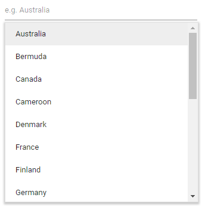

# Data Source in Blazor MultiSelect Dropdown Component

The MultiSelect loads data from local collections or remote services using the [DataSource](https://help.syncfusion.com/cr/blazor/Syncfusion.Blazor.DropDowns.SfDropDownBase-1.html#Syncfusion_Blazor_DropDowns_SfDropDownBase_1_DataSource) property. Local data can be an array, list, or any IEnumerable. Remote data is bound via [DataManager](https://help.syncfusion.com/cr/blazor/Syncfusion.Blazor.DataManager.html).

The MultiSelect also supports various data services such as OData, OData v4, and Web API, and data formats including XML, JSON, and JSONP by using [DataManager](https://help.syncfusion.com/cr/blazor/Syncfusion.Blazor.DataManager.html) adaptors.

| Fields | Type | Description |
|------|------|-------------|
| Text |  `string` | Specifies the display text of each list item. |
| Value |  `int or string` | Specifies the hidden data value mapped to each list item that should contain a unique value. |
| GroupBy |  `string` | Specifies the category under which the list item has to be grouped. |
| IconCss |  `string` | Specifies the icon class of each list item. |

N> When binding complex data to the MultiSelect, fields must be mapped correctly. Otherwise, the selected item remains undefined.

## Binding local data

Local data can be represented in two ways as described below.

### Array of object

The MultiSelect can generate its list items through an array of complex data. For this, the appropriate columns should be mapped to the [Fields](https://help.syncfusion.com/cr/blazor/Syncfusion.Blazor.DropDowns.FieldSettingsModel.html) property.

In the following example, `Name` column from complex data have been mapped to the `Value` field.

```cshtml
@using Syncfusion.Blazor.DropDowns

<SfMultiSelect TValue="string[]" TItem="Country" Placeholder="e.g. Australia" DataSource="@Countries">
    <MultiSelectFieldSettings Text="Name" Value="Code"></MultiSelectFieldSettings>
</SfMultiSelect>

@code {

    public class Country
    {
        public string Name { get; set; }

        public string Code { get; set; }
    }

    List<Country>Countries = new List<Country>
    {
        new Country() { Name = "Australia", Code = "AU" },
        new Country() { Name = "Bermuda", Code = "BM" },
        new Country() { Name = "Canada", Code = "CA" },
        new Country() { Name = "Cameroon", Code = "CM" },
        new Country() { Name = "Denmark", Code = "DK" },
        new Country() { Name = "France", Code = "FR" },
        new Country() { Name = "Finland", Code = "FI" },
        new Country() { Name = "Germany", Code = "DE" },
        new Country() { Name = "Greenland", Code = "GL" },
        new Country() { Name = "Hong Kong", Code = "HK" },
        new Country() { Name = "India", Code = "IN" },
        new Country() { Name = "Italy", Code = "IT" },
        new Country() { Name = "Japan", Code = "JP" },
        new Country() { Name = "Mexico", Code = "MX" },
        new Country() { Name = "Norway", Code = "NO" },
        new Country() { Name = "Poland", Code = "PL" },
        new Country() { Name = "Switzerland", Code = "CH" },
        new Country() { Name = "United Kingdom", Code = "GB" },
        new Country() { Name = "United States", Code = "US" },
    };
}
```



### Array of complex object

The MultiSelect can generate its list items from an array of complex data. Map the appropriate fields to the [Fields](https://help.syncfusion.com/cr/blazor/Syncfusion.Blazor.DropDowns.MultiSelectFieldSettings.html) property.

In the following example, the `Code.ID` field and `Country.CountryID` field from complex data are mapped to the `Value` and `Text` fields, respectively.

```cshtml
@using Syncfusion.Blazor.DropDowns

<SfMultiSelect TValue="string[]" TItem="Complex" Placeholder="e.g. Select a country" DataSource="@LocalData">
    <MultiSelectFieldSettings Text="Country.CountryID" Value="Code.ID"></MultiSelectFieldSettings>
</SfMultiSelect>

@code {

public List<Complex> LocalData { get; set; } = new Complex().GetData();

    public class Code
    {
        public string ID { get; set; }
    }

    public class Country
    {
        public string CountryID { get; set; }
    }

    public class Complex
    {
        public Country Country { get; set; }
        public Code Code { get; set; }
        public List<Complex> GetData() {
             List<Complex>Data = new List<Complex>();
            Data.Add(new Complex() { Country = new Country() { CountryID = "Australia" }, Code = new Code() { ID = "AU" } });
            Data.Add(new Complex() { Country = new Country() { CountryID = "Bermuda" }, Code = new Code() { ID = "BM" } });
            Data.Add(new Complex() { Country = new Country() { CountryID = "Canada" }, Code = new Code() { ID = "CA" } });
            Data.Add(new Complex() { Country = new Country() { CountryID = "Cameroon" }, Code = new Code() { ID = "CM" } });
            Data.Add(new Complex() { Country = new Country() { CountryID = "Denmark" }, Code = new Code() { ID = "DK" } });
            Data.Add(new Complex() { Country = new Country() { CountryID = "France" }, Code = new Code() { ID = "FR" } });
            return Data;
         }
     }
}
```


## Binding remote data

The MultiSelect supports retrieving data from remote services by using the `DataManager` component. The [Query](https://help.syncfusion.com/cr/blazor/Syncfusion.Blazor.DropDowns.SfDropDownBase-1.html#Syncfusion_Blazor_DropDowns_SfDropDownBase_1_Query) property is used to fetch data from the server and bind it to the MultiSelect.

The following sample displays the first six orders from the `Orders` table of the `Northwind` OData v4 service.

```cshtml
@using Syncfusion.Blazor.Data
@using Syncfusion.Blazor.DropDowns

<SfMultiSelect TValue="string[]" TItem="OrderDetails" Placeholder="Select a customer" Query="@Query">
    <SfDataManager Url="https://services.odata.org/V4/Northwind/Northwind.svc/Orders" Adaptor="Adaptors.ODataV4Adaptor" CrossDomain=true></SfDataManager>
    <MultiSelectFieldSettings Text="CustomerID" Value="OrderID"></MultiSelectFieldSettings>
</SfMultiSelect>

@code {
    public Query Query = new Query().Select(new List<string> { "CustomerID", "OrderID" }).Take(6).RequiresCount();

    public class OrderDetails
        {
            public int? OrderID { get; set; }
            public string CustomerID { get; set; }
            public int? EmployeeID { get; set; }
            public double? Freight { get; set; }
            public string ShipCity { get; set; }
            public bool Verified { get; set; }
            public DateTime? OrderDate { get; set; }
            public string ShipName { get; set; }
            public string ShipCountry { get; set; }
            public DateTime? ShippedDate { get; set; }
            public string ShipAddress { get; set; }
        }
}
```


### Web API Adaptor

Use the `WebApiAdaptor` to bind the MultiSelect with Web API endpoints that follow OData conventions.

```cshtml
@using Syncfusion.Blazor.Data
@using Syncfusion.Blazor.DropDowns

<SfMultiSelect TValue="string[]" Placeholder="Select a Employee" Query="@Query">
    <SfDataManager Url="https://ej2services.syncfusion.com/production/web-services/api/Employees" Adaptor="Adaptors.WebApiAdaptor" CrossDomain=true></SfDataManager>
    <MultiSelectFieldSettings Text="FirstName" Value="EmployeeID"></MultiSelectFieldSettings>
</SfMultiSelect>

@code {
   public Query Query = new Query();

    public class EmployeeData
    {
        public int EmployeeID { get; set; }
        public string FirstName { get; set; }
        public string Designation { get; set; }
        public string Country { get; set; }
    }
}
```


### Custom Adaptor

The [SfDataManager](https://help.syncfusion.com/cr/blazor/Syncfusion.Blazor.Data.SfDataManager.html) has custom adaptor support that allows manual operations on data. This can be used to implement custom data binding and editing operations in the MultiSelect component.

For custom data binding in the MultiSelect, use the `DataAdaptor` class. This abstract class acts as a base class for the custom adaptor.

The `DataAdaptor` abstract class has both synchronous and asynchronous method signatures that can be overridden in the custom adaptor.

```csharp
public abstract class DataAdaptor
{
    /// <summary>
    /// Performs data Read operation synchronously.
    /// </summary>
    public virtual object Read(DataManagerRequest dataManagerRequest, string key = null)

    /// <summary>
    /// Performs data Read operation asynchronously.
    /// </summary>
    public virtual Task<object> ReadAsync(DataManagerRequest dataManagerRequest, string key = null)
}
```

The custom data binding can be performed in the MultiSelect component by providing the custom adaptor class and overriding the Read or ReadAsync method of the DataAdaptor abstract class.

```cshtml
<SfMultiSelect TValue="string[]" TItem="Orders">
    <SfDataManager AdaptorInstance="@typeof(CustomAdaptor)" Adaptor="Adaptors.CustomAdaptor"></SfDataManager>
    <MultiSelectFieldSettings Value="CustomerID"></MultiSelectFieldSettings>
</SfMultiSelect>

@code{

    public class Orders
    {
        public Orders() { }
        public Orders(int OrderID, string CustomerID)
        {
            this.OrderID = OrderID;
            this.CustomerID = CustomerID;
        }
        public int OrderID { get; set; }
        public string CustomerID { get; set; }
    }
    public class CustomAdaptor : DataAdaptor
    {
        public static List<OrdersDetails> order = OrdersDetails.GetAllRecords();
        public override object Read(DataManagerRequest dm, string key = null)
        {
            IEnumerable<OrdersDetails> DataSource = order;
            if (dm.Search != null && dm.Search.Count > 0)
            {
                DataSource = DataOperations.PerformSearching(DataSource, dm.Search);  //Search
            }
            if (dm.Sorted != null && dm.Sorted.Count > 0) //Sorting
            {
                DataSource = DataOperations.PerformSorting(DataSource, dm.Sorted);
            }
            if (dm.Where != null && dm.Where.Count > 0) //Filtering
            {
                DataSource = DataOperations.PerformFiltering(DataSource, dm.Where, dm.Where[0].Operator);
            }
            int count = DataSource.Cast<OrdersDetails>().Count();
            if (dm.Skip != 0)
            {
                DataSource = DataOperations.PerformSkip(DataSource, dm.Skip);         //Paging
            }
            if (dm.Take != 0)
            {
                DataSource = DataOperations.PerformTake(DataSource, dm.Take);
            }
            return dm.RequiresCounts ? new DataResult() { Result = DataSource, Count = count } : (object)DataSource;
       }
    }
}
```

### Offline mode

To avoid a postback for every action, load all data during initialization and process actions on the client. To enable this behavior, use the `Offline` property of `DataManager`.

```cshtml
@using Syncfusion.Blazor.Data
@using Syncfusion.Blazor.DropDowns

<SfMultiSelect TValue="string[]" TItem="EmployeeData" Placeholder="Select a Employee" Query="@Query">
    <SfDataManager Url="https://ej2services.syncfusion.com/production/web-services/api/Employees" Adaptor="Adaptors.WebApiAdaptor" CrossDomain=true Offline=true></SfDataManager>
    <MultiSelectFieldSettings Text="FirstName" Value="EmployeeID"></MultiSelectFieldSettings>
</SfMultiSelect>

@code {
    public Query Query = new Query();

    public class EmployeeData
    {
        public int EmployeeID { get; set; }
        public string FirstName { get; set; }
        public string Designation { get; set; }
        public string Country { get; set; }
    }
}
```


### ValueTuple data binding

Bind [ValueTuple](https://learn.microsoft.com/en-us/dotnet/api/system.valuetuple-2?view=net-8.0) data to the MultiSelect component. The following code shows how to get a string value from enumeration data by using [ValueTuple](https://learn.microsoft.com/en-us/dotnet/api/system.valuetuple-2?view=net-8.0).

```csharp

@using Syncfusion.Blazor.DropDowns;

<SfMultiSelect TItem="(DayOfWeek, string)" Width="250px" TValue="DayOfWeek[]"
               DataSource="@(Enum.GetValues<DayOfWeek>().Select(e => (e, e.ToString())))">
    <MultiSelectFieldSettings Value="Item1" Text="Item2" />
</SfMultiSelect>

```


## Binding ExpandoObject

Bind [ExpandoObject](https://learn.microsoft.com/en-us/dotnet/api/system.dynamic.expandoobject?view=net-8.0) data to the MultiSelect component. In the following example, `ExpandoObject` is bound to a collection of vehicles.

```csharp

@using Syncfusion.Blazor.DropDowns
@using System.Dynamic

<SfMultiSelect TItem="ExpandoObject" TValue="string[]" PopupHeight="230px" Placeholder="Select a vehicle" DataSource="@VehicleData">
    <MultiSelectFieldSettings Text="Text" Value="ID"></MultiSelectFieldSettings>
</SfMultiSelect>

@code{
    public List<ExpandoObject> VehicleData { get; set; } = new List<ExpandoObject>();
    protected override void OnInitialized()
    {
        VehicleData = Enumerable.Range(1, 15).Select((x) =>
        {
            dynamic d = new ExpandoObject();
            d.ID = (1000 + x).ToString();
            d.Text = (new string[] { "Hennessey Venom", "Bugatti Chiron", "Bugatti Veyron Super Sport", "SSC Ultimate Aero", "Koenigsegg CCR", "McLaren F1", "Aston Martin One- 77", "Jaguar XJ220", "McLaren P1", "Ferrari LaFerrari", "Mahindra Jaguar", "Hyundai Toyota", "Jeep Volkswagen", "Tata Maruti Suzuki", "Audi Mercedes Benz" }[x - 1]);
            return d;
        }).Cast<ExpandoObject>().ToList<ExpandoObject>();
    }
}

```


## Binding DynamicObject

Bind [DynamicObject](https://learn.microsoft.com/en-us/dotnet/api/system.dynamic.dynamicobject?view=net-8.0) data to the MultiSelect component. In the following example, `DynamicObject` is bound to a collection of customers.

```csharp

@using Syncfusion.Blazor.DropDowns
@using System.Dynamic

<SfMultiSelect TValue="string[]" TItem="DynamicDictionary" Placeholder="Select a name" DataSource="@Orders">
    <MultiSelectFieldSettings Text="CustomerName" Value="CustomerName"></MultiSelectFieldSettings>
</SfMultiSelect>

@code{
    public List<DynamicDictionary> Orders = new List<DynamicDictionary>() { };
    protected override void OnInitialized()
    {
        Orders = Enumerable.Range(1, 15).Select((x) =>
        {
            dynamic d = new DynamicDictionary();
            d.OrderID = 1000 + x;
            d.CustomerName = (new string[] { "Nancy", "Andrew", "Janet", "Margaret", "Steven", "Michael", "Robert", "Anne", "Nige", "Fuller", "Dodsworth", "Leverling", "Callahan", "Suyama", "Davolio" }[x - 1]);
            return d;
        }).Cast<DynamicDictionary>().ToList<DynamicDictionary>();
    }
    public class DynamicDictionary : System.Dynamic.DynamicObject
    {
        Dictionary<string, object> dictionary = new Dictionary<string, object>();
        public override bool TryGetMember(GetMemberBinder binder, out object result)
        {
            string name = binder.Name;
            return dictionary.TryGetValue(name, out result);
        }
        public override bool TrySetMember(SetMemberBinder binder, object value)
        {
            dictionary[binder.Name] = value;
            return true;
        }
        //The GetDynamicMemberNames method of DynamicObject class must be overridden and return the property names to perform data operation and editing while using DynamicObject.
        public override System.Collections.Generic.IEnumerable<string> GetDynamicMemberNames()
        {
            return this.dictionary?.Keys;
        }
    }
}

```


## Binding ObservableCollection

Bind [ObservableCollection](https://learn.microsoft.com/en-us/dotnet/api/system.collections.objectmodel.observablecollection-1?view=net-8.0) data to the MultiSelect component. The following example `Observable Data` is bound to a collection of colors data.

```csharp

@using Syncfusion.Blazor.DropDowns
@using System.Collections.ObjectModel;

<SfMultiSelect TValue="string[]" TItem="Colors" PopupHeight="230px" Placeholder="Select a color" DataSource="@ColorsData">
    <MultiSelectFieldSettings Text="Color" Value="Code"></MultiSelectFieldSettings>
</SfMultiSelect>

@code {
    public class Colors
    {
        public string Code { get; set; }
        public string Color { get; set; }
    }
    private ObservableCollection<Colors> ColorsData = new ObservableCollection<Colors>()
    {
        new Colors() { Color = "Chocolate", Code = "#75523C" },
        new Colors() { Color = "CadetBlue", Code = "#3B8289" },
        new Colors() { Color = "DarkOrange", Code = "#FF843D" },
        new Colors() { Color = "DarkRed", Code = "#CA3832"},
        new Colors() { Color = "Fuchsia", Code = "#D44FA3" },
        new Colors() { Color = "HotPink", Code = "#F23F82" },
        new Colors() { Color = "Indigo", Code = "#2F5D81" },
        new Colors() { Color = "LimeGreen", Code = "#4CD242" },
        new Colors() { Color = "OrangeRed", Code = "#FE2A00" },
        new Colors() { Color = "Tomato", Code = "#FF745C" },
        new Colors() { Color = "Brown", Code = "#A52A2A" },
        new Colors() { Color = "Maroon", Code = "#800000" },
        new Colors() { Color = "Green", Code = "#008000" },
        new Colors() { Color = "Pink", Code = "#FFC0CB" },
        new Colors() { Color = "Purple", Code = "#800080" }
    };
}

```


## Entity Framework

Follow these steps to consume data from the **Entity Framework** in the MultiSelect component.

### Create DBContext class

Create a DBContext class called **OrderContext** to connect to a Microsoft SQL Server database.

```csharp
using Microsoft.EntityFrameworkCore;
using System;
using System.Collections.Generic;
using System.Linq;
using System.Threading.Tasks;
using EFDropDown.Shared.Models;

namespace EFDropDown.Shared.DataAccess
{
    public class OrderContext : DbContext
    {
        public virtual DbSet<Shared.Models.Order> Orders { get; set; }

        protected override void OnConfiguring(DbContextOptionsBuilder optionsBuilder)
        {
            if (!optionsBuilder.IsConfigured)
            {
                optionsBuilder.UseSqlServer(@"Data Source=(LocalDB)\MSSQLLocalDB;AttachDbFilename=D:\Blazor\DropDownList\EFDropDown\Shared\App_Data\NORTHWND.MDF;Integrated Security=True;Connect Timeout=30");
            }
        }
    }
}
```

### Create data access layer to perform data operation

Create a class named **OrderDataAccessLayer** that acts as the data access layer for retrieving records from the database table.

```csharp
using Microsoft.EntityFrameworkCore;
using System;
using System.Collections.Generic;
using System.Linq;
using System.Threading.Tasks;
using EFDropDown.Shared.Models;

namespace EFDropDown.Shared.DataAccess
{
    public class OrderDataAccessLayer
    {
        OrderContext db = new OrderContext();

        //To Get all Orders details
        public DbSet<Order> GetAllOrders()
        {
            try
            {
                return db.Orders;
            }
            catch
            {
                throw;
            }
        }
    }
}
```

### Creating Web API Controller

A Web API controller must be created to allow the MultiSelect to consume data directly from Entity Framework.

```csharp
using EFDropDown.Shared.DataAccess;
using EFDropDown.Shared.Models;
using Microsoft.AspNetCore.Mvc;
using Microsoft.Extensions.Primitives;
using System;
using System.Collections.Generic;
using System.Linq;
using System.Threading.Tasks;
using System.Web;
using Microsoft.AspNetCore.Http;

namespace EFDropDown.Controllers
{
    [Route("api/[controller]")]
    [ApiController]
    //TreeGrid
    public class DefaultController : ControllerBase
    {
        OrderDataAccessLayer db = new OrderDataAccessLayer();
        [HttpGet]
        public object Get()
        {
            IQueryable<Order> data = db.GetAllOrders().AsQueryable();
            var count = data.Count();
            var queryString = Request.Query;
            if (queryString.Keys.Contains("$inlinecount"))
            {
                StringValues Skip;
                StringValues Take;
                int skip = (queryString.TryGetValue("$skip", out Skip)) ? Convert.ToInt32(Skip[0]) : 0;
                int top = (queryString.TryGetValue("$top", out Take)) ? Convert.ToInt32(Take[0]) : data.Count();
                return new { Items = data.Skip(skip).Take(top), Count = count };
            }
            else
            {
                return data;
            }
         }
    }
}
```

### Configure MultiSelect component using Web API adaptor

Now, the MultiSelect can be configured using the **'SfDataManager'** to interact with the created Web API and consume the data appropriately. To interact with a Web API, use `WebApiAdaptor`.

```cshtml
@using Syncfusion.Blazor.Data
@using Syncfusion.Blazor.DropDowns

<SfMultiSelect TValue="string[]" TItem="Order" Placeholder="Select a Country">
    <SfDataManager Url="api/Default" Adaptor="Adaptors.WebApiAdaptor" CrossDomain="true"></SfDataManager>
    <MultiSelectFieldSettings  Text="ShipCountry" Value="OrderID"></MultiSelectFieldSettings>
</SfMultiSelect>

@code{
    public class Order
    {
        public int? OrderID { get; set; }
        public string[] ShipCountry { get; set; }
    }
}
```