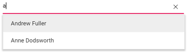
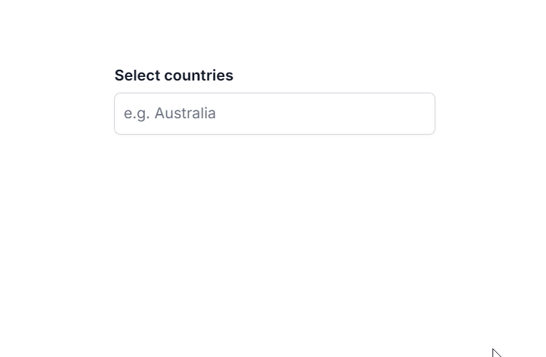
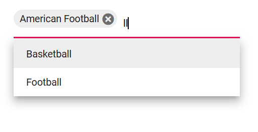
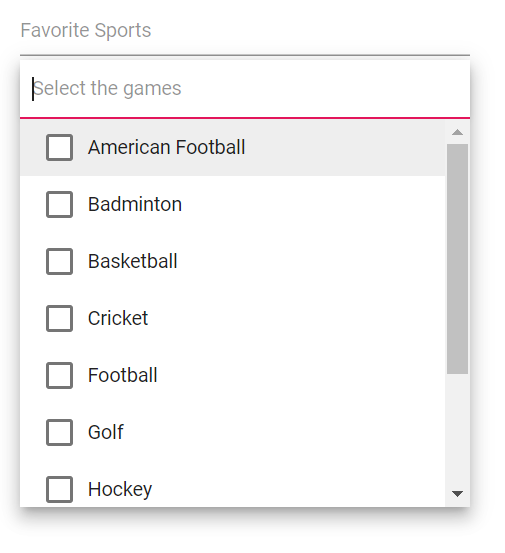
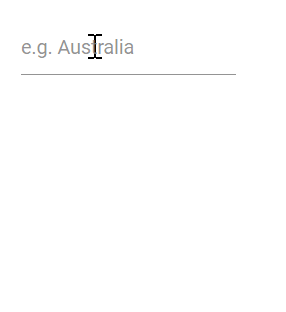

# Filtering in Blazor MultiSelect Dropdown Component

The MultiSelect provides built-in filtering when [AllowFiltering](https://help.syncfusion.com/cr/blazor/Syncfusion.Blazor.DropDowns.MultiSelectModel-1.html#Syncfusion_Blazor_DropDowns_MultiSelectModel_1_AllowFiltering) is enabled. Filtering begins as the user types in the search box. The default value of AllowFiltering is `false`.

## Local data

The following example demonstrates filtering with local data in the MultiSelect component.







## Remote data

For remote data, each keystroke triggers a server query for filtering (subject to debounce settings). Use an adaptor such as [ODataAdaptor](https://blazor.syncfusion.com/documentation/data/adaptors#odata-adaptor) along with the [Query](https://help.syncfusion.com/cr/blazor/Syncfusion.Blazor.Data.Query.html) property to perform server-side filtering. For best performance, combine remote filtering with debounce or a minimum character length.

The following example demonstrates remote filtering using OData.







## Debounce delay

Use the [DebounceDelay](https://help.syncfusion.com/cr/blazor/Syncfusion.Blazor.DropDowns.SfMultiSelect-2.html#Syncfusion_Blazor_DropDowns_SfMultiSelect_2_DebounceDelay) property to delay filtering requests by a specified number of milliseconds. This reduces the frequency of queries while typing and improves responsiveness. The default debounce delay is 300 ms. To disable debouncing, set the value to 0.







## Filter type

Use the [FilterType](https://help.syncfusion.com/cr/blazor/Syncfusion.Blazor.DropDowns.SfDropDownBase-1.html#Syncfusion_Blazor_DropDowns_SfDropDownBase_1_FilterType) property to specify how search text is matched against item text.

FilterType     | Description
------------ | -------------
[StartsWith](https://help.syncfusion.com/cr/blazor/Syncfusion.Blazor.DropDowns.FilterType.html#Syncfusion_Blazor_DropDowns_FilterType_StartsWith) | Checks whether the value starts with the specified text.
[EndsWith](https://help.syncfusion.com/cr/blazor/Syncfusion.Blazor.DropDowns.FilterType.html#Syncfusion_Blazor_DropDowns_FilterType_EndsWith) | Checks whether the value ends with the specified text.
[Contains](https://help.syncfusion.com/cr/blazor/Syncfusion.Blazor.DropDowns.FilterType.html#Syncfusion_Blazor_DropDowns_FilterType_Contains) | Checks whether the value contains the specified text.

In the following example, the `EndsWith` filter type is configured using the `FilterType` property.







## Case sensitive filtering

Data items can be filtered with or without case sensitivity using the [DataManager](https://help.syncfusion.com/cr/blazor/Syncfusion.Blazor.Data.SfDataManager.html). Specify the [IgnoreCase](https://help.syncfusion.com/cr/blazor/Syncfusion.Blazor.Data.WhereFilter.html#Syncfusion_Blazor_Data_WhereFilter_IgnoreCase) option in the [Where](https://help.syncfusion.com/cr/blazor/Syncfusion.Blazor.Data.Query.html#Syncfusion_Blazor_Data_Query_Where_Syncfusion_Blazor_Data_WhereFilter_) clause to control case sensitivity.

The following example shows case-sensitive filtering.







## Filter text box placeholder 

Display watermark text in the filter bar by using the [FilterBarPlaceholder](https://help.syncfusion.com/cr/blazor/Syncfusion.Blazor.DropDowns.SfMultiSelect-2.html#Syncfusion_Blazor_DropDowns_SfMultiSelect_2_FilterBarPlaceholder) property. This applies when [AllowFiltering](https://help.syncfusion.com/cr/blazor/Syncfusion.Blazor.DropDowns.SfMultiSelect-2.html#Syncfusion_Blazor_DropDowns_SfMultiSelect_2_AllowFiltering) is set to `true` in CheckBox mode.`FilterBarPlaceholder` is depends on `AllowFiltering` in checkbox mode.





 

## Custom Filtering

The MultiSelect filtering query can be customized through the Filtering event. Custom filter libraries (for example, fuzzy search) can also be integrated.







## Minimum filter length

To control when remote filtering occurs, validate the minimum number of characters before sending a query by using the [Filtering event arguments](https://help.syncfusion.com/cr/blazor/Syncfusion.Blazor.DropDowns.FilteringEventArgs.html#Syncfusion_Blazor_DropDowns_FilteringEventArgs_Text) within the [Filtering](https://help.syncfusion.com/cr/blazor/Syncfusion.Blazor.DropDowns.MultiSelectEvents-2.html#Syncfusion_Blazor_DropDowns_MultiSelectEvents_2_Filtering) event handler.

In the following example, a remote request is not made until the search text contains at least three characters.







