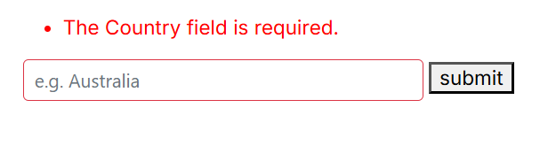
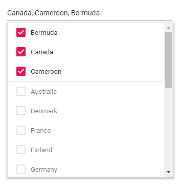

# Form Validation in MultiSelect

## Edit form validation

The MultiSelect component can be used inside an EditForm to create a form that includes a list for selecting an option. The `EditForm` component validates all data annotation rules using the `DataAnnotationsValidator` component.

When the MultiSelect input is valid, the form is ready to be submitted. If the input is invalid, an error message will be displayed until a valid value is chosen.

* The EditForm component wraps the entire form, has the Model attribute set to the model variable of type Countries, and triggers the handleSubmit() method when the form is submitted.
* The DataAnnotationsValidator component enables validation based on the Data Annotations attributes applied on the model properties.
* The ValidationSummary component displays a summary of all validation errors on the form.
* The ValidationMessage component displays a validation error message for the Name property of the model variable.
* The submit button submits the form and triggers the handleSubmit() method when clicked.







## Selection Limit

The number of selectable items in the MultiSelect component can be limited by setting the [MaximumSelectionLength](https://help.syncfusion.com/cr/blazor/Syncfusion.Blazor.DropDowns.SfMultiSelect-2.html#Syncfusion_Blazor_DropDowns_SfMultiSelect_2_MaximumSelectionLength) property.

In the example below, the selection limit is set to three items, and the MultiSelect component displays the selected items in CheckBox mode.







