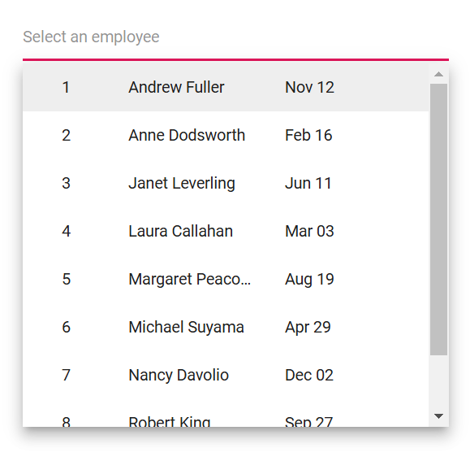

# Multicolumn MultiSelect Dropdown

Display two or more columns in the popup by applying the `e-multi-column` class through the [CssClass](https://help.syncfusion.com/cr/blazor/Syncfusion.Blazor.DropDowns.SfMultiSelect-2.html#Syncfusion_Blazor_DropDowns_SfMultiSelect_2_CssClass) property. This organizes item content into a grid-like layout within each list item.

- [ItemTemplate](https://blazor.syncfusion.com/documentation/multiselect-dropdown/templates#item-template) – Use `ItemTemplate` to define the columns rendered for each item in the popup.
- [ValueTemplate](https://blazor.syncfusion.com/documentation/multiselect-dropdown/templates#value-template) – Use `ValueTemplate` to control how the selected value (chips/input) is displayed based on the defined columns.

Use the built-in utility classes below to control text alignment within each column:

- `e-text-center`: Centers the text in the column.
- `e-text-right`: Right-aligns the text in the column.
- `e-text-left`: Left-aligns the text in the column.









## How to display multicolumn item and CheckBox inline

To align the checkbox and item details on the same line within a templated item, apply the following CSS. These styles position the checkbox so it appears inline with the item content:

 ```css
    .e-popup.e-multi-select-list-wrapper .e-list-item .e-checkbox-wrapper {
     position: absolute;
     top: 10px;
     left: 5px;
   }
```

## Limitations of multicolumn layout

- Column-level features such as filtering and sorting are not supported.
- The multicolumn layout visually aligns fields in a grid-like manner but does not provide a full data grid feature set.