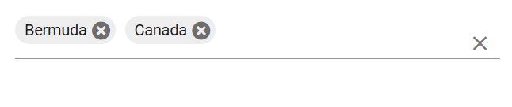
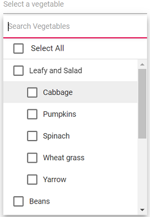

# Multiple Selection Display Modes

## Basic modes

The MultiSelect component provides multiple display modes to visualize selected items:

- `Default`: Selected items are displayed as chip type when the component is in focus. Otherwise, selected items are displayed with a delimiter character.
- `Box`: The selected items are displayed as a chip (box) type in the MultiSelect input box.
- `Delimiter`: The selected items are displayed with a delimiter character in the MultiSelect input box.

## Box mode

In Box mode, selected values are displayed as chips (boxes) within the MultiSelect input field, even after the component loses focus.







### Show the chip remove icon based on conditions

The chip cancel (remove) icon can be shown or hidden conditionally by using the [OnChipTag](https://help.syncfusion.com/cr/blazor/Syncfusion.Blazor.DropDowns.MultiSelectEvents-2.html#Syncfusion_Blazor_DropDowns_MultiSelectEvents_2_OnChipTag) event. The [TaggingEventArgs](https://help.syncfusion.com/cr/blazor/Syncfusion.Blazor.DropDowns.TaggingEventArgs-1.html) argument provides the [SetClass](https://help.syncfusion.com/cr/blazor/Syncfusion.Blazor.DropDowns.TaggingEventArgs-1.html#Syncfusion_Blazor_DropDowns_TaggingEventArgs_1_SetClass) property to assign a custom CSS class to selected chips. Apply a CSS rule for that class to hide the cancel icon for specific items.

In the example below, the cancel icon is hidden for the "Badminton" and "Cricket" items.







## CheckBox mode

To get started quickly with CheckBox mode in the Blazor MultiSelect Dropdown component, watch the following video:



The MultiSelect has built-in support to select multiple values through checkbox, when the [Mode](https://help.syncfusion.com/cr/blazor/Syncfusion.Blazor.DropDowns.SfMultiSelect-2.html#Syncfusion_Blazor_DropDowns_SfMultiSelect_2_Mode) property is set to `CheckBox`.

To use checkbox, inject the `CheckBoxSelection` module in the MultiSelect.







## Grouping checkbox

Arrange the data source items by grouping them with checkbox mode in MultiSelect. Clicking the checkbox in group will select all the items grouped under it. Click the MultiSelect element and then type the character in the search box. It will display the filtered list items based on the typed characters and then select the multiple values through the checkbox.







## Selection Reordering

Use [EnableSelectionOrder](https://help.syncfusion.com/cr/blazor/Syncfusion.Blazor.DropDowns.SfMultiSelect-2.html#Syncfusion_Blazor_DropDowns_SfMultiSelect_2_EnableSelectionOrder) to control how selected items are ordered while the popup is open. When enabled, the order of the selected items follows the sequence in which items were selected.







## Select all

The MultiSelect component has in-built support to select all the list items using `Select All` options in the header. When the [ShowSelectAll](https://help.syncfusion.com/cr/blazor/Syncfusion.Blazor.DropDowns.SfMultiSelect-2.html#Syncfusion_Blazor_DropDowns_SfMultiSelect_2_ShowSelectAll) property is set to true, by default Select All text will show. You can customize the name attribute of the Select All option by using [SelectAllText](https://help.syncfusion.com/cr/blazor/Syncfusion.Blazor.DropDowns.SfMultiSelect-2.html#Syncfusion_Blazor_DropDowns_SfMultiSelect_2_SelectAllText).

For the unSelect All option, by default unSelect All text will show. You can customize the name attribute of the unSelect All option by using [UnSelectAllText](https://help.syncfusion.com/cr/blazor/Syncfusion.Blazor.DropDowns.MultiSelectModel-1.html#Syncfusion_Blazor_DropDowns_MultiSelectModel_1_UnSelectAllText).







## See also

- [Blazor MultiSelect DropDown with selection stacked vertically in CheckBox](https://www.syncfusion.com/forums/172062/how-to-stack-selected-items-vertically-in-a-multiselct-dropdown)
- [Disable CheckBox for certain values in Blazor MultiSelect DropDown](https://www.syncfusion.com/forums/157795/is-it-possible-to-disable-checkbox-for-certain-values-in-multiselect-dropdown)