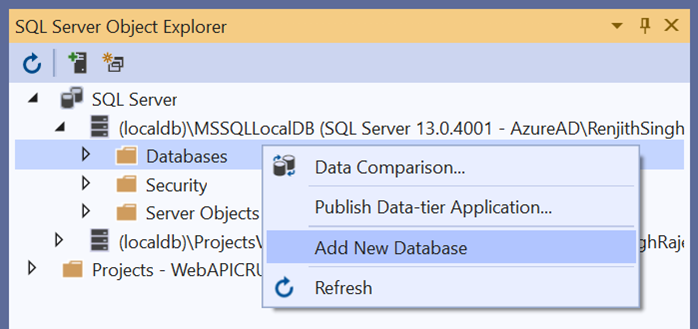
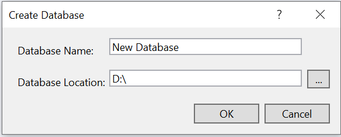
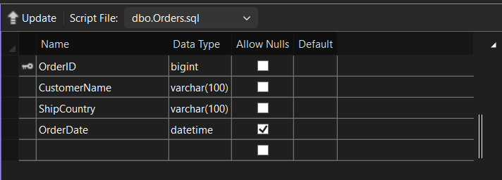
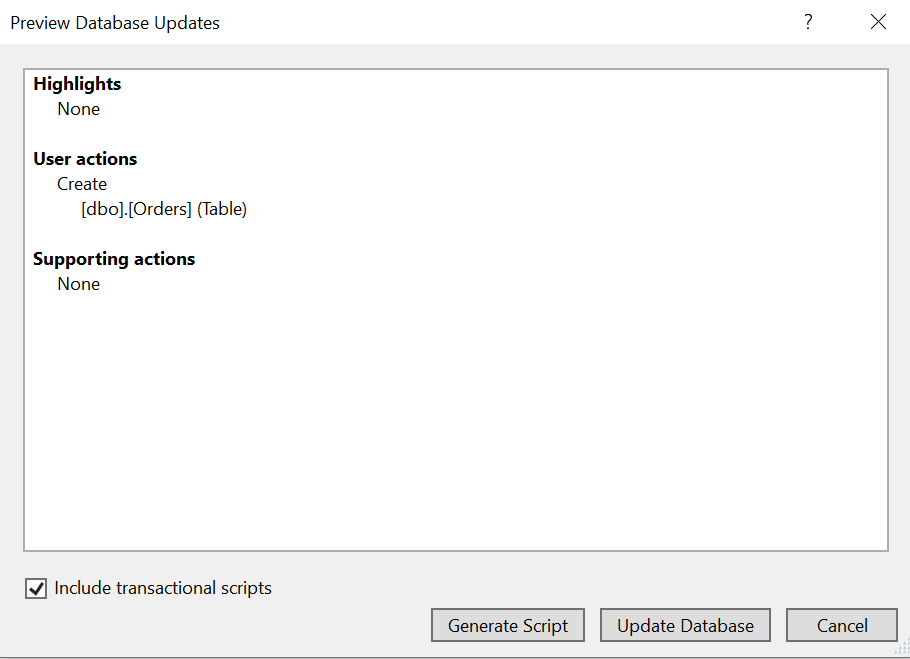
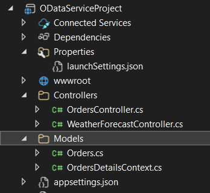

# Bind data from RESTful web services to Syncfusion® Blazor MultiSelect DropDown

This article demonstrates how to retrieve data from an OData RESTful web service, bind it to the Syncfusion® Blazor MultiSelect DropDown component using the [ODataV4Adaptor](https://blazor.syncfusion.com/documentation/data/adaptors#odatav4-adaptor) of `SfDataManager`. The MultiSelect DropDown component allows users to select multiple values from a dropdown list populated with data from the OData service.

Choose the suitable adaptor based on the RESTful service which you are using to bind data for the Syncfusion<sup style="font-size:70%">&reg;</sup> Blazor component. Refer to the following documentation to know about the available Adaptors of SfDataManager.
 * [Adaptors](https://blazor.syncfusion.com/documentation/data/adaptors)

## Prerequisite software

The following software are required:
* Visual Studio 2022 or later
* .NET 8.0 or later

## Create the database

Open Visual Studio, select **View -> SQL Server Object Explorer**. Right-click on the Databases folder to create a new Database and name it as **OrdersDetails**.




Right-click on the **Tables** folder of the created database and click **Add New Table**.


Use the following query to add a new table named **Orders**.

```sql
CREATE TABLE Orders(
    OrderID BigInt Identity(1,1) Primary Key Not Null,
    CustomerName Varchar(200) Not Null,
    ShipCountry Varchar(100) Null,
    OrderDate DateTime Null
)
```

Now, the Orders table design will look like below. Click on the **Update** button.



Now, click on **Update Database**.



### Insert sample data into the Orders table

After creating the table, populate it with sample data. You can use either SQL INSERT statements for bulk data entry or the Swagger UI for interactive testing.

**Option 1: Using SQL INSERT statements**

Execute the following SQL commands to add multiple records at once:

```sql
-- Insert sample rows (OrderID is IDENTITY so it's omitted)
INSERT INTO Orders (CustomerName, ShipCountry, OrderDate) VALUES
('John Doe',       'USA',         '2024-02-03T10:30:00'),
('Maria Silva',    'Brazil',      '2024-01-15T09:00:00'),
('Akira Tanaka',   'Japan',       '2024-03-20T14:45:00'),
('Liam O''Connor', 'Ireland',     '2024-02-28T11:20:00'),
('Chen Wei',       'China',       '2024-01-05T08:10:00'),
('Olivia Brown',   'United Kingdom','2024-04-01T16:00:00'),
('Noah Müller',    'Germany',     '2024-03-11T12:00:00'),
('Sofia Rossi',    'Italy',       '2024-02-18T13:30:00'),
('Carlos Perez',   'Mexico',      '2024-01-22T15:15:00'),
('Aisha Khan',     'UAE',         '2024-03-05T10:05:00');
GO
```

**Option 2: Using Swagger UI**

For interactive API testing and individual record creation, refer to the [Adding data to the database using Swagger](#adding-data-to-the-database-using-swagger) section after setting up the OData service project.

## Create OData service project

Open Visual Studio 2022 and create an empty ASP.NET Core Web API application named **ODataServiceProject**. After creating the application, install the [Microsoft.AspNetCore.OData](https://www.nuget.org/packages/Microsoft.AspNetCore.OData/) package by running the following command in the Package Manager Console.

```
Install-Package Microsoft.AspNetCore.OData
```

This package contains everything you need to create OData v4.0 endpoints using ASP.NET Core and to support OData query syntax for your web APIs.

### Generate DbContext and model class from the database

Scaffold **DbContext** and **model classes** from the existing **OrdersDetails** database. To perform scaffolding and work with the SQL Server database, install the following NuGet packages.

* [Microsoft.EntityFrameworkCore.Tools](https://www.nuget.org/packages/Microsoft.EntityFrameworkCore.Tools): This package creates database context and model classes from the database.

* [Microsoft.EntityFrameworkCore.SqlServer](https://www.nuget.org/packages/Microsoft.EntityFrameworkCore.SqlServer/): The database provider that allows [Entity Framework Core](https://learn.microsoft.com/en-us/ef/core/) to work with SQL Server.

Run the following commands in the **Package Manager Console**.

```
Install-Package Microsoft.EntityFrameworkCore.Tools
Install-Package Microsoft.EntityFrameworkCore.SqlServer
```

Once the above packages are installed, you can scaffold DbContext and Model classes. Run the following command in the **Package Manager Console**.

```
Scaffold-DbContext "Server=(localdb)\MSSQLLocalDB;Database=OrdersDetails;Integrated Security=True;Connect Timeout=30;Encrypt=False;TrustServerCertificate=False;ApplicationIntent=ReadWrite;MultiSubnetFailover=False" Microsoft.EntityFrameworkCore.SqlServer -OutputDir Models
```

The above scaffolding command contains the following details for creating DbContext and model classes for the existing database and its tables.
* **Connection string**: Server=(localdb)\MSSQLLocalDB;Database=OrdersDetails;Integrated Security=True;Connect Timeout=30;Encrypt=False;TrustServerCertificate=False;ApplicationIntent=ReadWrite;MultiSubnetFailover=False
* **Data provider**: Microsoft.EntityFrameworkCore.SqlServer
* **Output directory**: -OutputDir Models

After running the above command, the **OrdersDetailsContext.cs** and **Orders.cs** files will be created under the **ODataServiceProject.Models** folder as follows.



You can see that OrdersDetailsContext.cs file contains the connection string details in the **OnConfiguring** method.




using System;
using Microsoft.EntityFrameworkCore;
using Microsoft.EntityFrameworkCore.Metadata;

namespace ODataServiceProject.Models
{
    public partial class OrdersDetailsContext : DbContext
    {
        public OrdersDetailsContext()
        {
        }

        public OrdersDetailsContext(DbContextOptions<OrdersDetailsContext> options)
            : base(options)
        {
        }

        public virtual DbSet<Orders> Orders { get; set; }

        protected override void OnConfiguring(DbContextOptionsBuilder optionsBuilder)
        {
            if (!optionsBuilder.IsConfigured)
            {
                optionsBuilder.UseSqlServer("Server=(localdb)\\MSSQLLocalDB;Database=OrdersDetails;Integrated Security=True;Connect Timeout=30;Encrypt=False;TrustServerCertificate=False;ApplicationIntent=ReadWrite;MultiSubnetFailover=False");
            }
        }

        ...
    }
}




It is not recommended to store connection strings with sensitive information directly in the OrdersDetailsContext.cs file. Move the connection string to the **appsettings.json** file for better security and configuration management.




{
  "DetailedErrors": true,
  "Logging": {
    "LogLevel": {
      "Default": "Information",
      "Microsoft.AspNetCore": "Warning"
    }
  },
  "AllowedHosts": "*",
  "ConnectionStrings": {
    "OrdersDetailsDatabase": "Server=(localdb)\\MSSQLLocalDB;Database=OrdersDetails;Integrated Security=True;Connect Timeout=30;Encrypt=False;TrustServerCertificate=False;ApplicationIntent=ReadWrite;MultiSubnetFailover=False"
  }
}




Configure the DbContext using the connection string and register it as a scoped service using the AddDbContext method in **Program.cs**.




builder.Services.AddDbContext<OrdersDetailsContext>(option =>
    option.UseSqlServer(builder.Configuration.GetConnectionString("OrdersDetailsDatabase")));




### Creating ODataV4 service

The application is now configured to connect with the **OrdersDetails** database using [Entity Framework](https://learn.microsoft.com/en-us/ef/core/). Create an OData controller to serve data from the DbContext to the Blazor application.

To create the OData controller, right-click the **Controllers** folder in ODataServiceProject and select **Add -> New Item -> API controller with read/write actions**. Name this controller **OrdersController** as it returns Orders table records.

Replace the controller with the following code to handle CRUD operations and OData queries for the Orders table.




using Microsoft.AspNetCore.Mvc;
using Microsoft.AspNetCore.OData.Deltas;
using Microsoft.AspNetCore.OData.Query;
using Microsoft.AspNetCore.OData.Routing.Controllers;
using ODataServiceProject.Models;

namespace ODataServiceProject.Controllers
{
    [Route("api/[controller]")]
    public class OrdersController : ODataController
    {
        private readonly OrdersDetailsContext _db;
        
        // Constructor injection for DbContext
        public OrdersController(OrdersDetailsContext context)
        {
            _db = context;
        }
        
        // GET: Retrieve all orders with OData query support
        [EnableQuery]
        [HttpGet]
        public IActionResult Get()
        {
            return Ok(_db.Orders);
        }
        
        // GET: Retrieve a specific order by ID
        [EnableQuery]
        [HttpGet]
        public IActionResult Get([FromRoute] long key)
        {
            var order = _db.Orders.FirstOrDefault(o => o.OrderId == key);
            if (order == null)
            {
                return NotFound();
            }
            return Ok(order);
        }
        
        // POST: Create a new order
        [HttpPost]
        public async Task<IActionResult> Post([FromBody] Orders order)
        {
            if (!ModelState.IsValid)
            {
                return BadRequest(ModelState);
            }
            _db.Orders.Add(order);
            await _db.SaveChangesAsync();
            return Created(order);
        }
        
        // PATCH: Update an existing order
        [HttpPatch]
        public async Task<IActionResult> Patch([FromRoute] long key, [FromBody] Delta<Orders> delta)
        {
            if (!ModelState.IsValid)
            {
                return BadRequest(ModelState);
            }
            var entity = await _db.Orders.FindAsync(key);
            if (entity == null)
            {
                return NotFound();
            }
            delta.Patch(entity);
            await _db.SaveChangesAsync();
            return Updated(entity);
        }
        
        // DELETE: Remove an order by ID
        [HttpDelete]
        public async Task<IActionResult> Delete([FromRoute] long key)
        {
            var deleterow = await _db.Orders.FindAsync(key);
            if (deleterow == null)
            {
                return NotFound();
            }
            _db.Orders.Remove(deleterow);
            await _db.SaveChangesAsync();
            return NoContent();
        }
    }
}




Add the following line in the **launchSettings.json** file.




{
  "$schema": "https://json.schemastore.org/launchsettings.json",
  "profiles": {
    "http": {
      "commandName": "Project",
      "dotnetRunMessages": true,
      "launchBrowser": false,
      "applicationUrl": "http://localhost:5087",
      "environmentVariables": {
        "ASPNETCORE_ENVIRONMENT": "Development"
      }
    },
    "https": {
      "commandName": "Project",
      "dotnetRunMessages": true,
      "launchBrowser": false,
      "launchUrl": "odata/orders",
      "applicationUrl": "https://localhost:7188;http://localhost:5087",
      "environmentVariables": {
        "ASPNETCORE_ENVIRONMENT": "Development"
      }
    }
  }
}




Additionally, include the AddCors() and UseCors() methods in the **Program.cs** file of the ODataService project when configuring with a Blazor Web App.

Open the **Program.cs** file and configure it as follows:




using Microsoft.EntityFrameworkCore;
using ODataServiceProject.Models;
using Microsoft.OData.Edm;
using Microsoft.OData.ModelBuilder;
using Microsoft.AspNetCore.OData;

var builder = WebApplication.CreateBuilder(args);

// Add services to the container.
static IEdmModel GetEdmModel()
{
    ODataConventionModelBuilder builder = new ODataConventionModelBuilder();
    builder.EntitySet<Orders>("Orders");
    return builder.GetEdmModel();
}

// Add DbContext
builder.Services.AddDbContext<OrdersDetailsContext>(option =>
                option.UseSqlServer(builder.Configuration.GetConnectionString("OrdersDetailsDatabase")));

builder.Services.AddControllers().AddOData(opt => opt.AddRouteComponents("odata", GetEdmModel()).Count().Filter().OrderBy().Expand().Select().SetMaxTop(null));

// Add CORS policy for Blazor Web App
// Note: AllowAnyOrigin() is suitable for development only. 
// For production, specify allowed origins using WithOrigins("https://yourdomain.com")
builder.Services.AddCors(options =>
{
    options.AddPolicy("NewPolicy", builder =>
    builder.AllowAnyOrigin()
        .AllowAnyMethod()
        .AllowAnyHeader());
});

var app = builder.Build();

// Enable CORS with the defined policy
app.UseHttpsRedirection();
app.UseCors("NewPolicy");
app.UseAuthorization();

app.MapControllers();

app.Run();




### Adding data to the database using Swagger

Run the OData service and use Swagger UI to interactively test the API and add data to the database.

1. Run the **ODataServiceProject** in Visual Studio.

2. Once the application starts, navigate to `https://localhost:7188/swagger` in the browser to access the Swagger UI.

3. The Swagger documentation page displays all available OData endpoints.

4. To add new data to the Orders table, click on the **POST /Orders** endpoint to expand it.

5. Click the **Try it out** button on the right side.

6. In the request body section, replace the JSON template with order data:

```json
{
  "customerName": "John Doe",
  "shipCountry": "USA",
  "orderDate": "2024-02-03T10:30:00"
}
```

N> Note: Do not include `orderId` in the POST request as it's an auto-incrementing primary key that will be generated automatically by the database.

7. Click the **Execute** button to send the POST request.

8. If successful, a **201 Created** response appears with the newly created order details including the auto-generated `orderId`.

9. Verify the data was added by clicking on the **GET /odata/orders** endpoint and executing it to view all orders in the database.

Additional operations available for testing:
* **GET /odata/orders/{key}** - Retrieve a specific order by OrderId
* **PATCH /odata/orders/{key}** - Update an existing order
* **DELETE /odata/orders/{key}** - Delete an order by OrderId

N> Swagger UI is useful for quickly testing the OData service and populating the database with sample data before connecting it to the Blazor application.

## Create Blazor application

Choose one of the following Blazor application types based on your requirements:

### Create Blazor Web App

Create a **Blazor Web App** using Visual Studio 2022 via [Microsoft templates](https://learn.microsoft.com/en-us/aspnet/core/blazor/tooling) or the [Syncfusion<sup style="font-size:70%">&reg;</sup> Blazor Extension](https://blazor.syncfusion.com/documentation/visual-studio-integration/template-studio).

Configure the appropriate [interactive render mode](https://learn.microsoft.com/en-us/aspnet/core/blazor/components/render-modes#render-modes) and [interactivity location](https://learn.microsoft.com/en-us/aspnet/core/blazor/tooling#interactivity-location) when creating the Blazor Web App.

### Create Blazor Server Application

Alternatively, create a **Blazor Server App** using Visual Studio via [Microsoft templates](https://learn.microsoft.com/en-us/aspnet/core/blazor/tooling) or the [Syncfusion<sup style="font-size:70%">&reg;</sup> Blazor Extension](https://blazor.syncfusion.com/documentation/visual-studio-integration/template-studio).

## Add Syncfusion<sup style="font-size:70%">&reg;</sup> Blazor MultiSelect DropDown and Themes NuGet packages

To add the **Blazor MultiSelect DropDown** component, open the NuGet package manager in Visual Studio (*Tools → NuGet Package Manager → Manage NuGet Packages for Solution*), then search and install [Syncfusion.Blazor.DropDowns](https://www.nuget.org/packages/Syncfusion.Blazor.DropDowns/) and [Syncfusion.Blazor.Themes](https://www.nuget.org/packages/Syncfusion.Blazor.Themes/).

If using `WebAssembly` or `Auto` render modes in a Blazor Web App, install Syncfusion<sup style="font-size:70%">&reg;</sup> Blazor NuGet packages in the client project.

Alternatively, you can utilize the following package manager command to achieve the same.




Install-Package Syncfusion.Blazor.DropDowns -Version {{ site.releaseversion }}
Install-Package Syncfusion.Blazor.Themes -Version {{ site.releaseversion }}




N> Syncfusion<sup style="font-size:70%">&reg;</sup> Blazor components are available in [nuget.org](https://www.nuget.org/packages?q=syncfusion.blazor). Refer to [NuGet packages](https://blazor.syncfusion.com/documentation/nuget-packages) topic for available NuGet packages list with component details.

Open the **~/_Imports.razor** file and import the following namespaces.



@using Syncfusion.Blazor
@using Syncfusion.Blazor.Data
@using Syncfusion.Blazor.DropDowns



Register the Syncfusion<sup style="font-size:70%">&reg;</sup> Blazor Service in the **~/Program.cs** file.

For a Blazor Web App with `WebAssembly` or `Auto (Server and WebAssembly)` interactive render mode, register the Syncfusion<sup style="font-size:70%">&reg;</sup> Blazor service in both **~/Program.cs** files of your web app.

```cshtml

....
using Syncfusion.Blazor;
....
builder.Services.AddSyncfusionBlazor();
....

```

Themes provide life to components. Syncfusion<sup style="font-size:70%">&reg;</sup> Blazor has different [themes](https://blazor.syncfusion.com/documentation/appearance/themes). They are:

* Bootstrap5
* Material 3
* Tailwind CSS
* High Contrast
* Fluent

In this demo application, the latest theme is used.

  * For **Blazor Web App**, reference the stylesheet inside the `<head>` of **~/Components/App.razor**.
  * For **Blazor WebAssembly App**, reference the stylesheet inside the `<head>` of **~/wwwroot/index.html**.
  * For **Blazor Server App**, reference the stylesheet inside the `<head>` of **~/Components/App.razor**.



<link href="_content/Syncfusion.Blazor.Themes/bootstrap5.css" rel="stylesheet" />



* For **Blazor Web App**, reference scripts at the end of the `<body>` section in the **~/Components/App.razor** file.
* For **Blazor WASM App**, reference scripts at the end of the `<body>` section in the **~/wwwroot/index.html** file.
* For **Blazor Server App**, reference scripts at the end of the `<body>` section in the **~/Components/App.razor** file.

```html
<body>
    ....
    <script src="_content/Syncfusion.Blazor.Core/scripts/syncfusion-blazor.min.js" type="text/javascript"></script>
</body>
```

## Add Syncfusion<sup style="font-size:70%">&reg;</sup> Blazor MultiSelect DropDown component

After configuring the Syncfusion<sup style="font-size:70%">&reg;</sup> Blazor package, add the MultiSelect DropDown component to a `.razor` page inside the `Pages` folder.

If the interactivity location is set to `Per page/component` in the web app, define a render mode at the top of the Syncfusion<sup style="font-size:70%">&reg;</sup> Blazor component-included razor page as follows:




@* Your App render mode define here *@
@rendermode InteractiveAuto







<SfMultiSelect TValue="string[]" TItem="Orders"></SfMultiSelect>




## Bind data to Blazor MultiSelect DropDown component using ODataV4Adaptor

To consume data from the OData controller, add **SfDataManager** with **ODataV4Adaptor**. The ODataV4Adaptor facilitates communication between the Blazor component and OData v4.0 services, enabling query operations like filtering, sorting, and paging. For more details, refer to [ODataV4Adaptor](https://blazor.syncfusion.com/documentation/data/adaptors#odatav4-adaptor) documentation.




<SfMultiSelect TValue="string[]" TItem="Orders">
    <SfDataManager Url="https://localhost:7188/odata/orders" Adaptor="Adaptors.ODataV4Adaptor"></SfDataManager>
</SfMultiSelect>




N> In the example above, a localhost URL is used. Replace it with the actual URL of your deployed OData service.

Define MultiSelect DropDown field settings using the [MultiSelectFieldSettings](https://help.syncfusion.com/cr/blazor/Syncfusion.Blazor.DropDowns.MultiSelectFieldSettings.html) tag. The following code configures field mappings and query operations.




<SfMultiSelect TValue="string[]" TItem="Orders" Query="@Query">
    <SfDataManager Url="https://localhost:7188/odata/orders" Adaptor="Adaptors.ODataV4Adaptor"></SfDataManager>
    <MultiSelectFieldSettings Text="CustomerName" Value="OrderId"></MultiSelectFieldSettings>
</SfMultiSelect>

@code {
    public Query Query = new Query().Select(new List<string> { "CustomerName", "OrderId" }).Take(6).RequiresCount();

    public class Orders
    {
        public long OrderId { get; set; }
        public string? CustomerName { get; set; }
        public string? ShipCountry { get; set; }
        public DateTime? OrderDate { get; set; }
    }
}




When the application runs, the **Get()** method in the OData controller is called to retrieve the Orders data. The ODataV4Adaptor automatically handles the data binding and query operations between the MultiSelect DropDown component and the OData service.




[Route("api/[controller]")]
public class OrdersController : ODataController
{
    private OrdersDetailsContext _db;
    public OrdersController(OrdersDetailsContext context)
    {
        _db = context;
    }
    [EnableQuery]
    [HttpGet]
    public IActionResult Get()
    {
        return Ok(_db.Orders);
    }
    ...
}




N> Find the complete sample at this [GitHub location](https://github.com/SyncfusionExamples/multiselect-dropdown-odata-binding).

## See also

* [Data binding in Blazor MultiSelect DropDown](https://blazor.syncfusion.com/documentation/multiselect-dropdown/data-binding)
* [Adaptors in SfDataManager](https://blazor.syncfusion.com/documentation/data/adaptors)
* [Blazor MultiSelect DropDown component overview](https://blazor.syncfusion.com/documentation/multiselect-dropdown/getting-started)
