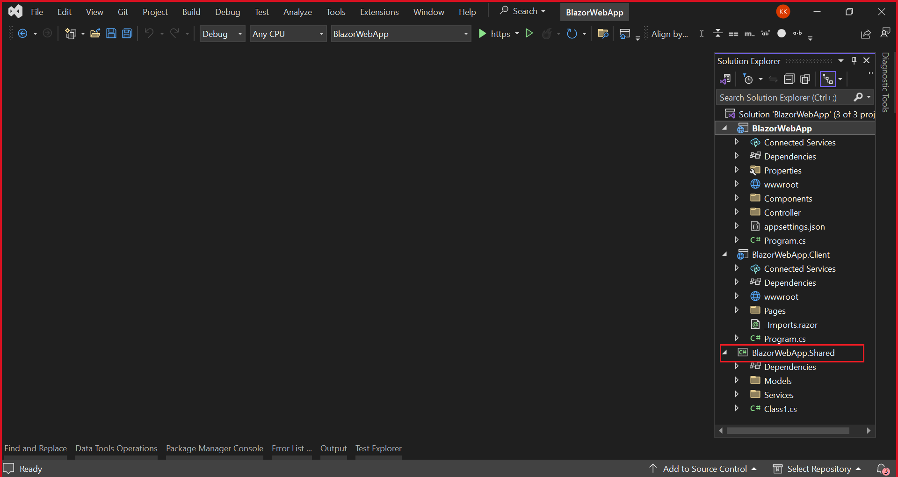

# Bind data from Web API services to Syncfusion® Blazor MultiSelect DropDown

This article demonstrates how to retrieve data from a WebAPI controller, bind it to the Syncfusion® Blazor MultiSelect DropDown component using the [WebApiAdaptor](https://blazor.syncfusion.com/documentation/data/adaptors#web-api-adaptor) of `SfDataManager`, and perform CRUD operations.

The WebApiAdaptor of SfDataManager can interact with Web APIs created with OData endpoints. The WebApiAdaptor is extended from the ODataAdaptor. Hence, to use WebApiAdaptor, the endpoint should understand the OData formatted queries sent along with the request.

To enable the OData query option for Web API, refer to this [documentation](https://learn.microsoft.com/en-us/aspnet/web-api/overview/odata-support-in-aspnet-web-api/supporting-odata-query-options).

## Prerequisite software

The following software are required:
* Visual Studio 2022 or later
* .NET 8.0 or later
* SQL Server LocalDB (included with Visual Studio)

## Create the database

Open Visual Studio, select **View -> SQL Server Object Explorer**. Right-click on the Databases folder to create a new Database and name it as **OrdersDetails**.


Right-click on the **Tables** folder of the created database and click **Add New Table**.


Use the following query to add a new table named **Orders**.

```sql
CREATE TABLE Orders(
    OrderID BigInt Identity(1,1) Primary Key Not Null,
    CustomerName Varchar(200) Not Null,
    ShipCountry Varchar(100) Null,
    OrderDate DateTime Null
)
```

Now, the Orders table design will look like below. Click on the **Update** button.


Now, click on **Update Database**.


### Insert sample data into the Orders table

After creating the table, populate it with sample data. You can use either SQL INSERT statements for bulk data entry or add data through the Web API after setup.

**Option 1: Using SQL INSERT statements**

Execute the following SQL commands to add multiple records at once:

```sql
-- Insert sample rows (OrderID is IDENTITY so it's omitted)
INSERT INTO Orders (CustomerName, ShipCountry, OrderDate) VALUES
('John Doe',       'USA',         '2024-02-03T10:30:00'),
('Maria Silva',    'Brazil',      '2024-01-15T09:00:00'),
('Akira Tanaka',   'Japan',       '2024-03-20T14:45:00'),
('Liam O''Connor', 'Ireland',     '2024-02-28T11:20:00'),
('Chen Wei',       'China',       '2024-01-05T08:10:00'),
('Olivia Brown',   'United Kingdom','2024-04-01T16:00:00'),
('Noah Müller',    'Germany',     '2024-03-11T12:00:00'),
('Sofia Rossi',    'Italy',       '2024-02-18T13:30:00'),
('Carlos Perez',   'Mexico',      '2024-01-22T15:15:00'),
('Aisha Khan',     'UAE',         '2024-03-05T10:05:00');
GO
```

**Option 2: Using Web API**

For interactive API testing and individual record creation, you can add data through the Web API endpoints after completing the setup below.

## Create a new Blazor Web App

Create a **Blazor Web App** using Visual Studio 2022 via [Microsoft templates](https://learn.microsoft.com/en-us/aspnet/core/blazor/tooling) or the [Syncfusion<sup style="font-size:70%">&reg;</sup> Blazor Extension](https://blazor.syncfusion.com/documentation/visual-studio-integration/template-studio).

Configure the appropriate [interactive render mode](https://learn.microsoft.com/en-us/aspnet/core/blazor/components/render-modes#render-modes) and [interactivity location](https://learn.microsoft.com/en-us/aspnet/core/blazor/tooling#interactivity-location) when creating the Blazor Web App.

### Generate DbContext and model class from the database

Scaffold **DbContext** and **model classes** from the existing **OrdersDetails** database. To perform scaffolding and work with the SQL Server database, install the following NuGet packages.

If you have created a Blazor Web App with the `Interactive render mode` set to `WebAssembly` or `Auto`, follow these steps:

* Create a new project with Class Library template named **BlazorWebApp.Shared** for DbContext and model class as shown below.



Additionally, ensure that you have added a reference to the `BlazorWebApp.Shared` project in both the server-side and client-side projects of your web application.

* Then, open the NuGet Package Manager and install the following packages in both the shared and server-side projects of your Blazor Web App.

   * [Microsoft.EntityFrameworkCore.Tools](https://www.nuget.org/packages/Microsoft.EntityFrameworkCore.Tools): This package creates database context and model classes from the database.
   * [Microsoft.EntityFrameworkCore.SqlServer](https://www.nuget.org/packages/Microsoft.EntityFrameworkCore.SqlServer/): The database provider that allows Entity Framework Core to work with SQL Server.

Alternatively, you can utilize the following package manager command to achieve the same.




Install-Package Microsoft.EntityFrameworkCore.Tools
Install-Package Microsoft.EntityFrameworkCore.SqlServer




Once the above packages are installed, you can scaffold DbContext and Model classes. Run the following command in the Package Manager Console under the `BlazorWebApp.Shared` project.

```
Scaffold-DbContext "Server=(localdb)\MSSQLLocalDB;Database=OrdersDetails;Integrated Security=True;Connect Timeout=30;Encrypt=False;TrustServerCertificate=False;ApplicationIntent=ReadWrite;MultiSubnetFailover=False" Microsoft.EntityFrameworkCore.SqlServer -OutputDir Data
```

The above scaffolding command contains the following details for creating DbContext and model classes for the existing database and its tables.
  * **Connection string**: Server=(localdb)\MSSQLLocalDB;Database=OrdersDetails;Integrated Security=True;Connect Timeout=30;Encrypt=False;TrustServerCertificate=False;ApplicationIntent=ReadWrite;MultiSubnetFailover=False
  * **Data provider**: Microsoft.EntityFrameworkCore.SqlServer
  * **Output directory**: -OutputDir Data

After running the above command, **OrdersDetailsContext.cs** and **Orders.cs** files will be created under the Data folder of `BlazorWebApp.Shared` project as follows.

You can see that OrdersDetailsContext.cs file contains the connection string details in the **OnConfiguring** method.




using Microsoft.EntityFrameworkCore;

namespace BlazorWebApp.Shared.Data;

public partial class OrdersDetailsContext : DbContext
{
    public OrdersDetailsContext()
    {
    }

    public OrdersDetailsContext(DbContextOptions<OrdersDetailsContext> options)
        : base(options)
    {
    }

    public virtual DbSet<Order> Orders { get; set; }

    protected override void OnConfiguring(DbContextOptionsBuilder optionsBuilder)
        => optionsBuilder.UseSqlServer("Server=(localdb)\\MSSQLLocalDB;Database=OrdersDetails;Integrated Security=True;Connect Timeout=30;Encrypt=False;TrustServerCertificate=False;ApplicationIntent=ReadWrite;MultiSubnetFailover=False");
}



Additionally, ensure the connection strings are added in the **appsettings.json** file of the server-side project of your Web App.




{
  "Logging": {
    "LogLevel": {
      "Default": "Information",
      "Microsoft.AspNetCore": "Warning"
    }
  },
  "AllowedHosts": "*",
  "ConnectionStrings": {
    "OrdersDetailsDatabase": "Server=(localdb)\\MSSQLLocalDB;Database=OrdersDetails;Integrated Security=True;Connect Timeout=30;Encrypt=False;TrustServerCertificate=False;ApplicationIntent=ReadWrite;MultiSubnetFailover=False"
  }
}




Configure the DbContext using the connection string and register it as a scoped service using the AddDbContext method in **Program.cs** of the server-side project only.




builder.Services.AddDbContext<OrdersDetailsContext>(option =>
    option.UseSqlServer(builder.Configuration.GetConnectionString("OrdersDetailsDatabase")));




### Creating API Controller

The application is now configured to connect with the **OrdersDetails** database using Entity Framework. Create a Web API controller to serve data from the DbContext to the Blazor application.

To create the Web API controller, right-click the **Controllers** folder in the Server-side project and select **Add -> New Item -> API controller with read/write actions** to create a new Web API controller. Name this controller **OrdersController** as it returns Orders table records.

Replace the Web API controller with the following code to handle CRUD operations for the Orders table.




using Microsoft.AspNetCore.Mvc;
using BlazorWebApp.Shared.Data;

namespace BlazorWebApp
{
    [Route("api/[controller]")]
    [ApiController]
    public class OrdersController : ControllerBase
    {
        private readonly OrdersDetailsContext _context;
        
        // Constructor injection for DbContext
        public OrdersController(OrdersDetailsContext context)
        {
            _context = context;
        }
        
        // GET: Retrieve all orders
        [HttpGet]
        public object Get()
        {
            return new { Items = _context.Orders, Count = _context.Orders.Count() };
        }
        
        // POST: Create a new order
        [HttpPost]
        public void Post([FromBody] Orders order)
        {
            _context.Orders.Add(order);
            _context.SaveChanges();
        }
        
        // PUT: Update an existing order
        [HttpPut]
        public void Put(long id, [FromBody] Orders order)
        {
            Orders existingOrder = _context.Orders.Where(x => x.OrderId.Equals(order.OrderId)).FirstOrDefault();
            if (existingOrder != null)
            {
                existingOrder.CustomerName = order.CustomerName;
                existingOrder.ShipCountry = order.ShipCountry;
                existingOrder.OrderDate = order.OrderDate;
                _context.SaveChanges();
            }
        }
        
        // DELETE: Remove an order by ID
        [HttpDelete("{id}")]
        public void Delete(long id)
        {
            Orders order = _context.Orders.Where(x => x.OrderId.Equals(id)).FirstOrDefault();
            if (order != null)
            {
                _context.Orders.Remove(order);
                _context.SaveChanges();
            }
        }
    }
}




Open the **Program.cs** file and add **AddControllers** and **MapControllers** methods as follows.




......
builder.Services.AddControllers();
....
app.MapControllers();
.....




## Create Blazor Server Application

Alternatively, you can create a **Blazor Server App** using Visual Studio via [Microsoft Templates](https://learn.microsoft.com/en-us/aspnet/core/blazor/tooling) or the [Syncfusion<sup style="font-size:70%">&reg;</sup> Blazor Extension](https://blazor.syncfusion.com/documentation/visual-studio-integration/template-studio).

### Generate DbContext and model class from the database

Scaffold **DbContext** and **model classes** from the existing **OrdersDetails** database. To perform scaffolding and work with the SQL Server database, install the following NuGet packages.

* [Microsoft.EntityFrameworkCore.Tools](https://www.nuget.org/packages/Microsoft.EntityFrameworkCore.Tools): This package creates database context and model classes from the database.
* [Microsoft.EntityFrameworkCore.SqlServer](https://www.nuget.org/packages/Microsoft.EntityFrameworkCore.SqlServer/): The database provider that allows Entity Framework Core to work with SQL Server.

Run the following commands in the Package Manager Console.




Install-Package Microsoft.EntityFrameworkCore.Tools
Install-Package Microsoft.EntityFrameworkCore.SqlServer




Once the above packages are installed, you can scaffold DbContext and Model classes. Run the following command in the **Package Manager Console**.

```
Scaffold-DbContext "Server=(localdb)\MSSQLLocalDB;Database=OrdersDetails;Integrated Security=True;Connect Timeout=30;Encrypt=False;TrustServerCertificate=False;ApplicationIntent=ReadWrite;MultiSubnetFailover=False" Microsoft.EntityFrameworkCore.SqlServer -OutputDir Data
```

The above scaffolding command contains the following details for creating DbContext and model classes for the existing database and its tables.
* **Connection string**: Server=(localdb)\MSSQLLocalDB;Database=OrdersDetails;Integrated Security=True;Connect Timeout=30;Encrypt=False;TrustServerCertificate=False;ApplicationIntent=ReadWrite;MultiSubnetFailover=False
* **Data provider**: Microsoft.EntityFrameworkCore.SqlServer
* **Output directory**: -OutputDir Data

After running the above command, **OrdersDetailsContext.cs** and **Orders.cs** files will be created under the **Data** folder as follows.


You can see that OrdersDetailsContext.cs file contains the connection string details in the **OnConfiguring** method.




using System;
using Microsoft.EntityFrameworkCore;

namespace WebAPIMultiSelectApp.Data
{
    public partial class OrdersDetailsContext : DbContext
    {
        public OrdersDetailsContext()
        {
        }

        public OrdersDetailsContext(DbContextOptions<OrdersDetailsContext> options)
            : base(options)
        {
        }

        public virtual DbSet<Orders> Orders { get; set; }

        protected override void OnConfiguring(DbContextOptionsBuilder optionsBuilder)
        {
            if (!optionsBuilder.IsConfigured)
            {
                optionsBuilder.UseSqlServer("Server=(localdb)\\MSSQLLocalDB;Database=OrdersDetails;Integrated Security=True;Connect Timeout=30;Encrypt=False;TrustServerCertificate=False;ApplicationIntent=ReadWrite;MultiSubnetFailover=False");
            }
        }

        ...
    }
}




It is not recommended to store connection strings with sensitive information directly in the OrdersDetailsContext.cs file. Move the connection string to the **appsettings.json** file for better security and configuration management.




{
  "Logging": {
    "LogLevel": {
      "Default": "Information",
      "Microsoft.AspNetCore": "Warning"
    }
  },
  "AllowedHosts": "*",
  "ConnectionStrings": {
    "OrdersDetailsDatabase": "Server=(localdb)\\MSSQLLocalDB;Database=OrdersDetails;Integrated Security=True;Connect Timeout=30;Encrypt=False;TrustServerCertificate=False;ApplicationIntent=ReadWrite;MultiSubnetFailover=False"
  }
}




Configure the DbContext using the connection string and register it as a scoped service using the AddDbContext method in **Program.cs**.




builder.Services.AddDbContext<OrdersDetailsContext>(option =>
    option.UseSqlServer(builder.Configuration.GetConnectionString("OrdersDetailsDatabase")));




### Creating API Controller

The application is now configured to connect with the **OrdersDetails** database using Entity Framework. Create a Web API controller to serve data from the DbContext to the Blazor application.

To create the Web API controller, right-click the **Controllers** folder in the Server project and select **Add -> New Item -> API controller with read/write actions** to create a new Web API controller. Name this controller **OrdersController** as it returns Orders table records.

Replace the Web API controller with the following code to handle CRUD operations for the Orders table.




using Microsoft.AspNetCore.Mvc;
using WebAPIMultiSelectApp.Data;

namespace WebAPIMultiSelectApp
{
    [Route("api/[controller]")]
    [ApiController]
    public class OrdersController : ControllerBase
    {
        private readonly OrdersDetailsContext _context;
        
        // Constructor injection for DbContext
        public OrdersController(OrdersDetailsContext context)
        {
            _context = context;
        }
        
        // GET: Retrieve all orders
        [HttpGet]
        public object Get()
        {
            return new { Items = _context.Orders, Count = _context.Orders.Count() };
        }
        
        // POST: Create a new order
        [HttpPost]
        public void Post([FromBody] Orders order)
        {
            _context.Orders.Add(order);
            _context.SaveChanges();
        }
        
        // PUT: Update an existing order
        [HttpPut]
        public void Put(long id, [FromBody] Orders order)
        {
            Orders existingOrder = _context.Orders.Where(x => x.OrderId.Equals(order.OrderId)).FirstOrDefault();
            if (existingOrder != null)
            {
                existingOrder.CustomerName = order.CustomerName;
                existingOrder.ShipCountry = order.ShipCountry;
                existingOrder.OrderDate = order.OrderDate;
                _context.SaveChanges();
            }
        }
        
        // DELETE: Remove an order by ID
        [HttpDelete("{id}")]
        public void Delete(long id)
        {
            Orders order = _context.Orders.Where(x => x.OrderId.Equals(id)).FirstOrDefault();
            if (order != null)
            {
                _context.Orders.Remove(order);
                _context.SaveChanges();
            }
        }
    }
}




Open the **Program.cs** file and add **MapDefaultControllerRoute** method as follows.




......

app.UseRouting();

app.MapDefaultControllerRoute();
app.MapBlazorHub();
app.MapFallbackToPage("/_Host");

app.Run();




## Add Syncfusion<sup style="font-size:70%">&reg;</sup> Blazor MultiSelect DropDown and Themes NuGet packages

To add the **Blazor MultiSelect DropDown** component, open the NuGet package manager in Visual Studio (*Tools → NuGet Package Manager → Manage NuGet Packages for Solution*), then search and install [Syncfusion.Blazor.DropDowns](https://www.nuget.org/packages/Syncfusion.Blazor.DropDowns/) and [Syncfusion.Blazor.Themes](https://www.nuget.org/packages/Syncfusion.Blazor.Themes/).

If using `WebAssembly` or `Auto` render modes in a Blazor Web App, install Syncfusion<sup style="font-size:70%">&reg;</sup> Blazor NuGet packages in the client project.

Alternatively, you can utilize the following package manager command to achieve the same.




Install-Package Syncfusion.Blazor.DropDowns -Version {{ site.releaseversion }}
Install-Package Syncfusion.Blazor.Themes -Version {{ site.releaseversion }}




N> Syncfusion<sup style="font-size:70%">&reg;</sup> Blazor components are available in [nuget.org](https://www.nuget.org/packages?q=syncfusion.blazor). Refer to [NuGet packages](https://blazor.syncfusion.com/documentation/nuget-packages) topic for available NuGet packages list with component details.

Open the **~/_Imports.razor** file and import the following namespaces.



@using Syncfusion.Blazor
@using Syncfusion.Blazor.Data
@using Syncfusion.Blazor.DropDowns



Register the Syncfusion<sup style="font-size:70%">&reg;</sup> Blazor Service in the **~/Program.cs** file.

For a Blazor Web App with `WebAssembly` or `Auto (Server and WebAssembly)` interactive render mode, register the Syncfusion<sup style="font-size:70%">&reg;</sup> Blazor service in both **~/Program.cs** files of your web app.

```cshtml

....
using Syncfusion.Blazor;
....
builder.Services.AddSyncfusionBlazor();
....

```

Themes provide life to components. Syncfusion<sup style="font-size:70%">&reg;</sup> Blazor has different [themes](https://blazor.syncfusion.com/documentation/appearance/themes). They are:

* Bootstrap5
* Material 3
* Tailwind CSS
* High Contrast
* Fluent

In this demo application, the latest theme is used.

  * For **Blazor Web App**, reference the stylesheet inside the `<head>` of **~/Components/App.razor**.
  * For **Blazor WebAssembly App**, reference the stylesheet inside the `<head>` of **~/wwwroot/index.html**.
  * For **Blazor Server App**, reference the stylesheet inside the `<head>` of **~/Components/App.razor**.



<link href="_content/Syncfusion.Blazor.Themes/bootstrap5.css" rel="stylesheet" />



* For **Blazor Web App**, reference scripts at the end of the `<body>` section in the **~/Components/App.razor** file.
* For **Blazor WASM App**, reference scripts at the end of the `<body>` section in the **~/wwwroot/index.html** file.
* For **Blazor Server App**, reference scripts at the end of the `<body>` section in the **~/Components/App.razor** file.

```html
<body>
    ....
    <script src="_content/Syncfusion.Blazor.Core/scripts/syncfusion-blazor.min.js" type="text/javascript"></script>
</body>
```

## Add Syncfusion<sup style="font-size:70%">&reg;</sup> Blazor MultiSelect DropDown component

After configuring the Syncfusion<sup style="font-size:70%">&reg;</sup> Blazor package, add the MultiSelect DropDown component to a `.razor` page inside the `Pages` folder.

If the interactivity location is set to `Per page/component` in the web app, define a render mode at the top of the Syncfusion<sup style="font-size:70%">&reg;</sup> Blazor component-included razor page as follows:




@* Your App render mode define here *@
@rendermode InteractiveAuto







<SfMultiSelect TValue="string[]" TItem="Orders"></SfMultiSelect>




## Bind data to Blazor MultiSelect DropDown component using WebApiAdaptor

To consume data from the WebAPI controller, add **SfDataManager** with **WebApiAdaptor**. The WebApiAdaptor facilitates communication between the Blazor component and Web API services, enabling query operations like filtering, sorting, and paging. For more details, refer to [WebApiAdaptor](https://blazor.syncfusion.com/documentation/data/adaptors#web-api-adaptor) documentation.




<SfMultiSelect TValue="string[]" TItem="Orders">
    <SfDataManager Url="api/Orders" Adaptor="Adaptors.WebApiAdaptor"></SfDataManager>
</SfMultiSelect>




Define MultiSelect DropDown field settings using the [MultiSelectFieldSettings](https://help.syncfusion.com/cr/blazor/Syncfusion.Blazor.DropDowns.MultiSelectFieldSettings.html) tag. The following code configures field mappings and query operations.




<SfMultiSelect TValue="string[]" TItem="Orders" Query="@Query">
    <SfDataManager Url="api/Orders" Adaptor="Adaptors.WebApiAdaptor"></SfDataManager>
    <MultiSelectFieldSettings Text="CustomerName" Value="OrderId"></MultiSelectFieldSettings>
</SfMultiSelect>

@code {
    public Query Query = new Query().Select(new List<string> { "CustomerName", "OrderId" }).Take(10).RequiresCount();

    public class Orders
    {
        public long OrderId { get; set; }
        public string? CustomerName { get; set; }
        public string? ShipCountry { get; set; }
        public DateTime? OrderDate { get; set; }
    }
}




When the application runs, the **Get()** method in the Web API controller is called to retrieve the Orders data.




[Route("api/[controller]")]
[ApiController]
public class OrdersController : ControllerBase
{
    private readonly OrdersDetailsContext _context;
    
    public OrdersController(OrdersDetailsContext context)
    {
        _context = context;
    }
    
    [HttpGet]
    public object Get()
    {
        return new { Items = _context.Orders, Count = _context.Orders.Count() };
    }
    ...
}




The response object from the Web API should contain the properties `Items` and `Count`, whose values are a collection of entities and the total count of the entities, respectively.

The sample response object should look like this:

```json
{
    "Items": [{..}, {..}, {..}, ...],
    "Count": 10
}
```

## Handling CRUD operations with Syncfusion<sup style="font-size:70%">&reg;</sup> Blazor MultiSelect DropDown component

The MultiSelect DropDown component supports CRUD operations through custom toolbar buttons or programmatic actions. This section demonstrates how to add custom functionality for creating, updating, and deleting items.

### Adding custom toolbar for CRUD operations

Create a custom toolbar with buttons to perform CRUD operations on the selected items in the MultiSelect DropDown.




<div class="control-section">
    <div class="control-wrapper">
        <SfMultiSelect @ref="MultiSelectObj" TValue="string[]" TItem="Orders" Query="@Query" Placeholder="Select customers" Mode="VisualMode.Box">
            <SfDataManager Url="api/Orders" Adaptor="Adaptors.WebApiAdaptor"></SfDataManager>
            <MultiSelectFieldSettings Text="CustomerName" Value="OrderId"></MultiSelectFieldSettings>
        </SfMultiSelect>
        
        <div class="button-container">
            <button class="e-btn e-primary" @onclick="AddNewItem">Add New</button>
            <button class="e-btn e-success" @onclick="UpdateItem">Update Selected</button>
            <button class="e-btn e-danger" @onclick="DeleteItem">Delete Selected</button>
        </div>
    </div>
</div>

@code {
    SfMultiSelect<string[], Orders> MultiSelectObj;
    public Query Query = new Query().Select(new List<string> { "CustomerName", "OrderId" }).Take(10).RequiresCount();

    public class Orders
    {
        public long OrderId { get; set; }
        public string? CustomerName { get; set; }
        public string? ShipCountry { get; set; }
        public DateTime? OrderDate { get; set; }
    }
    
    // Add new item functionality
    private async Task AddNewItem()
    {
        // Example: Show a dialog to collect new order details
        // Then send POST request to api/Orders endpoint
        // After successful addition, refresh the MultiSelect data
        await MultiSelectObj.Refresh();
    }
    
    // Update selected item functionality
    private async Task UpdateItem()
    {
        if (MultiSelectObj.Value != null && MultiSelectObj.Value.Length > 0)
        {
            // Implement update logic here
            // Navigate to edit form or show dialog with selected item
        }
    }
    
    // Delete selected items - Removes all selected orders
    private async Task DeleteItem()
    {
        if (MultiSelectObj.Value != null && MultiSelectObj.Value.Length > 0)
        {
            // Show confirmation dialog
            // For each selected order ID, send DELETE request to api/Orders/{id}
            // After deletion, clear selection and refresh data
            MultiSelectObj.Value = null;
            await MultiSelectObj.Refresh();
        }
    }
}

<style>
    .button-container {
        margin-top: 20px;
        display: flex;
        gap: 10px;
    }
</style>




### Insert a new record

To insert a new record, create a form or dialog that collects the necessary information (CustomerName, ShipCountry, OrderDate) and sends a POST request to the Web API. After successful insertion, refresh the MultiSelect DropDown to display the new item.




// POST: Create a new order
[HttpPost]
public void Post([FromBody] Orders order)
{
    _context.Orders.Add(order);
    _context.SaveChanges();
}




### Update a record

To update a record, select an item from the MultiSelect DropDown and modify its properties. The updated data is sent to the Web API using a PUT request.




// PUT: Update an existing order
[HttpPut]
public void Put(long id, [FromBody] Orders order)
{
    Orders existingOrder = _context.Orders.Where(x => x.OrderId.Equals(order.OrderId)).FirstOrDefault();
    if (existingOrder != null)
    {
        existingOrder.CustomerName = order.CustomerName;
        existingOrder.ShipCountry = order.ShipCountry;
        existingOrder.OrderDate = order.OrderDate;
        _context.SaveChanges();
    }
}




### Delete a record

To delete a record, select an item from the MultiSelect DropDown and send a DELETE request to the Web API with the selected record's primary key value.




// DELETE: Remove an order by ID
[HttpDelete("{id}")]
public void Delete(long id)
{
    Orders order = _context.Orders.Where(x => x.OrderId.Equals(id)).FirstOrDefault();
    if (order != null)
    {
        _context.Orders.Remove(order);
        _context.SaveChanges();
    }
}




N> The WebApiAdaptor is suitable for Web APIs that support OData query conventions. For standard OData v4.0 services, use [ODataV4Adaptor](./multiselect-odata-restful-service) instead. Choose the appropriate adaptor based on your backend service implementation.

## See also

* [Data binding in Blazor MultiSelect DropDown](https://blazor.syncfusion.com/documentation/multiselect-dropdown/data-binding)
* [Adaptors in SfDataManager](https://blazor.syncfusion.com/documentation/data/adaptors)
* [Blazor MultiSelect DropDown component overview](https://blazor.syncfusion.com/documentation/multiselect-dropdown/getting-started)
* [OData binding in MultiSelect DropDown](./multiselect-odata-restful-service)

N> Find the complete sample at this [GitHub location](https://github.com/SyncfusionExamples/multiselect-dropdown-webapi-binding).
