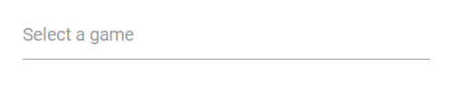
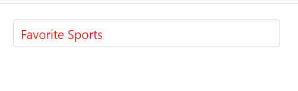
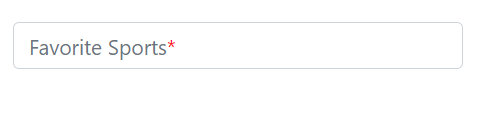
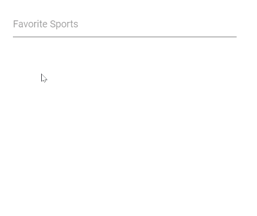
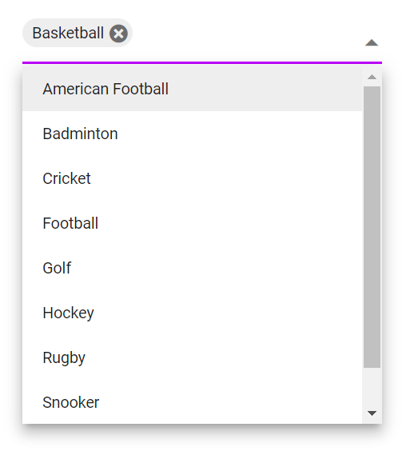

# Placeholder and Float Label in MultiSelect

## Placeholder

Use the [Placeholder](https://help.syncfusion.com/cr/blazor/Syncfusion.Blazor.DropDowns.SfMultiSelect-2.html#Syncfusion_Blazor_DropDowns_SfMultiSelect_2_Placeholder) property to display a small description of the expected value in the input. In the following sample demonstration, set the `Select a game` as the `Placeholder` property value, which will set the respective value to the `Placeholder` attribute of the input element in the DOM.







## Color of the placeholder text

You can change the color of the placeholder by targeting its CSS class `input.e-multiselect::placeholder`, which indicates the placeholder text, and set the desired color using the `color` property.







## Add mandatory indicator using placeholder

The mandatory indicator `*` can be applied to the placeholder by targeting its CSS class `.e-float-text::after` using the `content` style.







## FloatLabel

Use the [FloatLabelType](https://help.syncfusion.com/cr/blazor/Syncfusion.Blazor.DropDowns.SfMultiSelect-2.html#Syncfusion_Blazor_DropDowns_SfMultiSelect_2_FloatLabelType) property to specify the floating label behavior of the DropDownList that the `Placeholder` text floats above the TextBox based on the following values. `FloatLabelType` is applicable only when `Placeholder` is used. `FloatLabelType` is depends on `Placeholder`. Default value of `FloatLabelType` is `Never`.

The floating label supports the types of actions as follow.

Type     | Description
------------ | -------------
  [Auto](https://help.syncfusion.com/cr/blazor/Syncfusion.Blazor.Inputs.FloatLabelType.html#Syncfusion_Blazor_Inputs_FloatLabelType_Auto)       | The floating label will float above the input after focusing, or entering a value in the input.
  [Always](https://help.syncfusion.com/cr/blazor/Syncfusion.Blazor.Inputs.FloatLabelType.html#Syncfusion_Blazor_Inputs_FloatLabelType_Always)     | The floating label will always float above the input.
  [Never](https://help.syncfusion.com/cr/blazor/Syncfusion.Blazor.Inputs.FloatLabelType.html#Syncfusion_Blazor_Inputs_FloatLabelType_Never)      | By default, never float the label in the input when the placeholder is available.

The `FloatLabelType` as  `Auto` is demonstrated in the following code sample.







## Customizing the float label element’s focusing color

You can customize the component color when it is focused by targeting its CSS class `.e-input-focus::after`, which indicates the input element when it is focused, and set the desired color to the `background` property.







