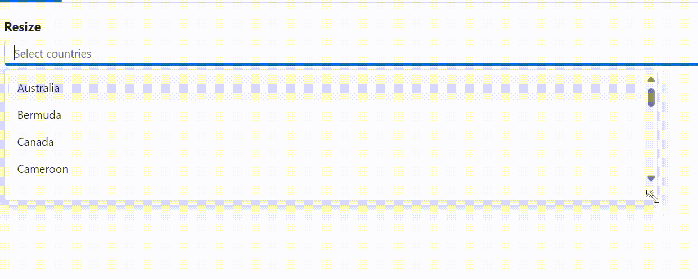
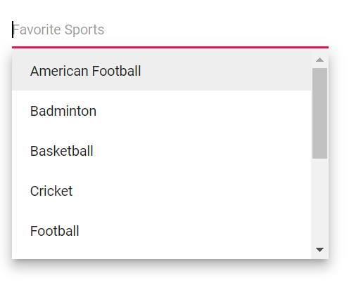
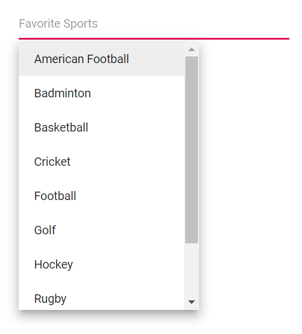
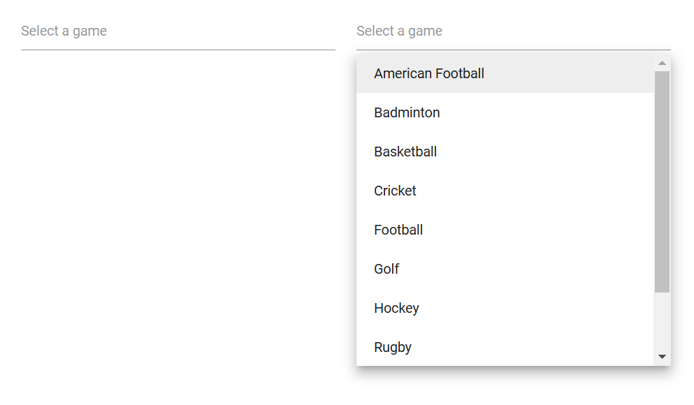
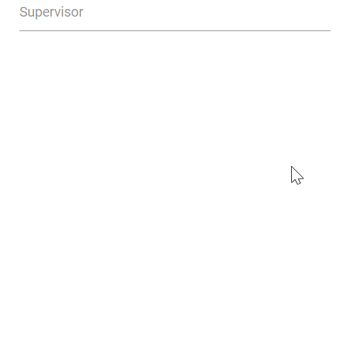
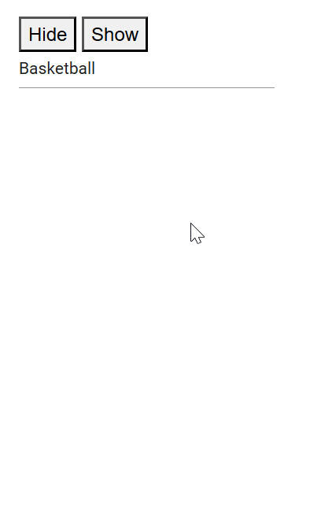

# Popup Setting in MultiSelect

## Popup resize

Dynamically adjust the size of the popup in the MultiSelect component by using the [AllowResize](https://help.syncfusion.com/cr/blazor/Syncfusion.Blazor.DropDowns.SfMultiSelect-2.html#Syncfusion_Blazor_DropDowns_SfMultiSelect_2_AllowResize) property. When enabled, users can resize the popup, improving visibility and control, with the resized dimensions being retained across sessions for a consistent user experience.





 

## Change the PopupHeight

Use the [PopupHeight](https://help.syncfusion.com/cr/blazor/Syncfusion.Blazor.DropDowns.SfMultiSelect-2.html#Syncfusion_Blazor_DropDowns_SfMultiSelect_2_PopupHeight) property to change the height of the popup. The default value of the `PopupHeight` is `300px`.







## Change the PopupWidth

To customize only the popup width, use the [PopupWidth](https://help.syncfusion.com/cr/blazor/Syncfusion.Blazor.DropDowns.SfMultiSelect-2.html#Syncfusion_Blazor_DropDowns_SfMultiSelect_2_PopupWidth) property. The default value of the `PopupWidth` is `100%`. If popup width unspecified, it sets based on the width of the MultiSelect component.







## Change the popup z-index

Customize the [ZIndex](https://help.syncfusion.com/cr/blazor/Syncfusion.Blazor.DropDowns.SfDropDownBase-1.html#Syncfusion_Blazor_DropDowns_SfDropDownBase_1_ZIndex) value of the popup element to control its stacking order. The default value is 1000.

## Show popup on initial loading

Show the popup on initial load by calling [ShowPopupAsync()](https://help.syncfusion.com/cr/blazor/Syncfusion.Blazor.DropDowns.SfMultiSelect-2.html#Syncfusion_Blazor_DropDowns_SfMultiSelect_2_ShowPopupAsync) in the [Created](https://help.syncfusion.com/cr/blazor/Syncfusion.Blazor.DropDowns.MultiSelectEvents-2.html#Syncfusion_Blazor_DropDowns_MultiSelectEvents_2_Created) event.







## Preventing opening and closing

Prevent the popup from opening or closing by setting [BeforeOpenEventArgs.Cancel](https://help.syncfusion.com/cr/blazor/Syncfusion.Blazor.DropDowns.BeforeOpenEventArgs.html#Syncfusion_Blazor_DropDowns_BeforeOpenEventArgs_Cancel) or [PopupEventArgs.Cancel](https://help.syncfusion.com/cr/blazor/Syncfusion.Blazor.DropDowns.PopupEventArgs.html#Syncfusion_Blazor_DropDowns_PopupEventArgs_Cancel) to true within the corresponding [OnOpen](https://help.syncfusion.com/cr/blazor/Syncfusion.Blazor.DropDowns.MultiSelectEvents-2.html#Syncfusion_Blazor_DropDowns_MultiSelectEvents_2_OnOpen) and [OnClose](https://help.syncfusion.com/cr/blazor/Syncfusion.Blazor.DropDowns.MultiSelectEvents-2.html#Syncfusion_Blazor_DropDowns_MultiSelectEvents_2_OnClose) events.







The following events are raised when opening and closing the popup.

### OnOpen event

The [OnOpen](https://help.syncfusion.com/cr/blazor/Syncfusion.Blazor.DropDowns.MultiSelectEvents-2.html#Syncfusion_Blazor_DropDowns_MultiSelectEvents_2_OnOpen) event triggers before the popup opens. If canceled, the popup remains closed.







### Opened event

The [Opened](https://help.syncfusion.com/cr/blazor/Syncfusion.Blazor.DropDowns.MultiSelectEvents-2.html#Syncfusion_Blazor_DropDowns_MultiSelectEvents_2_Opened) event triggers after the popup has opened.







### OnClose event

The [OnClose](https://help.syncfusion.com/cr/blazor/Syncfusion.Blazor.DropDowns.MultiSelectEvents-2.html#Syncfusion_Blazor_DropDowns_MultiSelectEvents_2_OnClose) event triggers before the popup closes. If canceled, the popup remains open.







### Closed event

The [Closed](https://help.syncfusion.com/cr/blazor/Syncfusion.Blazor.DropDowns.MultiSelectEvents-2.html#Syncfusion_Blazor_DropDowns_MultiSelectEvents_2_Closed) event triggers after the popup has closed.







## Popup height based on available space

Adjust the popup height based on the available viewport space by handling the window resize event and updating the popup’s height accordingly.













## Programmatically opening and closing popup

Open and close the popup programmatically by calling `ShowPopupAsync()` and `HidePopupAsync()` on the component instance. For example, bind button click events to these methods to toggle the popup.





 

