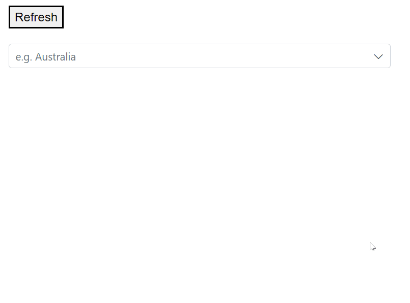

# RefreshDataAsync in Blazor MultiSelect Dropdown Component

The Remote data source is dynamically updated using the **RefreshDataAsync** function. With the aid of this method, update the data source without the need for a [Query](https://help.syncfusion.com/cr/blazor/Syncfusion.Blazor.DropDowns.SfDropDownBase-1.html#Syncfusion_Blazor_DropDowns_SfDropDownBase_1_Query). To update the data source, call the URL link with the help of the RefreshDataAsync method.

In the following example, the first render uses 5 data without using the [Query](https://help.syncfusion.com/cr/blazor/Syncfusion.Blazor.DropDowns.SfDropDownBase-1.html#Syncfusion_Blazor_DropDowns_SfDropDownBase_1_Query). The source is updated with 8 new data using the URL link.







N>When utilizing the `RefreshDataAsync` method with the filter enabled, you must prevent the component's default actions before calling the URL link and the RefreshDataAsync function in the Filtering Event.

### Web API adaptor:
You must use a customized controller in the `WebApiadaptor` to use the `RefreshDataAsync` method.
In this case, the URL link is used to render and refresh the data source.

The WebApiadaptor used with the controller and RefreshDataAsync function is denoted in the following code.













​​​​​​​

### Url adaptor:
When the `RefreshDataAsync` method is used in the Urladaptor, the query's `RequiresCount()` property is required to render the data source initially with the URL link. But the query property is not required to refresh the data source. Only the URL link is required.

The Urladaptor used with the controller and RefreshDataAsync function is denoted in the following code.













​​​​​​​

