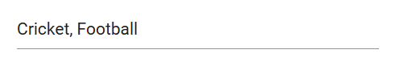
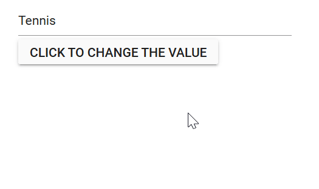

# Selection and deselection in MultiSelect

## Get selected value

Get the selected value of the MultiSelect component in the [ValueChange](https://help.syncfusion.com/cr/blazor/Syncfusion.Blazor.DropDowns.MultiSelectEvents-2.html#Syncfusion_Blazor_DropDowns_MultiSelectEvents_2_ValueChange) event using the [MultiSelectChangeEventArgs.Value](https://help.syncfusion.com/cr/blazor/Syncfusion.Blazor.DropDowns.MultiSelectChangeEventArgs-1.html#Syncfusion_Blazor_DropDowns_MultiSelectChangeEventArgs_1_Value) property.







## Preselected value on OnInitializedAsync

Bind the pre-selected value to the MultiSelect component using the [@bind-Value](https://help.syncfusion.com/cr/blazor/Syncfusion.Blazor.DropDowns.SfMultiSelect-2.html#Syncfusion_Blazor_DropDowns_SfMultiSelect_2_Value) attribute. Assign the value property inside the [OnInitializedAsync](https://learn.microsoft.com/en-us/aspnet/core/blazor/components/lifecycle?view=aspnetcore-6.0#component-initialization-oninitializedasync) lifecycle. The following sample shows how to bind the value on the initial rendering of the component.







## Programmatically change the selected value

Change the component value programmatically or externally by the component instance using the [@ref](https://learn.microsoft.com/en-us/aspnet/core/mvc/views/razor?view=aspnetcore-7.0#ref) attribute of the component. The following sample shows how to change the value of the component using click event of the button component.







### ValueChange event

The [ValueChange](https://help.syncfusion.com/cr/blazor/Syncfusion.Blazor.DropDowns.MultiSelectEvents-2.html#Syncfusion_Blazor_DropDowns_MultiSelectEvents_2_ValueChange) event is triggered when the value of the MultiSelect component get changed or modified. Also, it will return the necessary arguments including the current and previously selected or changed value.







### OnValueSelect event

The [OnValueSelect](https://help.syncfusion.com/cr/blazor/Syncfusion.Blazor.DropDowns.MultiSelectEvents-2.html#Syncfusion_Blazor_DropDowns_MultiSelectEvents_2_OnValueSelect) event is triggered when you select any value in the MultiSelect component. Get the necessary arguments including the [SelectEventArgs.ItemData](https://help.syncfusion.com/cr/blazor/Syncfusion.Blazor.DropDowns.SelectEventArgs-1.html). Also,  prevent the selection of items by setting the [SelectEventArgs.Cancel](https://help.syncfusion.com/cr/blazor/Syncfusion.Blazor.DropDowns.SelectEventArgs-1.html#Syncfusion_Blazor_DropDowns_SelectEventArgs_1_Cancel) property as `true` provided by the event arguments. 







## Get selected item by value

Get the entire object belonging to the value selected in the component using the [GetDataByValue](https://help.syncfusion.com/cr/blazor/Syncfusion.Blazor.DropDowns.SfMultiSelect-2.html#Syncfusion_Blazor_DropDowns_SfMultiSelect_2_GetDataByValueAsync__0_) method.







## Focus the next component on selection

Focus the component programmatically using the [FocusAsync](https://help.syncfusion.com/cr/blazor/Syncfusion.Blazor.DropDowns.SfMultiSelect-2.html#Syncfusion_Blazor_DropDowns_SfMultiSelect_2_FocusAsync) public method. It will set focus instantly to the MultiSelect component when invoking it. 







## Programmatically clear the selected value

To clear the MultiSelect value programmatically, use the [ClearAsync](https://help.syncfusion.com/cr/blazor/Syncfusion.Blazor.DropDowns.SfMultiSelect-2.html#Syncfusion_Blazor_DropDowns_SfMultiSelect_2_ClearAsync) method. This method clears out the selected values from the SfMultiSelect<TValue, TItem> component and sets the [Value](https://help.syncfusion.com/cr/blazor/Syncfusion.Blazor.DropDowns.SfMultiSelect-2.html#Syncfusion_Blazor_DropDowns_SfMultiSelect_2_Value) property to null.







## Prevent reload on form submit

To prevent the page from reloading when using the MultiSelect component inside a form, you can specify the type of the button as "button" by utilizing the `HTMLAttributes` property. This will prevent the page from reloading when the button is clicked.







## Programmatically trigger onChange event

Trigger the [ValueChange](https://help.syncfusion.com/cr/blazor/Syncfusion.Blazor.DropDowns.MultiSelectEvents-2.html#Syncfusion_Blazor_DropDowns_MultiSelectEvents_2_ValueChange) event manually by using the instance (taken from @ref attribute) of the [MultiSelectEvents](https://help.syncfusion.com/cr/blazor/Syncfusion.Blazor.DropDowns.MultiSelectEvents-2.html). In the following example, the `ValueChange` event is invoked inside the `Created` event handler. As per the following code, it will trigger once the component is created or rendered on the page.







## Programmatically focus in and focus out the component

In order to trigger the `FocusAsync()` and `FocusOutAsync()` methods using the instance of the combobox, you can use buttons. You can bind the click event of the button to the `FocusAsync()` and `FocusOutAsync()` methods. When the button is clicked, it triggers the corresponding method on the combobox.







While focusing and focus out the following event get triggered.

### Focus event

The [Focus](https://help.syncfusion.com/cr/blazor/Syncfusion.Blazor.DropDowns.MultiSelectEvents-2.html#Syncfusion_Blazor_DropDowns_MultiSelectEvents_2_Focus) event will trigger when the component gets focused. 







### Blur event

The [Blur](https://help.syncfusion.com/cr/blazor/Syncfusion.Blazor.DropDowns.MultiSelectEvents-2.html#Syncfusion_Blazor_DropDowns_MultiSelectEvents_2_Blur) event will trigger when focus moves out from the component. 





