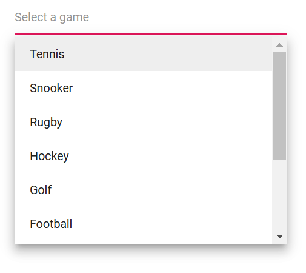

# Sorting in Blazor MultiSelect Component

Enable sorting of items in ascending or descending order by setting the [SortOrder](https://help.syncfusion.com/cr/blazor/Syncfusion.Blazor.DropDowns.SfDropDownBase-1.html#Syncfusion_Blazor_DropDowns_SfDropDownBase_1_SortOrder) property.

The available sort orders are:

SortOrder | Description
------------ | -------------
[None](https://help.syncfusion.com/cr/blazor/Syncfusion.Blazor.DropDowns.SortOrder.html#Syncfusion_Blazor_DropDowns_SortOrder_None) | No sorting; items appear in their original order.
[Ascending](https://help.syncfusion.com/cr/blazor/Syncfusion.Blazor.DropDowns.SortOrder.html#Syncfusion_Blazor_DropDowns_SortOrder_Ascending) | Items are sorted in ascending order.
[Descending](https://help.syncfusion.com/cr/blazor/Syncfusion.Blazor.DropDowns.SortOrder.html#Syncfusion_Blazor_DropDowns_SortOrder_Descending) | Items are sorted in descending order.

In the following demonstration sample, the items in the datasource are shuffled in random order but decide whether the items to be listed in ascending or descending order alphanumerically in the popup.







