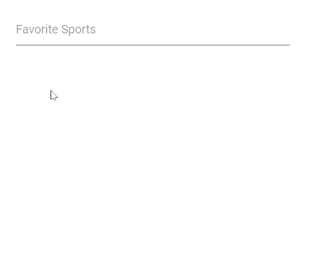
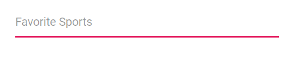
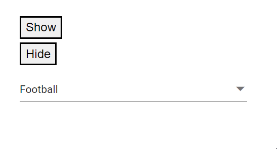

# Style and appearance in Blazor MultiSelect Dropdown Component

The following content provides the exact CSS structure that can be used to modify the control's appearance based on the user preference.

## Customizing the background color of container element

Use the following CSS to customize the background color of container element.

```css
.e-multiselect.e-input-group .e-multi-select-wrapper {
    background-color: red;
}
```

## Customizing the appearance of the delimiter container element

Use the following CSS to customize the appearance of delimiter container element.

```css
.e-multiselect .e-delim-values {
    -webkit-text-fill-color: blue;
    font-size: 16px;
    font-family: cursive;
}
```

## Customizing the appearance of chips

Use the following CSS to customize the appearance of selected chips.

```css
.e-multiselect .e-multi-select-wrapper .e-chips .e-chipcontent {
    font-family: cursive;
    font-size: 20px;
    -webkit-text-fill-color: blue;
}

.e-multi-select-wrapper .e-chips {
    background-color: aqua;
    height: 26px;
}
```

## Customizing the dropdown icon’s color

Use the following CSS to customize the dropdown icon’s color.

```css
.e-multiselect .e-input-group-icon.e-ddl-icon.e-icons, .e-multiselect .e-input-group-icon.e-ddl-icon.e-icons:hover {
    color: red;
    font-size: 13px;
}
```

## Customizing the focus color

Use the following CSS to customize the focusing color of input element.

```css
.e-multiselect.e-input-group.e-control-wrapper.e-input-focus::before, .e-multiselect.e-input-group.e-control-wrapper.e-input-focus::after {
    background: #c000ff;
}
```

## Customizing the disabled component’s text color

Use the following CSS to customize the text color when the component is disabled.

```css
.e-multiselect.e-disabled .e-multi-select-wrapper .e-delim-values {
    -webkit-text-fill-color: red;
}
```

## Customizing the color of the placeholder text

Use the following CSS to customize the text color of placeholder.

```css
.e-multiselect input.e-multiselect::placeholder {
    color: red;
}
```

## Customizing the placeholder to add mandatory indicator(*)

Use the following CSS to add the mandatory indicator * to the float label element.

```css
.e-input-group.e-control-wrapper.e-control-container.e-float-input .e-float-text::after {
    content: "*";
    color: red;
}
```

## Customizing the float label element's focusing color

Use the following CSS to customize the focusing color of float label element.

```css
.e-float-input.e-input-group:not(.e-float-icon-left) .e-float-line::before,.e-float-input.e-control-wrapper.e-input-group:not(.e-float-icon-left) .e-float-line::before,.e-float-input.e-input-group:not(.e-float-icon-left) .e-float-line::after,.e-float-input.e-control-wrapper.e-input-group:not(.e-float-icon-left) .e-float-line::after {
    background-color: #2319b8;
}

.e-multiselect.e-input-group.e-control-wrapper.e-control-container.e-float-input.e-input-focus .e-float-text.e-label-top {
        color: #2319b8;
}
```

## Customizing the outline theme's focus color

Use the following CSS to customize the focusing color of outline theme.

```css
.e-outline.e-input-group.e-input-focus:hover:not(.e-success):not(.e-warning):not(.e-error):not(.e-disabled):not(.e-float-icon-left),.e-outline.e-input-group.e-input-focus.e-control-wrapper:hover:not(.e-success):not(.e-warning):not(.e-error):not(.e-disabled):not(.e-float-icon-left),.e-outline.e-input-group.e-input-focus:not(.e-success):not(.e-warning):not(.e-error):not(.e-disabled),.e-outline.e-input-group.e-control-wrapper.e-input-focus:not(.e-success):not(.e-warning):not(.e-error):not(.e-disabled) {
    border-color: #b1bd15;
    box-shadow: inset 1px 1px #b1bd15, inset -1px 0 #b1bd15, inset 0 -1px #b1bd15;
}
```

## Customizing the background color of focus, hover, and active items

Use the following CSS to customize the background color of focus, hover and active items.

```css
.e-dropdownbase .e-list-item.e-item-focus, .e-dropdownbase .e-list-item.e-active, .e-dropdownbase .e-list-item.e-active.e-hover, .e-dropdownbase .e-list-item.e-hover {
    background-color: #1f9c99;
    color: #2319b8;
}
```

## Customizing the appearance of pop-up element

Use the following CSS to customize the appearance of popup element.

```css
.e-dropdownbase .e-list-item, .e-dropdownbase .e-list-item.e-item-focus {
    background-color: #29c2b8;
    color: #207cd9;
    font-family: emoji;
    min-height: 29px
}
```

## Customizing the color of the checkbox

Use the following CSS to customize the color of checkbox.

```css
.e-popup .e-checkbox-wrapper .e-frame.e-check, .e-popup .e-checkbox-wrapper:hover .e-frame.e-check {
    background-color: green;
    color: white;
}
```

## Properties

### CssClass

Specifies the [CssClass](https://help.syncfusion.com/cr/blazor/Syncfusion.Blazor.DropDowns.MultiSelectModel-1.html#Syncfusion_Blazor_DropDowns_MultiSelectModel_1_CssClass) name that can be appended with the root element of the MultiSelect. One or more custom CSS classes can be added to a MultiSelect.

Some of the possible values are

* `e-success`, which denotes the component in success state that is added green color to the dropdownlist's input field.
* `e-warning`, which denotes the component in warning state that is added orange color to the dropdownlist's input field.
* `e-error`, which denotes the component in error state that is added red color to the dropdownlist's input field.
* `e-outline`, which supports only in material theme.





 


### DelimiterChar

Sets the delimiter character for `default` and `delimiter` visibility modes. [DelimiterChar](https://help.syncfusion.com/cr/blazor/Syncfusion.Blazor.DropDowns.SfMultiSelect-2.html#Syncfusion_Blazor_DropDowns_SfMultiSelect_2_DelimiterChar) is applicable only in default and delimiter mode.

Default value of `DelimiterChar` is `,`.





 


### EnableCloseOnSelect

Based on the property, when item get select popup visibility state will changed.

Default value of [EnableCloseOnSelect](https://help.syncfusion.com/cr/blazor/Syncfusion.Blazor.DropDowns.SfMultiSelect-2.html#Syncfusion_Blazor_DropDowns_SfMultiSelect_2_EnableCloseOnSelect) is `true`.





 


### FloatLabelType

Specifies the floating label behavior of the MultiSelect that the [Placeholder](https://help.syncfusion.com/cr/blazor/Syncfusion.Blazor.DropDowns.SfMultiSelect-2.html#Syncfusion_Blazor_DropDowns_SfMultiSelect_2_Placeholder) text floats above the MultiSelect based on the following values. [FloatLabelType](https://help.syncfusion.com/cr/blazor/Syncfusion.Blazor.DropDowns.SfMultiSelect-2.html#Syncfusion_Blazor_DropDowns_SfMultiSelect_2_FloatLabelType) is applicable only when `Placeholder` is used.`FloatLabelType` is depends on `Placeholder`.

Possible values are:

* [Never](https://help.syncfusion.com/cr/blazor/Syncfusion.Blazor.Inputs.FloatLabelType.html#Syncfusion_Blazor_Inputs_FloatLabelType_Never) - Never floats the label in the MultiSelect when the placeholder is available.
* [Always](https://help.syncfusion.com/cr/blazor/Syncfusion.Blazor.Inputs.FloatLabelType.html#Syncfusion_Blazor_Inputs_FloatLabelType_Always) - The floating label always floats above the MultiSelect.
* [Auto](https://help.syncfusion.com/cr/blazor/Syncfusion.Blazor.Inputs.FloatLabelType.html#Syncfusion_Blazor_Inputs_FloatLabelType_Auto) - The floating label floats above the MultiSelect after focusing it or when enters the value in it.









### HideSelectedItem

Hides the selected item from the list item.

Default value of [HideSelectedItem](https://help.syncfusion.com/cr/blazor/Syncfusion.Blazor.DropDowns.SfMultiSelect-2.html#Syncfusion_Blazor_DropDowns_SfMultiSelect_2_HideSelectedItem) is `true`.

In the following code, `HideSelectedItem` is set as `false`.








### HtmlAttributes

You can add the additional input attributes such as disabled, value, and more to the root element.

If you configured both the property and equivalent input attribute, then the component considers the property value.








### InputAttributes

You can add the additional input attributes such as disabled, value, and more to the root element.

If you configured both the property and equivalent input attribute, then the component considers the property value.








### OpenOnClick

Whether to automatically open the popup when the control is clicked.

Default value of [OpenOnClick](https://help.syncfusion.com/cr/blazor/Syncfusion.Blazor.DropDowns.SfMultiSelect-2.html#Syncfusion_Blazor_DropDowns_SfMultiSelect_2_OpenOnClick) is `true`.









### Placeholder

Specifies the text that is shown as a hint or [Placeholder](https://help.syncfusion.com/cr/blazor/Syncfusion.Blazor.DropDowns.SfMultiSelect-2.html#Syncfusion_Blazor_DropDowns_SfMultiSelect_2_Placeholder) until the user focuses or enter a value in MultiSelect.








### PopupHeight

Gets or sets the height of the popup list. By default, it renders based on its list item.

Default value of [PopupHeight](https://help.syncfusion.com/cr/blazor/Syncfusion.Blazor.DropDowns.SfMultiSelect-2.html#Syncfusion_Blazor_DropDowns_SfMultiSelect_2_PopupHeight) is `300px`.








### PopupWidth

Gets or sets the width of the popup list and percentage values has calculated based on input width.

Default value of [PopupWidth](https://help.syncfusion.com/cr/blazor/Syncfusion.Blazor.DropDowns.SfMultiSelect-2.html#Syncfusion_Blazor_DropDowns_SfMultiSelect_2_PopupWidth) is `100%`.








### Readonly
 
Specifies the boolean value whether the MultiSelect allows the user to change the value.

Default value of [Readonly](https://help.syncfusion.com/cr/blazor/Syncfusion.Blazor.DropDowns.SfMultiSelect-2.html#Syncfusion_Blazor_DropDowns_SfMultiSelect_2_Readonly) is `false`.








### ShowClearButton

Enables close icon with the each selected item.

Default value of [ShowClearButton](https://help.syncfusion.com/cr/blazor/Syncfusion.Blazor.DropDowns.SfMultiSelect-2.html#Syncfusion_Blazor_DropDowns_SfMultiSelect_2_ShowClearButton) is `true`.








### ShowDropDownIcon

Allows you to either show or hide the DropDown button on the component.

Default value of [ShowDropDownIcon](https://help.syncfusion.com/cr/blazor/Syncfusion.Blazor.DropDowns.SfMultiSelect-2.html#Syncfusion_Blazor_DropDowns_SfMultiSelect_2_ShowDropDownIcon) is `false`.








### TabIndex

Specifies the tab order of the DropDownList component.







### Width

Gets or sets the width of the component. By default, it sizes based on its parent. container dimension.

Default value of [Width](https://help.syncfusion.com/cr/blazor/Syncfusion.Blazor.DropDowns.SfMultiSelect-2.html#Syncfusion_Blazor_DropDowns_SfMultiSelect_2_Width) is `100%`.
 




 


## Methods 

### ClearAsync()

Allows you to clear the selected values from the MultiSelect component.

#### Declaration

> public Task ClearAsync()








### FocusAsync()

Sets the focus to the MultiSelect component for interaction.

#### Declaration

> public Task FocusAsync()

### FocusOutAsync()

Remove the focus from the MultiSelect component, if the component is in focus state.

#### Declaration

> public Task FocusOutAsync()







### HidePopupAsync()

Hides the popup if it is in an open state.

#### Declaration

> public Task HidePopupAsync()

### ShowPopupAsync()

Opens the popup that displays the list of items.

#### Declaration

> public Task ShowPopupAsync()







### HideSpinner()

Hides the spinner loader.

#### Declaration

> public Task HideSpinner()

### ShowSpinner()

Shows the spinner loader.

#### Declaration

> public Task ShowSpinner()










