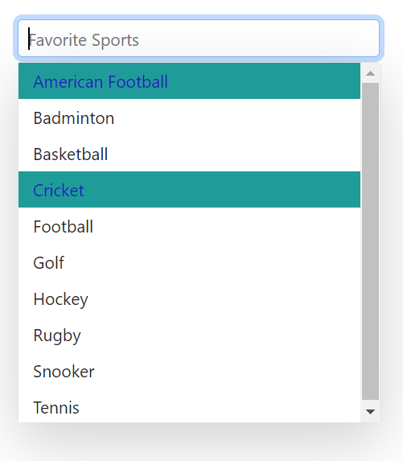

# Style and appearance in Blazor MultiSelect Dropdown Component

The following content outlines the CSS structure and properties that can be used to customize the component’s appearance.

## Read-only mode

Use the [Readonly](https://help.syncfusion.com/cr/blazor/Syncfusion.Blazor.DropDowns.SfMultiSelect-2.html#Syncfusion_Blazor_DropDowns_SfMultiSelect_2_Readonly) property to specify whether users can change the value.







## Disabled state

Control interactivity with the [Enabled](https://help.syncfusion.com/cr/blazor/Syncfusion.Blazor.DropDowns.SfMultiSelect-2.html#Syncfusion_Blazor_DropDowns_SfMultiSelect_2_Enabled) property. Setting it to false disables the component. In contrast, setting [Readonly](https://help.syncfusion.com/cr/blazor/Syncfusion.Blazor.DropDowns.SfMultiSelect-2.html#Syncfusion_Blazor_DropDowns_SfMultiSelect_2_Readonly) to true keeps the component interactive for focus and scrolling but prevents changes to the value.







### Customizing the disabled component’s text color

Customize the text color of a disabled component by targeting `.e-multiselect.e-disabled` and setting the `-webkit-text-fill-color` property.







## Change remove icon color in chip

To change the remove icon color in a chip within the Syncfusion&reg; Blazor MultiSelect component, you can use the following CSS style to customize it.







## Show the custom icon in dropdown icon

Customize the dropdown [icon](https://ej2.syncfusion.com/documentation/appearance/icons#material) by targeting its CSS class `.e-ddl-icon::before`, which indicates the icon element displayed within the dropdown list component, and set the desired icon to the `content` property.







To style only a specific instance, set a custom class via [CssClass](https://help.syncfusion.com/cr/blazor/Syncfusion.Blazor.DropDowns.SfMultiSelect-2.html#Syncfusion_Blazor_DropDowns_SfMultiSelect_2_CssClass) and scope the CSS to that class.







## Adding icons in popup items

Display icons in list items by mapping a field to [IconCss](https://help.syncfusion.com/cr/blazor/Syncfusion.Blazor.DropDowns.MultiSelectFieldSettings.html#Syncfusion_Blazor_DropDowns_MultiSelectFieldSettings_IconCss).







## Customizing the background color of the container

Customize the appearance of the container element within the multiselect component by targeting its CSS class `.e-multi-select-wrapper`, which indicates the parent element of the input, and allows you to apply any desired styles to the component.







## Customizing the dropdown icon’s color

Customize the dropdown [icon](https://ej2.syncfusion.com/documentation/appearance/icons/#material) by targeting its CSS class `.e-ddl-icon.e-icons`, which indicates the icon element displayed within the multiselect component, and setting the desired color to the `color` property.







## CssClass

Specifies the [CssClass](https://help.syncfusion.com/cr/blazor/Syncfusion.Blazor.DropDowns.MultiSelectModel-1.html#Syncfusion_Blazor_DropDowns_MultiSelectModel_1_CssClass) name that can be appended with the root element of the MultiSelect. One or more custom CSS classes can be added to a MultiSelect.

Some of the possible values are

* `e-success`, which denotes the component in success state that is added green color to the multiselect's input field.
* `e-warning`, which denotes the component in warning state that is added orange color to the multiselect's input field.
* `e-error`, which denotes the component in error state that is added red color to the multiselect's input field.
* `e-outline`, which supports only in material theme.





 

## Customizing the appearance of the delimiter container

Customize the appearance of the delimiter container element within the multiselect component by targeting its CSS class `.e-delim-values`, which indicates the selected values separated by the delimiter character of the multiselect component, and allows you to apply any desired styles to the component.







## Customizing the appearance of chips

Customize the appearance of the chips within the multiselect component by targeting its CSS classes `.e-chips` and `.e-chipcontent`, which represent the chips of the multiselect component, and apply any desired styles to the component.







## Customizing the outline theme focus color

Customize the color of the multiselect component when it is in a focused state and rendered with an outline theme, by targeting its CSS class `e-outline` which indicates the input element when it is focused, and allows you to set the desired color to the `color` property.







## Customizing focus, hover, and active item styles

Customize the background color and text color of list items within the multiselect component when they are in a focused, active, or hovered state by targeting the CSS classes `.e-list-item.e-item-focus`, `.e-list-item.e-active`, and `.e-list-item.e-hover`, and set the desired color to the `background-color` and `color` properties.







## Customizing the appearance of the popup element

Use the following CSS to customize the appearance of popup element.

Customize the appearance of the popup element within the multiselect component by targeting the CSS class `.e-list-item.e-item-focus`, which indicates the list item element when it is focused, and and allows you to apply any desired styles to the component.







## Change HTML attributes

Add additional input attributes such as disabled, value, and more to the root element.

If you configured both the property and equivalent input attribute, then the component considers the property value.







## Set various font families for dropdown elements

The font-family of the multiselect dropdown list can be changed by overriding using the following selector. The overridden can be applied to specific component by adding a class name through the [CssClass](https://help.syncfusion.com/cr/blazor/Syncfusion.Blazor.DropDowns.SfMultiSelect-2.html#Syncfusion_Blazor_DropDowns_SfMultiSelect_2_CssClass) property.

In the following sample, the font family of the MultiSelect, ListItem text in DropDownList and filterInput text are changed.







## Show a tooltip on list items

You can achieve this behavior by integrating the tooltip component. When the mouse hovers over the DropDownList option, a tooltip appears with information about the hovered list item.

The following code demonstrates how to display a tooltip when hovering over the DropDownList option.







## Change the width

Set the component width using the [Width](https://help.syncfusion.com/cr/blazor/Syncfusion.Blazor.DropDowns.SfMultiSelect-2.html#Syncfusion_Blazor_DropDowns_SfMultiSelect_2_Width) property. The default is 100% (inherits parent width).





 

## Disable specific items in the dropdown list

The [MultiSelect](https://help.syncfusion.com/cr/blazor/Syncfusion.Blazor.DropDowns.SfMultiSelect-2.html) provides options for individual items to be either in an enabled or disabled state for specific scenarios. The category of each list item can be mapped through the [Disabled](https://help.syncfusion.com/cr/blazor/Syncfusion.Blazor.DropDowns.MultiSelectFieldSettings.html#Syncfusion_Blazor_DropDowns_MultiSelectFieldSettings_Disabled) field in the data table. Once an item is disabled, it cannot be selected as a value for the component. To configure the disabled item columns, use the `MultiSelectFieldSettings.Disabled` property.

In the following sample, State are grouped according on its category using `Disabled` field.









## Disable item method

The disableItem method can be used to handle dynamic changing in disable state of a specific item. Only one item can be disabled in this method. To disable multiple items, this method can be iterated with the items list or array. The disabled field state will to be updated in the [DataSource](https://help.syncfusion.com/cr/blazor/Syncfusion.Blazor.DropDowns.SfDropDownBase-1.html#Syncfusion_Blazor_DropDowns_SfDropDownBase_1_DataSource), when the item is disabled using this method. If the selected item is disabled dynamically, then the selection will be cleared.

| Parameter | Type | Description |
|------|------|------|
| itemValue | <code>string</code> \| <code>number</code> \| <code>boolean</code> \| <code>object</code> | Identifies the item to update by its value. |
| itemIndex | <code>number</code> | Identifies the item to update by its index. |

## Customizing the color of the checkbox

Change the color of the checkbox by targeting the CSS classes `.e-checkbox-wrapper` and `.e-frame.e-check` which indicates the checkbox of the list item element. Set the desired color using the `background-color` and `color` properties.







## InputAttributes

Add extra input attributes to the root element via `InputAttributes`. If both a property and an equivalent input attribute are set, the property value takes precedence.







## Customization of hiding selected item

By default, selected items are hidden from the list. Set [HideSelectedItem](https://help.syncfusion.com/cr/blazor/Syncfusion.Blazor.DropDowns.SfMultiSelect-2.html#Syncfusion_Blazor_DropDowns_SfMultiSelect_2_HideSelectedItem) to false to show selected items in the list. The default value is true.







## Show or hide the popup after selection

Use [EnableCloseOnSelect](https://help.syncfusion.com/cr/blazor/Syncfusion.Blazor.DropDowns.SfMultiSelect-2.html#Syncfusion_Blazor_DropDowns_SfMultiSelect_2_EnableCloseOnSelect) to control whether the popup closes automatically after a selection. The default is true.





 

## Programmatically clearing value

Clear the value programmatically by calling `ClearAsync()` on the component instance (for example, from a button click handler).







## Programmatically show and hide spinner

Show or hide the built-in spinner by calling `ShowSpinnerAsync()` and `HideSpinnerAsync()` on the component instance.







## Programmatically focus in and focus out

Move focus in and out programmatically by calling `FocusAsync()` and `FocusOutAsync()` on the component instance.







## Popup opening on click

Use the `OpenOnClick` property to control whether clicking the component opens the popup automatically. The default value is true.







