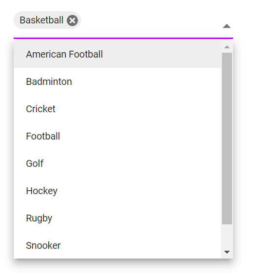
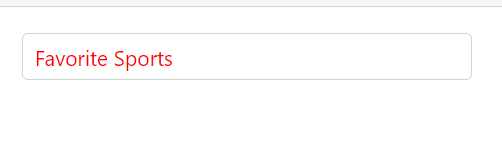
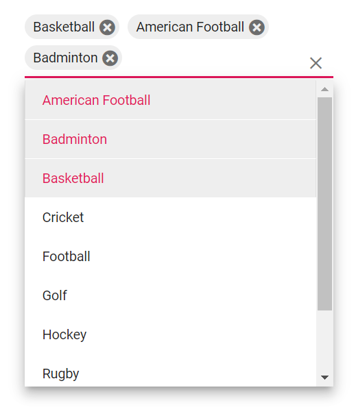
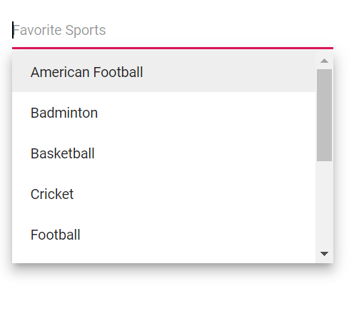
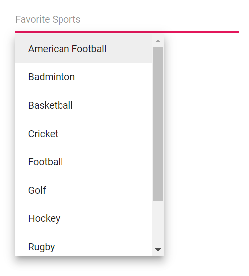

# Style and appearance in Blazor MultiSelect Dropdown Component

The following content provides the exact CSS structure that can be used to modify the control's appearance based on the user preference.

## Read-only mode

Specify the boolean value to the [Readonly](https://help.syncfusion.com/cr/blazor/Syncfusion.Blazor.DropDowns.SfDropDownList-2.html#Syncfusion_Blazor_DropDowns_SfDropDownList_2_Readonly) whether the MultiSelect allows the user to change the value or not.







## CssClass

Specifies the [CssClass](https://help.syncfusion.com/cr/blazor/Syncfusion.Blazor.DropDowns.MultiSelectModel-1.html#Syncfusion_Blazor_DropDowns_MultiSelectModel_1_CssClass) name that can be appended with the root element of the MultiSelect. One or more custom CSS classes can be added to a MultiSelect.

Some of the possible values are

* `e-success`, which denotes the component in success state that is added green color to the multiselect's input field.
* `e-warning`, which denotes the component in warning state that is added orange color to the multiselect's input field.
* `e-error`, which denotes the component in error state that is added red color to the multiselect's input field.
* `e-outline`, which supports only in material theme.





 

## Customizing the background color of container element

You can customize the color of the container element within the multiselect component by targeting its CSS class `.e-multi-select-wrapper`, which indicates the wrapper element of the multiselect component, and set the desired color for the `background-color` property.







## Customizing the appearance of the delimiter container element

You can customize the appearance of the delimiter container element within the multiselect component by targeting its CSS class `.e-delim-values`, which indicates the selected values separated by the delimiter character of the multiselect component, and allows you to apply any desired styles to the component.







## Customizing the appearance of chips

You can customize the appearance of the chips within the multiselect component by targeting its CSS classes `.e-chips` and `.e-chipcontent`, which represent the chips of the multiselect component, and apply any desired styles to the component.







## Customizing the dropdown icon’s color

You can customize the dropdown [icon](https://ej2.syncfusion.com/documentation/appearance/icons/#material) by targeting its CSS class `.e-ddl-icon.e-icons`, which indicates the icon element displayed within the multiselect component, and setting the desired color to the `color` property.







## Customizing the focus color

You can customize the component color when it is focused by targeting its CSS class `.e-input-focus::after`, which indicates the input element when it is focused, and set the desired color to the `background` property.







## Customizing the disabled component’s text color

You can customize the text color of a disabled component by targeting its CSS class `.e-multiselect.e-disabled`, which indicates the input element in a disabled state, and set the desired color to the `-webkit-text-fill-color` property.







## Customizing the color of the placeholder text

You can change the color of the placeholder by targeting its CSS class `input.e-multiselect::placeholder`, which indicates the placeholder text, and set the desired color using the `color` property.







## Customizing the placeholder to add mandatory indicator(*)

The mandatory indicator `*` can be applied to the placeholder by targeting its CSS class `.e-float-text::after` using the `content` style.







## Customizing the float label element's focusing color

You can change the text color of the floating label when it is focused by targeting its CSS classes `.e-input-focus` and `.e-float-text.e-label-top`. These classes indicate the floating label text while it is focused and set the desired color using the `color` property.







## Customizing the outline theme's focus color

You can customize the color of the multiselect component when it is in a focused state and rendered with an outline theme, by targeting its CSS class `e-outline` which indicates the input element when it is focused, and allows you to set the desired color to the `color` property.







## Customizing the background color of focus, hover, and active items

You can customize the background color and text color of list items within the multiselect component when they are in a focused, active, or hovered state by targeting the CSS classes `.e-list-item.e-item-focus`, `.e-list-item.e-active`, and `.e-list-item.e-hover`, and set the desired color to the `background-color` and `color` properties.







## Customizing the appearance of pop-up element

Use the following CSS to customize the appearance of popup element.

You can customize the appearance of the popup element within the multiselect component by targeting the CSS class `.e-list-item.e-item-focus`, which indicates the list item element when it is focused, and and allows you to apply any desired styles to the component.







## Customizing the color of the checkbox

You can change the color of the checkbox by targeting the CSS classes `.e-checkbox-wrapper` and `.e-frame.e-check` which indicates the checkbox of the list item element. Set the desired color using the `background-color` and `color` properties.







## Placeholder

Specifies the text that is shown as a hint or [Placeholder](https://help.syncfusion.com/cr/blazor/Syncfusion.Blazor.DropDowns.SfMultiSelect-2.html#Syncfusion_Blazor_DropDowns_SfMultiSelect_2_Placeholder) until the user focuses or enter a value in MultiSelect.







## FloatLabelType

Specifies the floating label behavior of the MultiSelect that the [Placeholder](https://help.syncfusion.com/cr/blazor/Syncfusion.Blazor.DropDowns.SfMultiSelect-2.html#Syncfusion_Blazor_DropDowns_SfMultiSelect_2_Placeholder) text floats above the MultiSelect based on the following values. [FloatLabelType](https://help.syncfusion.com/cr/blazor/Syncfusion.Blazor.DropDowns.SfMultiSelect-2.html#Syncfusion_Blazor_DropDowns_SfMultiSelect_2_FloatLabelType) is applicable only when `Placeholder` is used.`FloatLabelType` is depends on `Placeholder`.

Possible values are:

* [Never](https://help.syncfusion.com/cr/blazor/Syncfusion.Blazor.Inputs.FloatLabelType.html#Syncfusion_Blazor_Inputs_FloatLabelType_Never) - Never floats the label in the MultiSelect when the placeholder is available.
* [Always](https://help.syncfusion.com/cr/blazor/Syncfusion.Blazor.Inputs.FloatLabelType.html#Syncfusion_Blazor_Inputs_FloatLabelType_Always) - The floating label always floats above the MultiSelect.
* [Auto](https://help.syncfusion.com/cr/blazor/Syncfusion.Blazor.Inputs.FloatLabelType.html#Syncfusion_Blazor_Inputs_FloatLabelType_Auto) - The floating label floats above the MultiSelect after focusing it or when enters the value in it.







## HtmlAttributes

You can add the additional input attributes such as disabled, value, and more to the root element.

If you configured both the property and equivalent input attribute, then the component considers the property value.







## InputAttributes

You can add the additional input attributes such as disabled, value, and more to the root element.

If you configured both the property and equivalent input attribute, then the component considers the property value.







## Customization of hiding selected item

By default, the selected items are hidden from the list in the MultiSelect component. You can change this behavior by setting the [HideSelectedItem](https://help.syncfusion.com/cr/blazor/Syncfusion.Blazor.DropDowns.SfMultiSelect-2.html#Syncfusion_Blazor_DropDowns_SfMultiSelect_2_HideSelectedItem) property to false. The default value of HideSelectedItem is true.

In the following code, `HideSelectedItem` is set as `false`.







## Show or Hide Popup after selection

The [EnableCloseOnSelect](https://help.syncfusion.com/cr/blazor/Syncfusion.Blazor.DropDowns.SfMultiSelect-2.html#Syncfusion_Blazor_DropDowns_SfMultiSelect_2_EnableCloseOnSelect) property is a boolean attribute that determines whether the multi-select component's popup should close or remain open after a user makes a selection. When set to true, the popup will automatically close after a selection is made. When set to false, the popup will remain open after a selection is made. Default value of `EnableCloseOnSelect` is `true`.





 

## Change the PopupHeight

Customize the height of the popup using the [PopupHeight](https://help.syncfusion.com/cr/blazor/Syncfusion.Blazor.DropDowns.SfDropDownList-2.html#Syncfusion_Blazor_DropDowns_SfDropDownList_2_PopupHeight). The default value of the `PopupHeight` is `300px`.







## Change the PopupWidth

Customize the width of the popup using the [PopupWidth](https://help.syncfusion.com/cr/blazor/Syncfusion.Blazor.DropDowns.SfDropDownList-2.html#Syncfusion_Blazor_DropDowns_SfDropDownList_2_PopupWidth) property. The default value of the `PopupWidth` is `100%`. If popup width unspecified, it sets based on the width of the MultiSelect component.







## Change the Width

Gets or sets the width of the component. By default, it sizes based on its parent. container dimension.

Default value of [Width](https://help.syncfusion.com/cr/blazor/Syncfusion.Blazor.DropDowns.SfMultiSelect-2.html#Syncfusion_Blazor_DropDowns_SfMultiSelect_2_Width) is `100%`.
 




 

## Programmatically clearing value

You can clear the value programmatically by accessing the `ClearAsync()` method through an instance of the multiselect. You can bind the click event of a button to the `ClearAsync()` method. When the button is clicked, it will trigger the `ClearAsync()` method on the multiselect, clearing its value.







## Programmatically show and hide spinner

In order to trigger the `HideSpinnerAsync()` and `ShowSpinnerAsync()` methods of the multiselect, you can use buttons. The code provided binds the click event of the button to the corresponding method on the multiselect instance. When the button is clicked, it will trigger the `HideSpinnerAsync()` and `ShowSpinnerAsync()` methods on the multiselect, respectively.







## Programmatically focus in and focus out the component

In order to trigger the `FocusAsync()` and `FocusOutAsync()` methods using the instance of the multiselect, you can use buttons. You can bind the click event of the button to the `FocusAsync()` and `FocusOutAsync()` methods. When the button is clicked, it triggers the corresponding method on the multiselect.







## Popup opening on click

`OpenOnClick` is property of a multi-select component that controls the behavior of the popup. It determines whether the popup should open automatically when the user clicks on the multi-select component or if it should only open when the user clicks on a specific button or icon. Default value of `OpenOnClick` is `true`.







