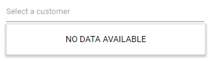
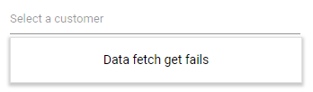

# Templates

The MultiSelect has been provided with several options to customize each list item, group title,
selected value, header, and footer elements.

## Item template

The content of each list item within the MultiSelect can be customized with the
help of [ItemTemplate](https://help.syncfusion.com/cr/blazor/Syncfusion.Blazor.DropDowns.SfDropDownBase-1.html#Syncfusion_Blazor_DropDowns_SfDropDownBase_1_ItemTemplate) property.

In the following sample, each list item is split into two columns to display relevant data.

```cshtml
@using Syncfusion.Blazor.Data
@using Syncfusion.Blazor.DropDowns
@using Syncfusion.Blazor

<SfMultiSelect Placeholder="Select a employee" TValue="string[]" TItem="EmployeeData" Query="@Query">
    <MultiSelectTemplates TItem="EmployeeData">
        <ItemTemplate>
            <span><span class='name'>@((context as EmployeeData).FirstName)</span><span class='country'>@((context as EmployeeData).Country)</span></span>
        </ItemTemplate>
    </MultiSelectTemplates>
    <SfDataManager Url="https://ej2services.syncfusion.com/production/web-services/api/Employees" Adaptor="Adaptors.WebApiAdaptor" CrossDomain=true></SfDataManager>
    <MultiSelectFieldSettings Text="FirstName" Value="Country"></MultiSelectFieldSettings>
</SfMultiSelect>

@code {
    public class EmployeeData
    {
        public string FirstName { get; set; }
        public string Country { get; set; }
    }
    public Query Query = new Query();
}

<style>
    .country {
        right: 15px;
        position: absolute;
    }
</style>
```

The output will be as follows.


## Value template

The currently selected value that is displayed by default on the MultiSelect input element can be customized using the [ValueTemplate](https://help.syncfusion.com/cr/blazor/Syncfusion.Blazor.DropDowns.SfMultiSelect-1.html#Syncfusion_Blazor_DropDowns_SfMultiSelect_1_ValueTemplate) property.

In the following sample, the selected value is displayed as a combined text of both `FirstName` and `Designation`
in the MultiSelect input, which is separated by a hyphen.

```cshtml
@using Syncfusion.Blazor.Data
@using Syncfusion.Blazor.DropDowns
@using Syncfusion.Blazor
<SfMultiSelect TValue="string[]" TItem="EmployeeData" Placeholder="Select a employee" Query="@Query">
    <MultiSelectTemplates TItem="EmployeeData">
        <ItemTemplate>
            <span><span class='name'>@((context as EmployeeData).FirstName)</span><span class='destination'>@((context as EmployeeData).Designation)</span></span>
        </ItemTemplate>
        <ValueTemplate>
            <span>@((context as EmployeeData).FirstName) - @((context as EmployeeData).Designation)</span>
        </ValueTemplate>
    </MultiSelectTemplates>
    <SfDataManager Url="https://ej2services.syncfusion.com/production/web-services/api/Employees" Adaptor="Adaptors.WebApiAdaptor" CrossDomain=true></SfDataManager>
    <MultiSelectFieldSettings Text="FirstName" Value="Designation"></MultiSelectFieldSettings>
</SfMultiSelect>

@code {
    public class EmployeeData
    {
        public string FirstName { get; set; }
        public string Designation { get; set; }
    }
    public Query Query = new Query();
}
<style>
    .destination {
        right: 15px;
        position: absolute;
    }
</style>
```

The output will be as follows.


## Header template

The header element is shown statically at the top of the popup list items within the
MultiSelect, and any custom element can be placed as a header element using the
[HeaderTemplate](https://help.syncfusion.com/cr/blazor/Syncfusion.Blazor.DropDowns.SfMultiSelect-1.html#Syncfusion_Blazor_DropDowns_SfMultiSelect_1_HeaderTemplate) property.

In the following sample, the list items and its headers are designed and displayed as two columns
similar to multiple columns of the grid.

```cshtml
@using Syncfusion.Blazor.Data
@using Syncfusion.Blazor.DropDowns
@using Syncfusion.Blazor

<SfMultiSelect TValue="string[]" TItem="EmployeeData" Placeholder="Select a employe" Query="@Query">
    <MultiSelectTemplates TItem="EmployeeData">
        <ItemTemplate>
            <span class='item'><span class='name'>@((context as EmployeeData).FirstName)</span><span class='city'>@((context as EmployeeData).Country)</span></span>
        </ItemTemplate>
        <HeaderTemplate>
            <span class='head'><span class='name'>Name</span><span class='city'>Country</span></span>
        </HeaderTemplate>
    </MultiSelectTemplates>
    <SfDataManager Url="https://ej2services.syncfusion.com/production/web-services/api/Employees" Adaptor="Adaptors.WebApiAdaptor" CrossDomain=true></SfDataManager>
    <MultiSelectFieldSettings Value="Country" Text="FirstName"></MultiSelectFieldSettings>
</SfMultiSelect>

@code {
    public class EmployeeData
    {
        public string FirstName { get; set; }
        public string Country { get; set; }
    }
    public Query Query = new Query();
}

<style>
    .head, .item {
        display: table;
        width: 100%;
        margin: auto;
    }

    .head {
        height: 40px;
        font-size: 15px;
        font-weight: 600;
    }

    .name, .city {
        display: table-cell;
        vertical-align: middle;
        width: 50%;
    }

    .head .name {
        text-indent: 16px;
    }

    .head .city {
        text-indent: 10px;
    }
</style>
```

The output will be as follows.


## Footer template

The MultiSelect has options to show a footer element at the bottom of the list items in the popup list.
Here, you can place any custom element as a footer element using the [FooterTemplate](https://help.syncfusion.com/cr/blazor/Syncfusion.Blazor.DropDowns.SfMultiSelect-1.html#Syncfusion_Blazor_DropDowns_SfMultiSelect_1_FooterTemplate) property.

In the following sample, footer element displays the total number of list items present in the MultiSelect.

```cshtml
@using Syncfusion.Blazor.Data
@using Syncfusion.Blazor.DropDowns
@using Syncfusion.Blazor

<SfMultiSelect TValue="string[]" TItem="EmployeeData" Query="@Query" Placeholder="Select a customer">
    <MultiSelectTemplates TItem="EmployeeData">
        <FooterTemplate>
            <span class='footer'>Total list Item: 6 </span>
        </FooterTemplate>
    </MultiSelectTemplates>
    <SfDataManager Url="https://ej2services.syncfusion.com/production/web-services/api/Employees" Adaptor="Adaptors.WebApiAdaptor" CrossDomain=true></SfDataManager>
    <MultiSelectFieldSettings Value="Country" Text="FirstName"></MultiSelectFieldSettings>
</SfMultiSelect>

@code {

    public class EmployeeData
    {
        public string FirstName { get; set; }
    }
    public Query Query = new Query();
}

<style>
    .footer {
        text-indent: 1.2em;
        display: block;
        font-size: 15px;
        line-height: 40px;
        border-top: 1px solid #e0e0e0;
    }
</style>
```

The output will be as follows.


## No records template

The MultiSelect is provided with support to custom design the popup list content when no data is found
and no matches found on search with the help of
[NoRecordsTemplate](https://help.syncfusion.com/cr/blazor/Syncfusion.Blazor.DropDowns.SfDropDownBase-1.html#Syncfusion_Blazor_DropDowns_SfDropDownBase_1_NoRecordsTemplate) property.

In the following sample, popup list content displays the notification of no data available.

```cshtml
@using Syncfusion.Blazor.DropDowns

<SfMultiSelect TValue="string[]" TItem="EmployeeData" Placeholder="Select a employee" CssClass="e-custom" DataSource="@employee">
    <MultiSelectTemplates TItem="EmployeeData">
        <NoRecordsTemplate>
            <span class='norecord'> NO DATA AVAILABLE</span>
        </NoRecordsTemplate>
    </MultiSelectTemplates>
</SfMultiSelect>

@code {

    public class EmployeeData { }

    List<EmployeeData> employee = new List<EmployeeData> { };
}
```

The output will be as follows.



## Action failure template

There is also an option to custom design the popup list content when the data fetch request
fails at the remote server. This can be achieved using the
[ActionFailureTemplate](https://help.syncfusion.com/cr/blazor/Syncfusion.Blazor.DropDowns.SfDropDownBase-1.html#Syncfusion_Blazor_DropDowns_SfDropDownBase_1_ActionFailureTemplate) property.

In the following sample, when the data fetch request fails, the MultiSelect displays the notification.

```cshtml
@using Syncfusion.Blazor.Data
@using Syncfusion.Blazor.DropDowns
@using Syncfusion.Blazor

<SfMultiSelect  TValue="string[]" TItem="EmployeeData" Placeholder="Select a customer" Query="@Query">
    <MultiSelectTemplates TItem="EmployeeData">
        <ActionFailureTemplate>
            <span class='norecord'>Data fetch get fails </span>
        </ActionFailureTemplate>
    </MultiSelectTemplates>
    <SfDataManager Url="https://services.odata.org/V4/Northwind/Northwind.svcs/Employees" Adaptor="Adaptors.ODataV4Adaptor" CrossDomain=true></SfDataManager>
    <MultiSelectFieldSettings Value="Country" Text="FirstName"></MultiSelectFieldSettings>
</SfMultiSelect>

@code {
    public class EmployeeData
    {
        public string FirstName { get; set; }
    }
    public Query Query = new Query();
}
```

The output will be as follows.

