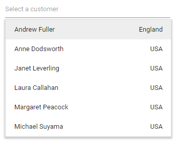
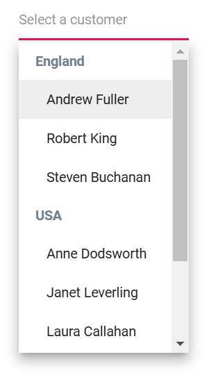
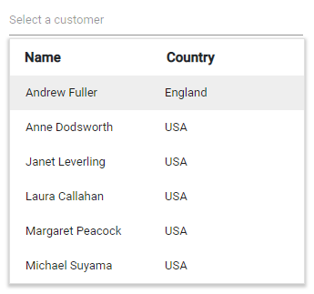
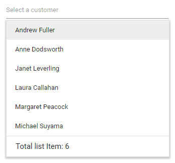

# Templates in Blazor MultiSelect Dropdown Component

The MultiSelect provides template options to customize the selected value, list items, group headers, header, and footer elements.

To get started quickly with templates in the Blazor MultiSelect Dropdown component, watch the following video:


## Value template

Customize how the currently selected value is displayed in the input by using the [ValueTemplate](https://help.syncfusion.com/cr/blazor/Syncfusion.Blazor.DropDowns.MultiSelectModel-1.html#Syncfusion_Blazor_DropDowns_MultiSelectModel_1_ValueTemplate) property.

In the following sample, the selected value displays combined text from `FirstName` and `Designation`, separated by a hyphen.







## Item template

Customize the content of each list item by using the [ItemTemplate](https://help.syncfusion.com/cr/blazor/Syncfusion.Blazor.DropDowns.SfDropDownBase-1.html#Syncfusion_Blazor_DropDowns_SfDropDownBase_1_ItemTemplate) property.

In the following sample, each list item is split into two columns to display related data.







## Group template

Customize the group header title (used for both inline and floating headers) by using the [GroupTemplate](https://help.syncfusion.com/cr/blazor/Syncfusion.Blazor.DropDowns.SfDropDownBase-1.html#Syncfusion_Blazor_DropDowns_SfDropDownBase_1_GroupTemplate) property.

In the following sample, employees are grouped by city.







## Header template

Render a custom header at the top of the popup by using the [HeaderTemplate](https://help.syncfusion.com/cr/blazor/Syncfusion.Blazor.DropDowns.MultiSelectModel-1.html#Syncfusion_Blazor_DropDowns_MultiSelectModel_1_HeaderTemplate) property.

In the following sample, the header and list items are presented in two columns similar to a grid layout.







## Footer template

Render a custom footer at the bottom of the popup list by using the [FooterTemplate](https://help.syncfusion.com/cr/blazor/Syncfusion.Blazor.DropDowns.MultiSelectModel-1.html#Syncfusion_Blazor_DropDowns_MultiSelectModel_1_FooterTemplate) property.

In the following sample, the footer displays the total number of list items.







## No records template

Customize the popup content when no items are available or when search yields no matches by using the [NoRecordsTemplate](https://help.syncfusion.com/cr/blazor/Syncfusion.Blazor.DropDowns.SfDropDownBase-1.html#Syncfusion_Blazor_DropDowns_SfDropDownBase_1_NoRecordsTemplate) property.

In the following sample, the popup displays a “no data available” message.







## Action failure template

Customize the popup content displayed when a remote data request fails by using the [ActionFailureTemplate](https://help.syncfusion.com/cr/blazor/Syncfusion.Blazor.DropDowns.SfDropDownBase-1.html#Syncfusion_Blazor_DropDowns_SfDropDownBase_1_ActionFailureTemplate) property.

In the following sample, the component shows a notification when data retrieval fails.







