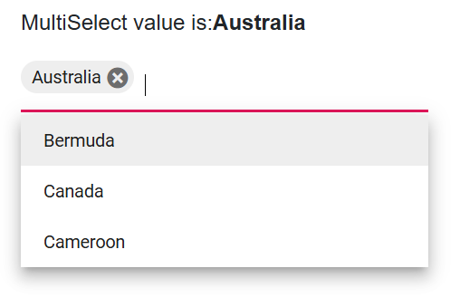
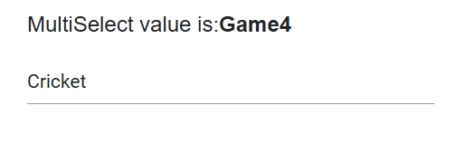
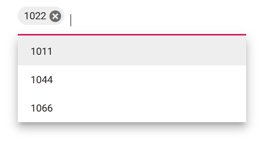
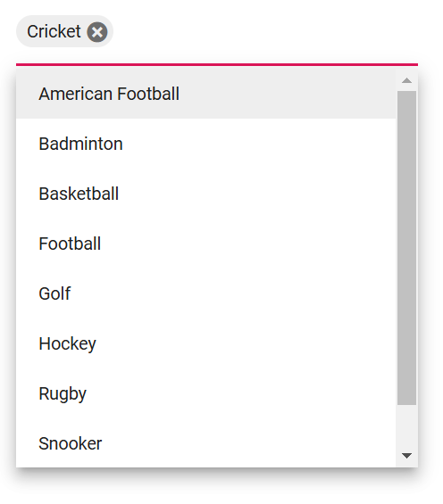
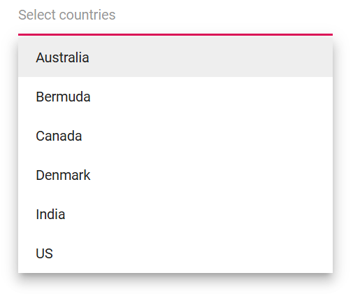
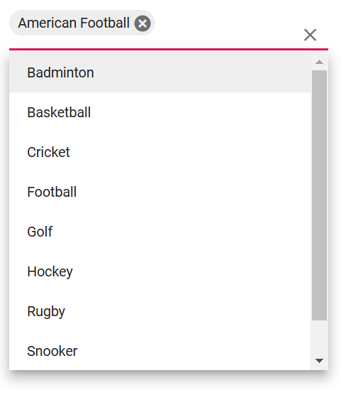

# Value Binding in MultiSelect

Value binding is the process of passing values between a component and its parent. There are two methods for binding values. These are:

- @bind-Value binding

## Bind value binding

Value binding is achieved by using the [@bind-Value](https://help.syncfusion.com/cr/blazor/Syncfusion.Blazor.DropDowns.SfMultiSelect-2.html#Syncfusion_Blazor_DropDowns_SfMultiSelect_2_Value) attribute, and it supports `string`, `int`, `enum`, `bool`, and complex types. When the component value changes, the bound variable used with `@bind-Value` is updated everywhere it is referenced. For binding to work correctly, the value assigned to `@bind-Value` must correspond to the field mapped to [MultiSelectFieldSettings.Value](https://help.syncfusion.com/cr/blazor/Syncfusion.Blazor.DropDowns.MultiSelectFieldSettings.html#Syncfusion_Blazor_DropDowns_MultiSelectFieldSettings_Value).

- TItem - Specifies the type of the data items in the MultiSelect component.
- TValue - Specifies the type of the value field (the selection type). The component’s Value is an array of this type.







## Text and value

The [MultiSelectFieldSettings.Value](https://help.syncfusion.com/cr/blazor/Syncfusion.Blazor.DropDowns.MultiSelectFieldSettings.html#Syncfusion_Blazor_DropDowns_MultiSelectFieldSettings_Value) and [MultiSelectFieldSettings.Text](https://help.syncfusion.com/cr/blazor/Syncfusion.Blazor.DropDowns.MultiSelectFieldSettings.html#Syncfusion_Blazor_DropDowns_MultiSelectFieldSettings_Text) properties map to the corresponding fields of the data model. The Value field maintains the unique value for each item in the data source, and the Text field provides the displayed text for list items in the popup.

The following example demonstrates Text and Value field mapping. For instance, the selected item displays `Badminton` (Text), while the Value field holds `Game2` (ID).







## Primitive type binding

The MultiSelect supports arrays of primitive data such as strings and numbers. Bind the value of primitive data to the [@bind-Value](https://help.syncfusion.com/cr/blazor/Syncfusion.Blazor.DropDowns.SfMultiSelect-2.html#Syncfusion_Blazor_DropDowns_SfMultiSelect_2_Value) attribute of the MultiSelect.

The following example demonstrates an array of strings as the data source.







The following example demonstrates an array of integers as the data source.







## Object binding

Bind object data to the [@bind-Value](https://help.syncfusion.com/cr/blazor/Syncfusion.Blazor.DropDowns.SfMultiSelect-2.html#Syncfusion_Blazor_DropDowns_SfMultiSelect_2_Value) attribute and map the value field via [MultiSelectFieldSettings.Value](https://help.syncfusion.com/cr/blazor/Syncfusion.Blazor.DropDowns.MultiSelectFieldSettings.html#Syncfusion_Blazor_DropDowns_MultiSelectFieldSettings_Value). Set `TItem` to the data item type and `TValue` to the value field type.

In the following example, the `Name` column is mapped to the Value field.







## Enum binding

Bind enum values to the [@bind-Value](https://help.syncfusion.com/cr/blazor/Syncfusion.Blazor.DropDowns.SfMultiSelect-2.html#Syncfusion_Blazor_DropDowns_SfMultiSelect_2_Value) attribute of the MultiSelect component. The following example shows how to use enum data and obtain the selected value(s).







## Show or hide clear button

Use the [ShowClearButton](https://help.syncfusion.com/cr/blazor/Syncfusion.Blazor.DropDowns.SfMultiSelect-2.html#Syncfusion_Blazor_DropDowns_SfMultiSelect_2_ShowClearButton) property to show or hide the clear button. When clicked, the selection is cleared and the bound Value is reset.

N> If `TValue` is a non-nullable type, the clear button sets the default value of that type (for example, `0` for `int`). If `TValue` is a nullable type (for example, `int?`), the clear button sets the Value to `null`.

The following example uses `string` as `TValue`, so clearing sets the value to `null`.







## Dynamically change TItem

The `TItem` type can be changed dynamically by creating a generic wrapper component using the `@typeparam` directive. The following example shows how to change `TItem` dynamically for different data sources.

### Creating generic MultiSelect component

Create a `MultiSelect.razor` file as a parent component. Add parameters for the List of `<TItem>` and the bound `TValue[]`.




@using Syncfusion.Blazor.DropDowns;
@typeparam TValue;
@typeparam TItem;

<SfMultiSelect TValue="TValue[]" Width="300px" TItem="TItem" @bind-Value="@DDLValue" Placeholder="Please select a value" DataSource="@customData">
    <MultiSelectFieldSettings Text="Text" Value="ID"></MultiSelectFieldSettings>
</SfMultiSelect>

@code {
[Parameter]
public List<TItem> customData { get; set; }
[Parameter]
public TValue[] DDLValue { get; set; }
[Parameter]
public EventCallback<TValue> DDLValueChanged { get; set; }
}




### Usage of generic component with different type

Render the generic MultiSelect with the required `TValue` and `TItem` in the respective Razor components.

In this example, the MultiSelect is rendered with `TValue` as `string` in `Index.razor` and with `TValue` as `int?` in `Counter.razor`.

**[Index.razor]**




<MultiSelect TValue="string[]" TItem="Games" @bind-DDLValue="@value" customData="@LocalData">
</MultiSelect>

@code{
    public string[] value { get; set; } = new string[] { "Game1" };

    public class Games
    {
        public string ID { get; set; }
        public string Text { get; set; }
    }
    List<Games> LocalData = new List<Games> {
        new Games() { ID= "Game1", Text= "American Football" },
        new Games() { ID= "Game2", Text= "Badminton" },
        new Games() { ID= "Game3", Text= "Basketball" },
        new Games() { ID= "Game4", Text= "Cricket" },
        new Games() { ID= "Game5", Text= "Football" },
        new Games() { ID= "Game6", Text= "Golf" },
        new Games() { ID= "Game7", Text= "Hockey" },
        new Games() { ID= "Game8", Text= "Rugby"},
        new Games() { ID= "Game9", Text= "Snooker" },
        new Games() { ID= "Game10", Text= "Tennis"},
    };
}




**[Counter.razor]**




<MultiSelect TValue="int?[]" TItem="Games" @bind-DDLValue="@value" customData="@LocalData">
</MultiSelect>

@code{

public int?[] value { get; set; } = new int?[] { 3 };
public class Games
{
    public int? ID { get; set; }
    public string Text { get; set; }
}
List<Games> LocalData = new List<Games> {
    new Games() { ID= 1, Text= "American Football" },
    new Games() { ID= 2, Text= "Badminton" },
    new Games() { ID= 3, Text= "Basketball" },
    new Games() { ID= 4, Text= "Cricket" },
    new Games() { ID= 5, Text= "Football" },
    new Games() { ID= 6, Text= "Golf" },
    new Games() { ID= 7, Text= "Hockey" },
    new Games() { ID= 8, Text= "Rugby"},
    new Games() { ID= 9, Text= "Snooker" },
    new Games() { ID= 10, Text= "Tennis"},
    };
}


