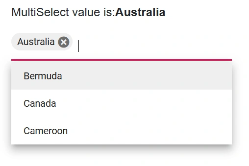
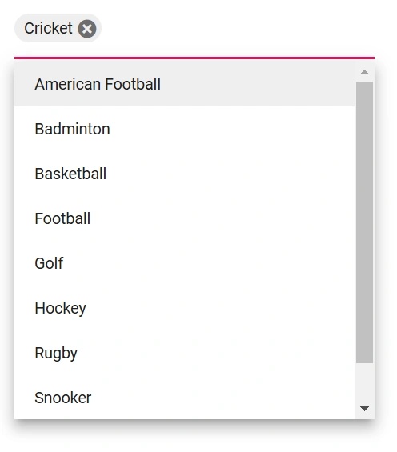

# Value Binding in Blazor MultiSelect

Value binding in the MultiSelect component establishes a connection between the component's selected values and variables in your application. This documentation covers the complete range of value binding scenarios, from basic usage to advanced edge cases and complex data integrations.

## Type System Overview

The MultiSelect component uses two generic type parameters that define the data handling characteristics:

* **TValue** - Specifies the type of the selected values. This type determines what values the [Value](https://help.syncfusion.com/cr/blazor/Syncfusion.Blazor.DropDowns.SfMultiSelect-2.html#Syncfusion_Blazor_DropDowns_SfMultiSelect_2_Value) property holds and what types are returned through events. Supported types include primitive types (`string`, `int`, `double`, `decimal`, `bool`), collection types (`Array[]`, `List<>`, `IEnumerable<>`), complex objects, nullable types (`int?`, `double?`), and special types like `Enum` and `Guid`.

* **TItem** - Defines the type of data items in the data source. This can be the same as or different from `TValue`. The component uses `TItem` to render the list items and `TValue` to track the selection.

### Generic Type Declaration


<SfMultiSelect TValue="int[]" TItem="Employee" @bind-Value="@SelectedIds" DataSource="@Employees">
    <MultiSelectFieldSettings Text="Name" Value="Id"></MultiSelectFieldSettings>
</SfMultiSelect>
@code {
    private int[] SelectedIds { get; set; }
}


## Value Binding Mechanisms

The MultiSelect supports multiple value binding approaches, each suited for different scenarios.

### Two-Way Binding with @bind-Value

The `@bind-Value` directive provides automatic synchronization between the component and bound variable. When the user changes the selection, the bound variable updates automatically, and when the variable changes programmatically, the component reflects the new selection.


<SfMultiSelect TValue="string[]" TItem="string" @bind-Value="@SelectedItems" Placeholder="Select items" DataSource="@ItemList" />
@code {
    private string[] SelectedItems { get; set; } = new string[] { "Item1", "Item2" };
    private List<string> ItemList { get; set; } = new List<string> { "Item1", "Item2", "Item3", "Item4" };
}


### One-Way Binding with ValueChange Event

For scenarios requiring manual control over value updates, use the `Value` property combined with the `ValueChange` event. This approach allows you to validate, transform, or conditionally update the bound variable.


<SfMultiSelect TValue="int[]" TItem="int" Value="@SelectedValues" ValueChange="@OnValueChange" DataSource="@DataSource" />
@code {
    private int[] SelectedValues { get; set; } = new int[] { 1, 2 };
    private Task OnValueChange(MultiSelectChangeEventArgs<int[]> args)
    {
        SelectedValues = args.Value;
        return Task.CompletedTask;
    }
}


### Text Property Binding

The [Text](https://help.syncfusion.com/cr/blazor/Syncfusion.Blazor.DropDowns.SfMultiSelect-2.html#Syncfusion_Blazor_DropDowns_SfMultiSelect_2_Text) property provides a string representation of the selected values, separated by the configured delimiter character. This is particularly useful when you need a simple text display rather than typed value objects.


<SfMultiSelect TValue="string[]" TItem="Games" Text="@SelectedText" Placeholder="Select games" DataSource="@GamesList">
    <MultiSelectFieldSettings Text="GameName" Value="GameId"></MultiSelectFieldSettings>
</SfMultiSelect>
@code {
    private string SelectedText { get; set; } = "Game1, Game2";
}


## Value Property Behavior

The [Value](https://help.syncfusion.com/cr/blazor/Syncfusion.Blazor.DropDowns.SfMultiSelect-2.html#Syncfusion_Blazor_DropDowns_SfMultiSelect_2_Value) property holds the current selection and supports multiple data types with specific behaviors for each.

### Initial Value Assignment

On component initialization, the `Value` property undergoes validation before display. Values not present in the data source are handled based on the [AllowCustomValue](https://help.syncfusion.com/cr/blazor/Syncfusion.Blazor.DropDowns.SfMultiSelect-2.html#Syncfusion_Blazor_DropDowns_SfMultiSelect_2_AllowCustomValue) setting. Values corresponding to disabled items are automatically filtered out from the selection.


<SfMultiSelect TValue="string[]" TItem="Product" @bind-Value="@SelectedProducts" DataSource="@Products">
    <MultiSelectFieldSettings Text="Name" Value="Id" Disabled="IsDisabled"></MultiSelectFieldSettings>
</SfMultiSelect>
@code {
    private string[] SelectedProducts { get; set; } = new string[] { "P1", "P2" };
}


> **Note:** When the data source contains disabled items that are also in the `Value`, those values are automatically removed during initialization.

### Dynamic Value Changes

When the `Value` property changes programmatically at runtime, the component performs a synchronized update sequence: clears previous selections, fetches corresponding items from the data source, updates the UI to reflect the new selection, and synchronizes the `Text` property to match.

### Collection Value Types

For multi-selection scenarios, `Value` supports array and list types. The component automatically deduplicates values and preserves the order of selection in the UI.


<SfMultiSelect TValue="int[]" TItem="Category" @bind-Value="@SelectedCategories" DataSource="@Categories">
    <MultiSelectFieldSettings Text="Name" Value="CategoryId"></MultiSelectFieldSettings>
</SfMultiSelect>
@code {
    private int[] SelectedCategories { get; set; } = new int[] { 1, 3, 5 };
    private List<Category> Categories { get; set; } = new List<Category>
    {
        new Category { CategoryId = 1, Name = "Electronics" },
        new Category { CategoryId = 2, Name = "Clothing" },
        new Category { CategoryId = 3, Name = "Home & Garden" },
        new Category { CategoryId = 4, Name = "Sports" },
        new Category { CategoryId = 5, Name = "Books" }
    };
}


### Null and Empty Value Handling

When `Value` is `null` or an empty collection, the component clears all selections and displays the empty state with placeholder text if configured. Partial null values within a collection are skipped during processing.


<SfMultiSelect TValue="int?[]" TItem="int" @bind-Value="@SelectedValues" Placeholder="Select values" DataSource="@DataSource" />
@code {
    private int?[] SelectedValues { get; set; } = null;
    private int[] DataSource { get; set; } = new int[] { 1, 2, 3, 4, 5 };
}


> **Note:** If `TValue` is a non-nullable type, setting `Value` to `null` results in `default(TValue)` (for example, `0` for `int`). If `TValue` is a nullable type (for example, `int?`), the `Value` becomes `null`.

## Value with Visual Modes

The [Mode](https://help.syncfusion.com/cr/blazor/Syncfusion.Blazor.DropDowns.SfMultiSelect-2.html#Syncfusion_Blazor_DropDowns_SfMultiSelect_2_Mode) property determines how selected values are displayed, directly impacting the visual representation of the bound `Value`.

### Default Mode

In Default mode, selections display as chips with an overflow indicator when selections exceed the visible area. The chips collapse to show an overflow count when the component loses focus.


<SfMultiSelect TValue="string[]" TItem="string" Mode="VisualMode.Default" @bind-Value="@SelectedItems" DataSource="@Items" Placeholder="Select items" />
@code {
    private string[] SelectedItems { get; set; } = new string[] { "Item1", "Item2", "Item3" };
}


### Box Mode

Box mode displays selections as permanent chips that remain visible regardless of focus state. The chip container is scrollable when many items are selected.


<SfMultiSelect TValue="string[]" TItem="string" Mode="VisualMode.Box" @bind-Value="@SelectedItems" DataSource="@Items" Placeholder="Select items" />


### Delimiter Mode

Delimiter mode shows selections as plain text separated by the [DelimiterChar](https://help.syncfusion.com/cr/blazor/Syncfusion.Blazor.DropDowns.SfMultiSelect-2.html#Syncfusion_Blazor_DropDowns_SfMultiSelect_2_DelimiterChar) property value. No chips or visual indicators appear beyond the text representation.


<SfMultiSelect TValue="string[]" TItem="string" Mode="VisualMode.Delimiter" DelimiterChar=";" @bind-Value="@SelectedItems" DataSource="@Items" Placeholder="Select items" />
@code {
    private string[] SelectedItems { get; set; } = new string[] { "Item1", "Item2", "Item3" };
}


### CheckBox Mode

CheckBox mode presents a checkbox UI within the dropdown for multiple selection. The [ShowSelectAll](https://help.syncfusion.com/cr/blazor/Syncfusion.Blazor.DropDowns.SfMultiSelect-2.html#Syncfusion_Blazor_DropDowns_SfMultiSelect_2_ShowSelectAll) property enables a Select All option in this mode.


<SfMultiSelect TValue="string[]" TItem="string" Mode="VisualMode.CheckBox" ShowSelectAll="true" @bind-Value="@SelectedItems" DataSource="@Items" Placeholder="Select items" />


## Value with Field Mappings

The [MultiSelectFieldSettings](https://help.syncfusion.com/cr/blazor/Syncfusion.Blazor.DropDowns.MultiSelectFieldSettings.html) configures how values map to data source fields.

### Value and Text Fields

The [Value](https://help.syncfusion.com/cr/blazor/Syncfusion.Blazor.DropDowns.MultiSelectFieldSettings.html#Syncfusion_Blazor_DropDowns_MultiSelectFieldSettings_Value) field maintains unique identifiers for each item, while the [Text](https://help.syncfusion.com/cr/blazor/Syncfusion.Blazor.DropDowns.MultiSelectFieldSettings.html#Syncfusion_Blazor_DropDowns_MultiSelectFieldSettings_Text) field provides display text for list items. When `TValue` is a primitive type and `TItem` is a complex object, the `Value` field mapping is required for proper binding.


<SfMultiSelect TValue="string" TItem="Country" @bind-Value="@SelectedCountryCode" DataSource="@Countries">
    <MultiSelectFieldSettings Text="CountryName" Value="CountryCode"></MultiSelectFieldSettings>
</SfMultiSelect>
@code {
    private string SelectedCountryCode { get; set; } = "US";
}


### Group By Configuration

The [GroupBy](https://help.syncfusion.com/cr/blazor/Syncfusion.Blazor.DropDowns.MultiSelectFieldSettings.html#Syncfusion_Blazor_DropDowns_MultiSelectFieldSettings_GroupBy) property groups items while maintaining proper `Value` selection. Group headers are not included in the `Value` collection. CheckBox mode supports group-level selection and deselection.


<SfMultiSelect TValue="string[]" TItem="Employee" Mode="VisualMode.CheckBox" @bind-Value="@SelectedEmployeeIds" DataSource="@Employees">
    <MultiSelectFieldSettings Text="Name" Value="Id" GroupBy="Department"></MultiSelectFieldSettings>
</SfMultiSelect>


### Disabled Field Mapping

The [Disabled](https://help.syncfusion.com/cr/blazor/Syncfusion.Blazor.DropDowns.MultiSelectFieldSettings.html#Syncfusion_Blazor_DropDowns_MultiSelectFieldSettings_Disabled) field prevents selection of specific items. If `Value` contains disabled items, they are filtered out automatically.


<SfMultiSelect TValue="int[]" TItem="TaskItem" @bind-Value="@SelectedTaskIds" DataSource="@Tasks">
    <MultiSelectFieldSettings Text="Title" Value="Id" Disabled="IsCompleted"></MultiSelectFieldSettings>
</SfMultiSelect>


## Value with Selection Features

### Maximum Selection Length

The [MaximumSelectionLength](https://help.syncfusion.com/cr/blazor/Syncfusion.Blazor.DropDowns.SfMultiSelect-2.html#Syncfusion_Blazor_DropDowns_SfMultiSelect_2_MaximumSelectionLength) property limits the number of items that can be selected. Values beyond this limit are silently ignored without throwing an error.


<SfMultiSelect TValue="string[]" TItem="string" MaximumSelectionLength="3" @bind-Value="@SelectedItems" DataSource="@Items" Placeholder="Select up to 3 items" />


> **Note:** If the bound `Value` already contains more items than `MaximumSelectionLength` allows, the existing selection is maintained but no additional selections are allowed until the count drops below the limit.

### Enable Selection Order

The [EnableSelectionOrder](https://help.syncfusion.com/cr/blazor/Syncfusion.Blazor.DropDowns.SfMultiSelect-2.html#Syncfusion_Blazor_DropDowns_SfMultiSelect_2_EnableSelectionOrder) property maintains the order of selection in the popup list, with selected items appearing at the top. This works with CheckBox mode only and without group checkbox functionality.


<SfMultiSelect TValue="string[]" TItem="string" Mode="VisualMode.CheckBox" EnableSelectionOrder="true" @bind-Value="@SelectedItems" DataSource="@Items" />


### Hide Selected Item

The [HideSelectedItem](https://help.syncfusion.com/cr/blazor/Syncfusion.Blazor.DropDowns.SfMultiSelect-2.html#Syncfusion_Blazor_DropDowns_SfMultiSelect_2_HideSelectedItem) property removes selected items from the dropdown list, improving visibility of unselected options. This property is not applied in CheckBox mode.


<SfMultiSelect TValue="string[]" TItem="string" HideSelectedItem="true" @bind-Value="@SelectedItems" DataSource="@Items" Placeholder="Select items" />


## Value with Data Features

### Allow Custom Value

The [AllowCustomValue](https://help.syncfusion.com/cr/blazor/Syncfusion.Blazor.DropDowns.SfMultiSelect-2.html#Syncfusion_Blazor_DropDowns_SfMultiSelect_2_AllowCustomValue) property enables selection of values not present in the data source. Custom items are added to both the selection and the `Value` collection. This property is unavailable in CheckBox mode.


<SfMultiSelect TValue="string[]" TItem="Tag" AllowCustomValue="true" @bind-Value="@SelectedTags" DataSource="@AvailableTags" Placeholder="Select or create tags">
    <MultiSelectFieldSettings Text="Name" Value="Id"></MultiSelectFieldSettings>
</SfMultiSelect>
@code {
    private string[] SelectedTags { get; set; } = new string[] { "urgent", "review" };
}


### Allow Filtering

When [AllowFiltering](https://help.syncfusion.com/cr/blazor/Syncfusion.Blazor.DropDowns.SfMultiSelect-2.html#Syncfusion_Blazor_DropDowns_SfMultiSelect_2_AllowFiltering) is enabled, the current `Value` selection is maintained during filtering operations. Selected items remain visible or hidden based on the component configuration.


<SfMultiSelect TValue="string[]" TItem="Product" AllowFiltering="true" @bind-Value="@SelectedProducts" DataSource="@Products" Placeholder="Search and select products">
    <MultiSelectFieldSettings Text="Name" Value="ProductId"></MultiSelectFieldSettings>
</SfMultiSelect>


### Enable Virtualization

The [EnableVirtualization](https://help.syncfusion.com/cr/blazor/Syncfusion.Blazor.DropDowns.SfMultiSelect-2.html#Syncfusion_Blazor_DropDowns_SfMultiSelect_2_EnableVirtualization) property supports large `Value` collections with virtual scrolling. Selection state persists across virtual page boundaries, and performance remains optimized for large data sources and value sets.


<SfMultiSelect TValue="string[]" TItem="string" EnableVirtualization="true" @bind-Value="@SelectedItems" DataSource="@LargeDataset" Placeholder="Select items" />


### Enable Group CheckBox

The [EnableGroupCheckBox](https://help.syncfusion.com/cr/blazor/Syncfusion.Blazor.DropDowns.SfMultiSelect-2.html#Syncfusion_Blazor_DropDowns_SfMultiSelect_2_EnableGroupCheckBox) property enables group-level selection with checkboxes. When a group is selected, all items within that group are added to `Value`. The indeterminate state appears for partial group selection.


<SfMultiSelect TValue="string[]" TItem="Item" Mode="VisualMode.CheckBox" EnableGroupCheckBox="true" @bind-Value="@SelectedItems" DataSource="@GroupedItems">
    <MultiSelectFieldSettings Text="Name" Value="Id" GroupBy="Category"></MultiSelectFieldSettings>
</SfMultiSelect>


## Value with State Persistence

### Enable Persistence

The [EnablePersistence](https://help.syncfusion.com/cr/blazor/Syncfusion.Blazor.DropDowns.SfMultiSelect-2.html#Syncfusion_Blazor_DropDowns_SfMultiSelect_2_EnablePersistence) property saves the `Value` to browser local storage, preserving the selection across page reloads. An [ID](https://help.syncfusion.com/cr/blazor/Syncfusion.Blazor.DropDowns.SfMultiSelect-2.html#Syncfusion_Blazor_DropDowns_SfMultiSelect_2_ID) property is required for storage key uniqueness.


<SfMultiSelect TValue="string[]" TItem="string" ID="countrySelector" EnablePersistence="true" @bind-Value="@SelectedCountries" DataSource="@Countries" Placeholder="Select countries" />


### Enabled and Readonly States

When [Enabled](https://help.syncfusion.com/cr/blazor/Syncfusion.Blazor.DropDowns.SfMultiSelect-2.html#Syncfusion_Blazor_DropDowns_SfMultiSelect_2_Enabled) is set to `false`, the `Value` can be set programmatically but cannot be changed by the user. When [Readonly](https://help.syncfusion.com/cr/blazor/Syncfusion.Blazor.DropDowns.SfMultiSelect-2.html#Syncfusion_Blazor_DropDowns_SfMultiSelect_2_Readonly) is `true`, the value displays but remains non-interactive. In both states, value binding continues to function normally.


<SfMultiSelect TValue="string[]" TItem="string" Enabled="false" @bind-Value="@SelectedItems" DataSource="@Items" Placeholder="Disabled selection" />
<SfMultiSelect TValue="string[]" TItem="string" Readonly="true" @bind-Value="@SelectedItems" DataSource="@Items" Placeholder="Readonly selection" />


## Show or Hide Clear Button

The [ShowClearButton](https://help.syncfusion.com/cr/blazor/Syncfusion.Blazor.DropDowns.SfMultiSelect-2.html#Syncfusion_Blazor_DropDowns_SfMultiSelect_2_ShowClearButton) property controls visibility of the clear button. When clicked, all selections clear and the `Value` resets.


<SfMultiSelect TValue="int?[]" TItem="int" ShowClearButton="true" @bind-Value="@SelectedValues" DataSource="@DataSource" Placeholder="Select values" />
@code {
    private int?[] SelectedValues { get; set; } = new int?[] { 1, 2, 3 };
}


> **Note:** If `TValue` is a non-nullable type, the clear button sets `Value` to `default(TValue)` (for example, `0` for `int`). If `TValue` is a nullable type, the clear button sets `Value` to `null`.

## Value-Related Events

The MultiSelect provides multiple events for tracking and controlling value changes at different stages.

### ValueChange Event

The [ValueChange](https://help.syncfusion.com/cr/blazor/Syncfusion.Blazor.DropDowns.SfMultiSelect-2.html#Syncfusion_Blazor_DropDowns_SfMultiSelect_2_ValueChanged) event fires when the value changes through user interaction, chip removal, clear button click, programmatic change, or API method calls. The event arguments include `OldValue` (previous value), `Value` (new value), and `IsInteracted` (indicating user-initiated change).


<SfMultiSelect TValue="int[]" TItem="int" Value="@SelectedValues" ValueChange="@OnValueChange" DataSource="@DataSource" Placeholder="Select values" />
@code {
    private int[] SelectedValues { get; set; } = new int[] { 1, 2 };
    private Task OnValueChange(MultiSelectChangeEventArgs<int[]> args)
    {
        SelectedValues = args.Value;
        return Task.CompletedTask;
    }
}


> **Note:** The `ValueChange` event is not triggered during initial render. It only fires for subsequent value changes after the component has rendered.

### OnValueSelect Event

The [OnValueSelect](https://help.syncfusion.com/cr/blazor/Syncfusion.Blazor.DropDowns.MultiSelectEvents-2.html#Syncfusion_Blazor_DropDowns_MultiSelectEvents_2_OnValueSelect) event fires before an item is selected and allows cancellation of the selection through the `Cancel` property.


<SfMultiSelect TValue="int[]" TItem="Employee" OnValueSelect="@OnItemSelect" DataSource="@Employees" Placeholder="Select employees">
    <MultiSelectFieldSettings Text="Name" Value="Id"></MultiSelectFieldSettings>
</SfMultiSelect>
@code {
    private Task OnItemSelect(SelectEventArgs<Employee> args)
    {
        if (args.ItemData.IsActive == false)
        {
            args.Cancel = true;
        }
        return Task.CompletedTask;
    }
}


### OnValueRemove Event

The [OnValueRemove](https://help.syncfusion.com/cr/blazor/Syncfusion.Blazor.DropDowns.MultiSelectEvents-2.html#Syncfusion_Blazor_DropDowns_MultiSelectEvents_2_OnValueRemove) event fires before an item is removed from selection, enabling prevention of specific deselections.


<SfMultiSelect TValue="int[]" TItem="Employee" OnValueRemove="@OnItemRemove" DataSource="@Employees" Placeholder="Select employees">
    <MultiSelectFieldSettings Text="Name" Value="Id"></MultiSelectFieldSettings>
</SfMultiSelect>
@code {
    private Task OnItemRemove(RemoveEventArgs<Employee> args)
    {
        if (args.ItemData.IsRequired)
        {
            args.Cancel = true;
        }
        return Task.CompletedTask;
    }
}


### ValueRemoved Event

The [ValueRemoved](https://help.syncfusion.com/cr/blazor/Syncfusion.Blazor.DropDowns.MultiSelectEvents-2.html#Syncfusion_Blazor_DropDowns_MultiSelectEvents_2_ValueRemoved) event fires after an item has been successfully removed, providing notification for logging or side effects.


<SfMultiSelect TValue="int[]" TItem="Employee" ValueRemoved="@OnItemRemoved" DataSource="@Employees" Placeholder="Select employees">
    <MultiSelectFieldSettings Text="Name" Value="Id"></MultiSelectFieldSettings>
</SfMultiSelect>
@code {
    private Task OnItemRemoved(RemoveEventArgs<Employee> args)
    {
        Console.WriteLine($"Removed: {args.ItemData.Name}");
        return Task.CompletedTask;
    }
}


### CustomValueSpecifier Event

The [CustomValueSpecifier](https://help.syncfusion.com/cr/blazor/Syncfusion.Blazor.DropDowns.MultiSelectEvents-2.html#Syncfusion_Blazor_DropDowns_MultiSelectEvents_2_CustomValueSpecifier) event fires when a custom value is entered and `AllowCustomValue` is enabled. This allows modification or enhancement of auto-generated items.


<SfMultiSelect TValue="string[]" TItem="Tag" AllowCustomValue="true" CustomValueSpecifier="@OnCustomValue" Placeholder="Select or create tags">
    <MultiSelectFieldSettings Text="Name" Value="Id"></MultiSelectFieldSettings>
</SfMultiSelect>
@code {
    private Task OnCustomValue(CustomValueEventArgs<Tag> args)
    {
        args.NewData = new Tag
        {
            Id = Guid.NewGuid().ToString(),
            Name = args.Text,
            CreatedDate = DateTime.Now
        };
        return Task.CompletedTask;
    }
}


### OnChipTag Event

The [OnChipTag](https://help.syncfusion.com/cr/blazor/Syncfusion.Blazor.DropDowns.MultiSelectEvents-2.html#Syncfusion_Blazor_DropDowns_MultiSelectEvents_2_OnChipTag) event fires before a chip is created for a selected item in Default or Box mode, allowing custom CSS class application.


<SfMultiSelect TValue="string[]" TItem="Category" Mode="VisualMode.Box" OnChipTag="@OnCreateChip" Placeholder="Select categories">
    <MultiSelectFieldSettings Text="Name" Value="Id"></MultiSelectFieldSettings>
</SfMultiSelect>
@code {
    private Task OnCreateChip(TaggingEventArgs<Category> args)
    {
        switch (args.ItemData.Type)
        {
            case "Important":
                args.SetClass = "e-warning";
                break;
            case "Urgent":
                args.SetClass = "e-danger";
                break;
        }
        return Task.CompletedTask;
    }
}


### SelectedAll Event

The [SelectedAll](https://help.syncfusion.com/cr/blazor/Syncfusion.Blazor.DropDowns.MultiSelectEvents-2.html#Syncfusion_Blazor_DropDowns_MultiSelectEvents_2_SelectedAll) event fires when the Select All option is clicked in CheckBox mode. The event arguments include `IsChecked` for selection or deselection state and `ItemData` containing all affected items.


<SfMultiSelect TValue="int[]" TItem="int" Mode="VisualMode.CheckBox" ShowSelectAll="true" SelectedAll="@OnSelectAll" Placeholder="Select items">
    <MultiSelectFieldSettings Text="Name" Value="Id"></MultiSelectFieldSettings>
</SfMultiSelect>
@code {
    private Task OnSelectAll(SelectAllEventArgs<int> args)
    {
        Console.WriteLine($"Selected all: {args.IsChecked}, Count: {args.ItemData.Count()}");
        return Task.CompletedTask;
    }
}


## Primitive Type Binding

The MultiSelect supports binding to primitive types directly without complex field mappings.

### String Array Binding


<SfMultiSelect TValue="string[]" TItem="string" @bind-Value="@SelectedStrings" DataSource="@StringData" Placeholder="Select strings" />
@code {
    private string[] SelectedStrings { get; set; } = new string[] { "Option1", "Option3" };
    private List<string> StringData { get; set; } = new List<string> { "Option1", "Option2", "Option3", "Option4" };
}


### Integer Array Binding


<SfMultiSelect TValue="int[]" TItem="int" @bind-Value="@SelectedInts" DataSource="@IntData" Placeholder="Select integers" />
@code {
    private int[] SelectedInts { get; set; } = new int[] { 1, 3, 5 };
    private int[] IntData { get; set; } = new int[] { 1, 2, 3, 4, 5 };
}


## Object Binding

For complex objects, bind `Value` to an object array and map the value field through `MultiSelectFieldSettings.Value`. The `TItem` represents the data item type while `TValue` represents the value field type.


<SfMultiSelect TValue="string[]" TItem="Games" @bind-Value="@SelectedGames" DataSource="@GameList" Placeholder="Select games">
    <MultiSelectFieldSettings Text="GameName" Value="GameId"></MultiSelectFieldSettings>
</SfMultiSelect>
@code {
    public string[] SelectedGames { get; set; } = new string[] { "Game1", "Game3" };
    public class Games
    {
        public string GameId { get; set; }
        public string GameName { get; set; }
    }
    List<Games> GameList = new List<Games>
    {
        new Games() { GameId = "Game1", GameName = "American Football" },
        new Games() { GameId = "Game2", GameName = "Badminton" },
        new Games() { GameId = "Game3", GameName = "Basketball" },
        new Games() { GameId = "Game4", GameName = "Cricket" },
        new Games() { GameId = "Game5", GameName = "Football" }
    };
}


## Enum Binding

Bind enum values to the `Value` property and use the appropriate `TValue` type for the enum collection.


<SfMultiSelect TValue="Priority[]" TItem="TaskItem" @bind-Value="@SelectedPriorities" DataSource="@Tasks" Placeholder="Select priority levels">
    <MultiSelectFieldSettings Text="Title" Value="Priority"></MultiSelectFieldSettings>
</SfMultiSelect>
@code {
    public Priority[] SelectedPriorities { get; set; } = new Priority[] { Priority.High, Priority.Medium };
    public enum Priority { Low, Medium, High, Critical }
    public class TaskItem
    {
        public string Title { get; set; }
        public Priority Priority { get; set; }
    }
    List<TaskItem> Tasks { get; set; } = new List<TaskItem>
    {
        new TaskItem { Title = "Task 1", Priority = Priority.High },
        new TaskItem { Title = "Task 2", Priority = Priority.Medium },
        new TaskItem { Title = "Task 3", Priority = Priority.Low }
    };
}


## Remote Data Binding

The MultiSelect properly maintains `Value` during asynchronous data loading, including server-side paging and filtering operations.


<SfMultiSelect TValue="string[]" TItem="Customer" @bind-Value="@SelectedCustomers">
    <MultiSelectFieldSettings Text="CompanyName" Value="CustomerID"></MultiSelectFieldSettings>
    <MultiSelectDataManager Adaptor="Adaptors.ODataV4Adaptor" Url="https://services.odata.org/V4/Northwind/Northwind.svc/Customers"></MultiSelectDataManager>
</SfMultiSelect>


> **Note:** Value validation against remote data occurs after data loads. If the initial `Value` contains items not available on the server, those values are filtered out once data is retrieved.

## Dynamic TItem Changes

The `TItem` type can be changed dynamically by creating a generic wrapper component using the `@typeparam` directive.

### Creating Generic MultiSelect Component


@using Syncfusion.Blazor.DropDowns
@typeparam TValue
@typeparam TItem

<SfMultiSelect TValue="TValue" Width="300px" TItem="TItem" @bind-Value="@DDLValue" Placeholder="Select a value" DataSource="@CustomData">
    <MultiSelectFieldSettings Text="Text" Value="ID"></MultiSelectFieldSettings>
</SfMultiSelect>
@code {
    [Parameter]
    public List<TItem> CustomData { get; set; }
    [Parameter]
    public TValue DDLValue { get; set; }
    [Parameter]
    public EventCallback<TValue> DDLValueChanged { get; set; }
}


### Using Generic Component with Different Types


<MultiSelect TValue="string[]" TItem="Games" @bind-DDLValue="@StringValue" CustomData="@StringData">
</MultiSelect>
@code {
    public string[] StringValue { get; set; } = new string[] { "Game1" };
    public class Games
    {
        public string ID { get; set; }
        public string Text { get; set; }
    }
    List<Games> StringData = new List<Games>
    {
        new Games() { ID = "Game1", Text = "American Football" },
        new Games() { ID = "Game2", Text = "Badminton" },
        new Games() { ID = "Game3", Text = "Basketball" }
    };
}


## Edge Cases and Handling

### Value with Items Not in DataSource

When [AllowCustomValue](https://help.syncfusion.com/cr/blazor/Syncfusion.Blazor.DropDowns.SfMultiSelect-2.html#Syncfusion_Blazor_DropDowns_SfMultiSelect_2_AllowCustomValue) is `false` and `Value` contains items not found in the data source, those values are ignored. When `AllowCustomValue` is `true`, custom items are created and added to the selection.

### Empty DataSource with Value

When the data source is empty but `Value` is set, the value is maintained but not displayed. The selection restores when data becomes available.

### Disabled Items in Value

Items mapped to disabled fields are automatically filtered from the `Value` collection during initialization and runtime updates.

### Type Conversion

The component attempts automatic type conversion when `TValue` types differ but are compatible. If conversion fails, the default value for `TValue` is used and a console warning is logged.

## API Methods for Value Manipulation

### ClearAsync Method

The [ClearAsync](https://help.syncfusion.com/cr/blazor/Syncfusion.Blazor.DropDowns.SfMultiSelect-2.html#Syncfusion_Blazor_DropDowns_SfMultiSelect_2_ClearAsync) method clears all selected values programmatically.


<SfMultiSelect TValue="string[]" TItem="string" @ref="@MultiSelectRef" @bind-Value="@SelectedItems" DataSource="@Items" Placeholder="Select items" />
<button @onclick="ClearSelection">Clear All</button>
@code {
    private SfMultiSelect<string[], string> MultiSelectRef;
    private string[] SelectedItems { get; set; } = new string[] { "Item1", "Item2" };
    private async Task ClearSelection()
    {
        await MultiSelectRef.ClearAsync();
    }
}


### SelectAllAsync Method

The [SelectAllAsync](https://help.syncfusion.com/cr/blazor/Syncfusion.Blazor.DropDowns.SfMultiSelect-2.html#Syncfusion_Blazor_DropDowns_SfMultiSelect_2_SelectAllAsync) method selects or deselects all items based on the state parameter.


<button @onclick="SelectAllItems">Select All</button>
<button @onclick="DeselectAllItems">Deselect All</button>
@code {
    private async Task SelectAllItems()
    {
        await MultiSelectRef.SelectAllAsync(true);
    }
    private async Task DeselectAllItems()
    {
        await MultiSelectRef.SelectAllAsync(false);
    }
}


### GetDataByValueAsync Method

The [GetDataByValueAsync](https://help.syncfusion.com/cr/blazor/Syncfusion.Blazor.DropDowns.SfMultiSelect-2.html#Syncfusion_Blazor_DropDowns_SfMultiSelect_2_GetDataByValueAsync) method retrieves data items corresponding to the provided values.


@code {
    private async Task GetSelectedItemData()
    {
        var items = await MultiSelectRef.GetDataByValueAsync(SelectedValues);
    }
}


### UpdateValueAsync Method

The [UpdateValueAsync](https://help.syncfusion.com/cr/blazor/Syncfusion.Blazor.DropDowns.SfMultiSelect-2.html#Syncfusion_Blazor_DropDowns_SfMultiSelect_2_UpdateValueAsync) method manually refreshes the component based on the current `Value` property, useful after programmatic value changes outside of binding.

### FocusAsync and FocusOutAsync Methods

The [FocusAsync](https://help.syncfusion.com/cr/blazor/Syncfusion.Blazor.DropDowns.SfMultiSelect-2.html#Syncfusion_Blazor_DropDowns_SfMultiSelect_2_FocusAsync) and [FocusOutAsync](https://help.syncfusion.com/cr/blazor/Syncfusion.Blazor.DropDowns.SfMultiSelect-2.html#Syncfusion_Blazor_DropDowns_SfMultiSelect_2_FocusOutAsync) methods control focus state for keyboard interaction workflows.

## Initialization Sequence

The component follows a specific initialization order:

1. Initial property values are processed
2. DataSource is loaded if provided
3. `Value` is validated against available data
4. UI updates to reflect the `Value`
5. `ValueChange` event is not fired for initial value

For runtime updates:

1. Property change is detected
2. `Value` is validated and processed
3. Selection state updates
4. UI synchronizes with selection
5. `ValueChange` fires if value actually changed

## Performance Considerations

For large value collections, enable [EnableVirtualization](https://help.syncfusion.com/cr/blazor/Syncfusion.Blazor.DropDowns.SfMultiSelect-2.html#Syncfusion_Blazor_DropDowns_SfMultiSelect_2_EnableVirtualization) to optimize rendering performance. The component uses debounced event firing and batched DOM updates to minimize overhead during rapid value changes. When using collection types with many items, ensure adequate `PopupHeight` configuration to accommodate virtual scrolling.