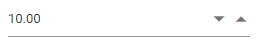

# Accessibility in Blazor Numeric TextBox Component

The NumericTextBox characterized with complete ARIA Accessibility support that helps to accessible by on-screen readers and other assistive technology devices. This component designed with the reference of the guidelines document given in [WAI ARAI Accessibility practices](http://www.w3.org/TR/wai-aria-practices-1.1/#spinbutton).

The NumericTextBox uses the `spinbutton` role and following ARIA properties to its element based on its state.

| **Property** | **Functionality** |
| --- | --- |
| aria-live | Indicates the priority of updates to a live region |
| aria-valuemin | Specifies the minimum allowable range of the NumericTextBox.|
| aria-valuemax | Specifies the maximum allowable range of the NumericTextBox. |
| aria-disabled | Indicates disabled state of the NumericTextBox. |
| aria-readonly | Indicates the read-only state of the NumericTextBox. |
| aria-valuenow | Specifies the current value of the NumericTextBox. |
| aria-invalid | Indicates that the user input is incorrect or not within acceptable ranges. |
| aria-label | Indicates a string value that labels the NumericTextBox. |

## Keyboard interaction

Keyboard interaction of the NumericTextBox component has been designed based on [WAI-ARIA Practices](http://www.w3.org/TR/wai-aria-practices-1.1/#spinbutton) described for the NumericTextBox and it is an alternative to mouse actions to interact with the NumericTextBox.

The following table shows shortcut keys and its corresponding usage.

| **Keyboard shortcuts** | **Actions** |
| --- | --- |
| <kbd>Arrow Down</kbd> | Increments the value. |
| <kbd>Arrow Up</kbd> | Decrements the value. |

```cshtml
@using Syncfusion.Blazor.Inputs

<SfNumericTextBox TValue="int?" Value=10></SfNumericTextBox>
```

The output will be as follows.

