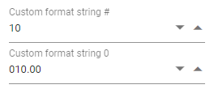

# Number Formats in Blazor Numeric TextBox Component

Use the [Format](https://help.syncfusion.com/cr/blazor/Syncfusion.Blazor.Inputs.NumericTextBoxModel-1.html#Syncfusion_Blazor_Inputs_NumericTextBoxModel_1_Format) property to control how the NumericTextBox value is displayed when the input is not focused. Formatting affects only the rendered text; the underlying value remains numeric. The component supports both standard and custom numeric format strings and respects the current culture for symbols and separators.

## Standard formats

Use standard numeric format specifiers such as `N`, `P`, and `C` to display numbers with culture-aware formatting (group separators, decimal separators, currency symbol, and percentage). For example, with a value of 0.5 and `P2`, the display shows 50.00% in most cultures. Currency (`C`) displays the symbol and number formatting based on the active culture. Format specifiers are case-insensitive.

```cshtml
@using Syncfusion.Blazor.Inputs

<SfNumericTextBox Value=0.5 Min=0 Max=1 Step=0.01 Format="p2" Placeholder="Percentage format" FloatLabelType="@FloatLabelType.Auto"></SfNumericTextBox>
<SfNumericTextBox TValue="int?" Value=10 Format="c2" Placeholder="Currency format" FloatLabelType="@FloatLabelType.Auto"></SfNumericTextBox>
```


## Custom formats

Combine custom numeric format specifiers to create tailored display patterns. The `#` specifier displays a digit only if one is present (optional digit), while `0` enforces a digit and pads with zeros if necessary (zero placeholder). The following examples illustrate using `#` and `0` to format values.

```cshtml
@using Syncfusion.Blazor.Inputs

<SfNumericTextBox TValue="int?" Value=10 Format="###.##" Placeholder="Custom format string #" FloatLabelType="@FloatLabelType.Always"></SfNumericTextBox>
<SfNumericTextBox TValue="int?" Value=10 Format="000.00" Placeholder="Custom format string 0" FloatLabelType="@FloatLabelType.Always"></SfNumericTextBox>
```

