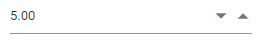
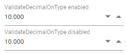

# Getting Started with Blazor Numeric TextBox Component

This section briefly explains about how to include a [Blazor NumericTextBox](https://www.syncfusion.com/blazor-components/blazor-numeric-textbox) component in your Blazor Server-Side and Client-Side application. You can refer to Getting Started with [Blazor Server-Side NumericTextBox](../getting-started/blazor-server-side-visual-studio/) and [Blazor WebAssembly NumericTextBox](../getting-started/blazor-webassembly-visual-studio/) documentation pages for configuration specifications.



## Importing Syncfusion Blazor component in the application

* Install `Syncfusion.Blazor.Inputs` NuGet package to the application by using the `NuGet Package Manager`.

    > Please ensure to check the `Include prerelease` option for our Beta release.

* You can add the client-side resources through [CDN](https://blazor.syncfusion.com/documentation/appearance/themes#cdn-reference) or from [NuGet](https://blazor.syncfusion.com/documentation/appearance/themes#static-web-assets) package in the  **HEAD** element of the **~/wwwroot/index.html** page.

    ```html
    <head>
        <link href="_content/Syncfusion.Blazor.Themes/bootstrap4.css" rel="stylesheet" />
        <!-- <link href="https://cdn.syncfusion.com/blazor/{{version}}/styles/{{theme}}.css" rel="stylesheet" /> -->
    </head>
    ```

    > For Internet Explorer 11 kindly refer the polyfills. Refer the [documentation](https://blazor.syncfusion.com/documentation/common/how-to/render-blazor-server-app-in-ie/) for more information.

    ```html
    <head>
        <link href="_content/Syncfusion.Blazor.Themes/bootstrap4.css" rel="stylesheet" />
        <script src="https://github.com/Daddoon/Blazor.Polyfill/releases/download/3.0.1/blazor.polyfill.min.js"></script>
    </head>
    ```

## Adding component package to the application

Open `~/_Imports.razor` file and import the `Syncfusion.Blazor.Inputs` package.

```cshtml
@using Syncfusion.Blazor.Inputs
```

## Add SyncfusionBlazor service in Program.cs

Open the **Program.cs** file and add services required by Syncfusion components using  **builder.Services.AddSyncfusionBlazor()** method.

```csharp
using Syncfusion.Blazor;

namespace BlazorApplication
{
    public class Program
    {
        public static async Task Main(string[] args)
        {
            ....
            ....
            builder.Services.AddSyncfusionBlazor();
            await builder.Build().RunAsync();
        }
    }
}
```

> To enable custom client side resource loading from CRG or CDN. You need to disable resource loading by `AddSyncfusionBlazor(true)` and load the scripts in the **HEAD** element of the **~/wwwroot/index.html** page.

 ```html
<head>
    <script src="https://cdn.syncfusion.com/blazor/{{ site.blazorversion }}/syncfusion-blazor.min.js"></script>
</head>
```

## Adding NumericTextBox component to the application

To initialize the NumericTextBox component add the below code to your `Index.razor` view page which is present under `~/Pages` folder.

```cshtml
<SfNumericTextBox TValue="int?" Value=10></SfNumericTextBox>
```

## Run the application

After successful compilation of your application, press `F5` to run the application.


## Range validation

You can set the minimum and maximum range of values in the NumericTextBox using the [Min](https://help.syncfusion.com/cr/blazor/Syncfusion.Blazor.Inputs.SfNumericTextBox-1.html#Syncfusion_Blazor_Inputs_SfNumericTextBox_1_Min) and [Max](https://help.syncfusion.com/cr/blazor/Syncfusion.Blazor.Inputs.SfNumericTextBox-1.html#Syncfusion_Blazor_Inputs_SfNumericTextBox_1_Max) properties, so the numeric value should be in the min and max range.

```cshtml
<SfNumericTextBox TValue="int?" Value=5 Max=100 Min=1 Step=5></SfNumericTextBox>
```



## Formatting the value

Users can set the format of the NumericTextBox component using the [Format](https://help.syncfusion.com/cr/blazor/Syncfusion.Blazor.Inputs.SfNumericTextBox-1.html#Syncfusion_Blazor_Inputs_SfNumericTextBox_1_Format) property. The value will be displayed in the specified format, when the component is in focused out state.

```cshtml
<SfNumericTextBox TValue="int?" Value=10 Format="c2"></SfNumericTextBox>
```


## Precision of numbers

You can restrict the number of decimals to be entered in the NumericTextBox by using the [Decimals](https://help.syncfusion.com/cr/blazor/Syncfusion.Blazor.Inputs.SfNumericTextBox-1.html#Syncfusion_Blazor_Inputs_SfNumericTextBox_1_Decimals) and [ValidateDecimalOnType](https://help.syncfusion.com/cr/blazor/Syncfusion.Blazor.Inputs.SfNumericTextBox-1.html#Syncfusion_Blazor_Inputs_SfNumericTextBox_1_ValidateDecimalOnType) properties. So, you cannot enter the number whose precision is greater than the mentioned decimals.

If `ValidateDecimalOnType` is false, number of decimals will not be restricted. Else, number of decimals will be restricted while typing in the NumericTextBox.

```cshtml
<SfNumericTextBox TValue="double?" Value=10 ValidateDecimalOnType=true Decimals=3 Format="n3" Placeholder="ValidateDecimalOnType enabled" FloatLabelType="@FloatLabelType.Auto"></SfNumericTextBox>

<SfNumericTextBox TValue="double?" Value=10 Decimals=3 Format="n3" Placeholder="ValidateDecimalOnType disabled" FloatLabelType="@FloatLabelType.Auto"></SfNumericTextBox>
```



> You can also explore the [Blazor NumericTextBox example](https://blazor.syncfusion.com/demos/numeric-textbox/default-functionalities?theme=bootstrap5) that shows how to configure the numeric textbox in Blazor.

## See Also

* [Getting Started with Syncfusion Blazor for Client-Side in .NET Core CLI](../getting-started/blazor-webassembly-dotnet-cli/)
* [Getting Started with Syncfusion Blazor for Server-side in Visual Studio](../getting-started/blazor-server-side-visual-studio/)
* [Getting Started with Syncfusion Blazor for Server-Side in .NET Core CLI](../getting-started/blazor-server-side-dotnet-cli/)