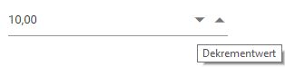

# Globalization

## Blazor server side

Add `UseRequestLocalization` middle-ware in Configure method in **Startup.cs** file to get browser Culture Info.

Refer the following code to add configuration in Startup.cs file

```csharp
using Microsoft.AspNetCore.Builder;
using Microsoft.AspNetCore.Localization;

namespace BlazorApplication
{
    public class Startup
    {
        ....
        ....

        public void Configure(IApplicationBuilder app, IWebHostEnvironment env)
        {
            app.UseRequestLocalization();
            ....
            ....
        }
    }
}
```

The **Localization** library allows you to localize default text content. The Numeric TextBox component has static text that can be changed to other cultures (Arabic, Deutsch, French, etc.).

In the following examples, demonstrate how to enable **Localization** for Numeric TextBox in server side Blazor samples. Here, we have used Resource file to translate the static text.

The Resource file is an XML file which contains the strings(key and value pairs) that you want to translate into different language. You can also refer Localization [link](https://blazor.syncfusion.com/documentation/common/localization/) to know more about how to configure and use localization in the ASP.Net Core application framework.

* Open the **Startup.cs** file and add the below configuration in the **ConfigureServices** function as follows.

```csharp
using Syncfusion.Blazor;
using System.Globalization;
using Microsoft.AspNetCore.Localization;

namespace BlazorApplication
{
    public class Startup
    {
        ....
        ....
        public void ConfigureServices(IServiceCollection services)
        {
            ....
            ....
            services.AddSyncfusionBlazor();
            services.AddLocalization(options => options.ResourcesPath = "Resources");
            services.Configure<RequestLocalizationOptions>(options =>
            {
                // define the list of cultures your app will support
                var supportedCultures = new List<CultureInfo>()
                {
                    new CultureInfo("de")
                };
                // set the default culture
                options.DefaultRequestCulture = new RequestCulture("de");
                options.SupportedCultures = supportedCultures;
                options.SupportedUICultures = supportedCultures;
                options.RequestCultureProviders = new List<IRequestCultureProvider>() {
                 new QueryStringRequestCultureProvider() // Here, You can also use other localization provider
                };
            });
            services.AddSingleton(typeof(ISyncfusionStringLocalizer), typeof(SampleLocalizer));
        }
    }
}
```

* Then, write a **class** by inheriting **ISyncfusionStringLocalizer** interface and override the Manager property to get the resource file details from the application end.

```csharp
using Syncfusion.Blazor;

namespace blazorInputs
{
     public class SampleLocalizer : ISyncfusionStringLocalizer
    {

        public string Get(string key)
        {
            return this.Manager.GetString(key);
        }

        public System.Resources.ResourceManager Manager
        {
            get
            {
                return blazorInputs.Resources.SyncfusionBlazorLocale.ResourceManager;
            }
        }
    }
}
```

* Add **.resx** file to Resource folder and enter the key value (Locale Keywords) in the **Name** column and the translated string in the Value column as follows.

| **Name** | **Value (in Deutsch culture)** |
| --- | --- |
| NumericTextBox_DecrementTitle | Wert verringern |
| NumericTextBox_IncrementTitle | Inkrementieren Sie den Wert |

* Finally, Specify the culture for Numeric TextBox using `locale` property.

```csharp
@using Syncfusion.Blazor.Inputs

<SfNumericTextBox TValue="int?" Value=10 Locale="de"></SfNumericTextBox>
```

## Blazor WebAssembly

Internationalization library provides support for formatting and parsing the number by using the
official [Unicode CLDR](http://cldr.unicode.org/) JSON data. The NumericTextBox comes with built-in
internationalization support to adapt based on culture.

The following steps explain how to render the NumericTextBox in German culture (‘de-DE’) in Blazor Web Assembly application.

* Open the **program.cs** file and add the below configuration in the **Builder ConfigureServices** function as follows.

```csharp
using Syncfusion.Blazor;
using Microsoft.AspNetCore.Builder;

namespace WebAssemblyLocale
{
    public class Program
    {
        public static async Task Main(string[] args)
        {
            ....
            ....
            builder.Services.Configure<RequestLocalizationOptions>(options =>
            {
                // Define the list of cultures your app will support
                var supportedCultures = new List<System.Globalization.CultureInfo>()
                {
                    new System.Globalization.CultureInfo("en-US"),
                    new System.Globalization.CultureInfo("de"),
                };

                // Set the default culture
                options.DefaultRequestCulture = new Microsoft.AspNetCore.Localization.RequestCulture("de");

                options.SupportedCultures = supportedCultures;
                options.SupportedUICultures = supportedCultures;
                options.RequestCultureProviders = new List<Microsoft.AspNetCore.Localization.IRequestCultureProvider>() {
                 new Microsoft.AspNetCore.Localization.QueryStringRequestCultureProvider()
                };
            });
            ....
            ....
        }
    }
}
```

* Download the required locale packages to render the Blazor NumericTextBox component with specified locale.

* To download the locale definition of Blazor components, use this [link](https://github.com/syncfusion/ej2-locale).

* After downloading the `blazor-locale` package, copy the `blazor-locale` folder with required local definition file into `wwwroot` folder.

* By default, the `blazor-locale` package contains the localized text for static text present in components like button text, placeholder, tooltip, and more.

* Set the culture by using the `SetCulture` method.

```csharp
@using Syncfusion.Blazor.Inputs
@inject HttpClient Http

<SfNumericTextBox TValue="int?" Value=10 Locale="de"></SfNumericTextBox>

@code {
    [Inject]
    protected IJSRuntime JsRuntime { get; set; }
    protected override async Task OnInitializedAsync()
    {
        this.JsRuntime.Sf().LoadLocaleData(await Http.GetJsonAsync<object>("blazor-locale/src/de.json")).SetCulture("de");
    }
}
```

The output will be as follows.


## Customize the localized text

* You can change the localized text of particular component by editing the `wwwroot/blazor-locale/src/{{locale name}}.json` file.

* In the following code, modified the localized text of `increment title` and `decrement title` in `de` culture.

[`wwwroot/blazor-locale/src/de.json`]

```csharp
{
  "de": {
    "numerictextbox": {
      "incrementTitle": "Wert erhöhen",
      "decrementTitle": "Dekrementwert"
    }
  }
}
```

The output will be as follows.



## Right to Left

RTL provides an option to switch the text direction and layout of the NumericTextBox component from right to left. It improves the user experiences and accessibility for users who use right-to-left languages (Arabic, Urdu, etc.). To enable RTL NumericTextBox, set the [EnableRtl](https://help.syncfusion.com/cr/blazor/Syncfusion.Blazor.Inputs.SfNumericTextBox-1.html#Syncfusion_Blazor_Inputs_SfNumericTextBox_1_EnableRtl) to true.

The following code example initializes the NumericTextBox component in `Chinese` culture.

```csharp
@using Syncfusion.Blazor.Inputs
@inject HttpClient Http

<SfNumericTextBox TValue="int?" Value=10 Locale="zh" EnableRtl="true"></SfNumericTextBox>

@code {
    [Inject]
    protected IJSRuntime JsRuntime { get; set; }
    protected override async Task OnInitializedAsync()
    {
        this.JsRuntime.Sf().LoadLocaleData(await Http.GetJsonAsync<object>("blazor-locale/src/zh.json")).SetCulture("zh");
    }
}
```

The output will be as follows.


