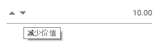

# Globalization in Blazor Numeric TextBox Component

[Blazor NumericTextBox](https://www.syncfusion.com/blazor-components/blazor-numeric-textbox) component can be localized. Refer to [Blazor Localization](https://blazor.syncfusion.com/documentation/common/localization) topic to localize Syncfusion<sup style="font-size:70%">&reg;</sup> Blazor components.

## Right to Left

RTL provides an option to switch the text direction and layout of the NumericTextBox component from right to left. It improves the user experiences and accessibility for users who use right-to-left languages (Arabic, Urdu, etc.). To enable RTL NumericTextBox, set the [EnableRtl](https://help.syncfusion.com/cr/blazor/Syncfusion.Blazor.Inputs.SfNumericTextBox-1.html#Syncfusion_Blazor_Inputs_SfNumericTextBox_1_EnableRtl) to true.

The following code example initializes the NumericTextBox component in `Chinese` culture.

```cshtml
@using Syncfusion.Blazor.Inputs
@inject HttpClient Http

<SfNumericTextBox TValue="int?" Value=10 Locale="zh" EnableRtl="true"></SfNumericTextBox>

@code {
    [Inject]
    protected IJSRuntime JsRuntime { get; set; }
    protected override async Task OnInitializedAsync()
    {
        this.JsRuntime.Sf().LoadLocaleData(await Http.GetJsonAsync<object>("blazor-locale/src/zh.json")).SetCulture("zh");
    }
}
```

