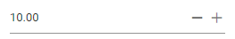

# Customize the up and down arrow in Blazor Numeric TextBox Component

This section explains how to change or customize spin up and down icons. You can customize spin button icons using `e-spin-up` and `e-spin-down` classes of those buttons.

You can override the default icons of `e-spin-up` and `e-spin-down` classes using the following CSS code snippets.

```cshtml
@using Syncfusion.Blazor.Inputs

<SfNumericTextBox TValue="int?" Value=10 CssClass="e-custom"></SfNumericTextBox>
<style>
    .e-numeric.e-custom .e-input-group-icon.e-spin-up:before {
        content: "\e823";
        color: rgba(0, 0, 0, 0.54);
    }

    .e-numeric.e-custom .e-input-group-icon.e-spin-down:before {
        content: "\e934";
        color: rgba(0, 0, 0, 0.54);
    }
</style>
```
