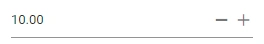

# Customize the up and down arrow in Blazor Numeric TextBox Component

This section explains how to change or customize the spin up and down icons. Customize the spin button icons using the `e-spin-up` and `e-spin-down` classes on those buttons.

The default icons of `e-spin-up` and `e-spin-down` classes using the following CSS code snippets.

```cshtml
@using Syncfusion.Blazor.Inputs

<SfNumericTextBox TValue="int?" Value=10 CssClass="e-custom"></SfNumericTextBox>
<style>
    .e-numeric.e-custom .e-input-group-icon.e-spin-up:before {
        content: "\e823";
        color: rgba(0, 0, 0, 0.54);
    }

    .e-numeric.e-custom .e-input-group-icon.e-spin-down:before {
        content: "\e934";
        color: rgba(0, 0, 0, 0.54);
    }
</style>
```
