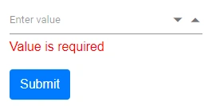

# How to bind Numeric Textbox to a model in Blazor

This section demonstrates binding the SfNumericTextBox value to a model using EditForm, along with data annotation–based validation. The example binds to a nullable integer (int?) model property to allow an empty state and shows how validation messages are displayed for the bound field.

In this sample, select a value in the Numeric TextBox and click Submit to trigger form validation. When the bound value is null, a validation error message is displayed below the Numeric TextBox based on the `Required` attribute. The form uses `EditForm` with `DataAnnotationsValidator` to enable validation, and `ValidationMessage` to display field-specific errors.

```cshtml
@using System.ComponentModel.DataAnnotations
@using Syncfusion.Blazor.Inputs

<EditForm Model="@User">
    <DataAnnotationsValidator />
    <ValidationSummary />
    <div class="form-group">
        <SfNumericTextBox TValue="int?" Placeholder='Enter value' @bind-Value="@User.ID"></SfNumericTextBox>
        <ValidationMessage For="@(() => User.ID)" />
    </div>
    <button type="submit" class="btn btn-primary">Submit</button>
</EditForm>

@code {

    public UserForm User = new UserForm();

    public class UserForm
    {
        [Required(ErrorMessage = "Value is required")]
        public int? ID { get; set; }
    }

    private void HandleValidSubmit()
    {
        // Handle a successful submission here.
    }
}
```

