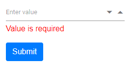

# NumericTextBox For and Model Binding

This section demonstrates the Strongly typed extension support in NumericTextBox. The view which bind with any model is called as
strongly typed view. You can bind any class as model to view.
You can access model properties on that view. You can use data associated with model to render components.

In this sample, first click the submit button to post the selected value in the MaskedTextBox. When posting the null value,
validation error message will be shown below the NumericTextBox.

```csharp
@using System.ComponentModel.DataAnnotations
@using Syncfusion.Blazor.Inputs

<EditForm Model="@User">
    <DataAnnotationsValidator />
    <div asp-validation-summary="All" class="text-danger"></div>
    <div class="form-group">
        <SfNumericTextBox Placeholder='Enter value' @bind-Value="@User.ID"></SfNumericTextBox>
        <ValidationMessage For="@(() => User.ID)" />
    </div>
    <button type="submit" class="btn btn-primary">Submit</button>
</EditForm>

@code {

    public Customer User = new Customer();

    public class Customer
    {
        [Required(ErrorMessage = "Value is required")]

        public int? ID { get; set; }

    }
}
```

The output will be as follows.


