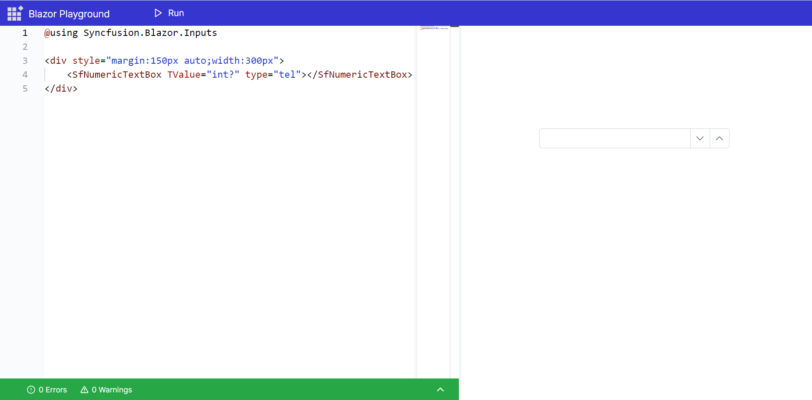

# Open Numeric Keyboard in Numeric TextBox Component

When implementing a Numeric TextBox in a web application, it is often desirable to restrict input to numeric values and to display the numeric keyboard on devices that support it. This can enhance the user experience by providing an appropriate keyboard for data entry.

## Enabling the Numeric Keyboard

To configure the Numeric TextBox to use the numeric keyboard, you can set the `type` attribute to `"tel"`. This instructs the browser to display the numeric keyboard on devices where it is available.

Here is an example code snippet using the Syncfusion<sup style="font-size:70%">&reg;</sup> Blazor Numeric TextBox component:

```csharp
@using Syncfusion.Blazor.Inputs

<div style="margin:150px auto;width:300px">
    <SfNumericTextBox TValue="int?" type="tel"></SfNumericTextBox>
</div>
```

By setting the `type` attribute to `"tel"`, the Numeric TextBox will trigger the numeric keyboard on supported devices, making it easier for users to enter numeric data.



## Fallback for Unsupported Browsers

It is important to note that not all browsers support the `type="tel"` attribute. In cases where a browser does not support this attribute, the `Numeric TextBox` will fall back to being a standard text input. This ensures that the functionality remains intact across all browsers, even if the enhanced keyboard experience is not available.

## Live Sample

To see a live example of the Numeric Textbox configured for the numeric keyboard, visit the following link:

[Syncfusion<sup style="font-size:70%">&reg;</sup> Blazor Playground - Numeric Textbox](https://blazorplayground.syncfusion.com/embed/rDLpjJrOLrHzOprq?appbar=true&editor=true&result=true&errorlist=true&theme=bootstrap5)

**Additional References:**
- [MDN Web Docs: input type="tel"](https://developer.mozilla.org/en-US/docs/Web/HTML/Element/input/tel)
