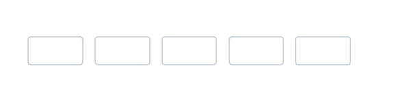
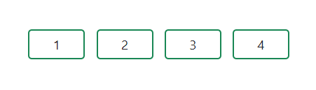

# Appearance in Blazor OTP Input component

You can also customize the appearance of OTP Input component.

## Setting input length

You can specify the length of OTP by using the [Length](https://help.syncfusion.com/cr/blazor/Syncfusion.Blazor.Inputs.SfOtpInput.html#Syncfusion_Blazor_Inputs_SfOtpInput_Length) property. The default value is `4`.

```cshtml

@using Syncfusion.Blazor.Inputs

<SfOtpInput Length=5></SfOtpInput>

```



## Disable inputs

You can disable the OTP Input component by using the [Disabled](https://help.syncfusion.com/cr/blazor/Syncfusion.Blazor.Inputs.SfOtpInput.html#Syncfusion_Blazor_Inputs_SfOtpInput_Disabled) property. By default the value is `false`.

```cshtml

@using Syncfusion.Blazor.Inputs

<SfOtpInput Disabled="true"></SfOtpInput>

```


## CssClass

You can customize the appearance of the OTP Input component, such as by changing its colors, fonts, sizes or other visual aspects by using the [CssClass](https://help.syncfusion.com/cr/blazor/Syncfusion.Blazor.Inputs.SfOtpInput.html#Syncfusion_Blazor_Inputs_SfOtpInput_CssClass) property.

The OTP input component supports the following predefined styles that can be defined using the `CssClass` property. You can customize by replacing the `CssClass` property with the below defined class names.

| cssClass | Description |
| -------- | -------- |
| `e-success` | Used to represent a positive action. |
| `e-warning` | Used to represent an action with caution. |
| `e-error` | Used to represent a negative action. |

```cshtml

@using Syncfusion.Blazor.Inputs

<SfOtpInput Value="1234" CssClass="e-success"></SfOtpInput>

```


