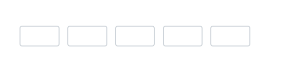
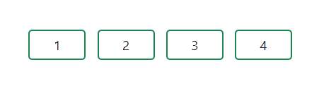

# Appearance in Blazor OTP Input component

Customize the appearance of the OTP input component, including input length, disabled state, and visual styles.

## Setting input length

Specify the length of the OTP by using the [Length](https://help.syncfusion.com/cr/blazor/Syncfusion.Blazor.Inputs.SfOtpInput.html#Syncfusion_Blazor_Inputs_SfOtpInput_Length) property. The default value is `4`. This value determines the number of input fields rendered for the OTP.

```cshtml

@using Syncfusion.Blazor.Inputs

<SfOtpInput Length=5></SfOtpInput>

```



## Disable inputs

Disable the OTP Input component by using the [Disabled](https://help.syncfusion.com/cr/blazor/Syncfusion.Blazor.Inputs.SfOtpInput.html#Syncfusion_Blazor_Inputs_SfOtpInput_Disabled) property. By default, the value is `false`. When disabled, the input fields are non-interactive and display the disabled visual style.

```cshtml

@using Syncfusion.Blazor.Inputs

<SfOtpInput Disabled="true"></SfOtpInput>

```


## CssClass

Customize the appearance of the OTP Input component by changing colors, fonts, sizes, and other visual aspects by using the [CssClass](https://help.syncfusion.com/cr/blazor/Syncfusion.Blazor.Inputs.SfOtpInput.html#Syncfusion_Blazor_Inputs_SfOtpInput_CssClass) property.

The OTP input component supports the following predefined styles that can be applied using the `CssClass` property. Replace the `CssClass` value with one of the following class names to apply the corresponding style.

| cssClass | Description |
| -------- | -------- |
| `e-success` | Used to represent a positive action. |
| `e-warning` | Used to represent an action with caution. |
| `e-error` | Used to represent a negative action. |

```cshtml

@using Syncfusion.Blazor.Inputs

<SfOtpInput Value="1234" CssClass="e-success"></SfOtpInput>

```



## Style Customization

Customize the OTP Input component with various visual styles by using the `CssClass` property. Below are examples of different style variations and hover effects.

### Default (Outline) Style

Displays standard outlined input boxes with the default Syncfusion appearance. Clean borders with subtle shadow on focus for visual feedback.

```cshtml
@using Syncfusion.Blazor.Inputs

<SfOtpInput Value="1234" CssClass="otp-default" />
```

```css
.e-otpinput.otp-default .e-otp-input-field {
    font-size: 18px;
    font-weight: 600;
    color: #333;
}

.e-otpinput.otp-default .e-otp-input-field:focus,
.e-otpinput.otp-default .e-otp-input-field.e-otp-input-focus {
    border-color: #333 !important;
    box-shadow: 0 0 0 3px rgba(51, 51, 51, 0.15) !important;
    outline: none !important;
}
```

### Filled Background Style

Each cell has a solid background with no visible border. Provides a modern, filled appearance with color-coded background on focus.

```cshtml
@using Syncfusion.Blazor.Inputs

<SfOtpInput Value="5678" CssClass="otp-filled" />
```

```css
.e-otpinput.otp-filled .e-otp-input-field {
    background: #e8f4fd !important;
    border: none !important;
    border-radius: 8px !important;
    color: #0a6ebd;
    font-weight: 700;
    font-size: 18px;
}

.e-otpinput.otp-filled .e-otp-input-field:focus,
.e-otpinput.otp-filled .e-otp-input-field.e-otp-input-focus {
    background: #bde0f9 !important;
    border: none !important;
    border-radius: 8px !important;
    color: #0a6ebd !important;
    outline: none !important;
    box-shadow: none !important;
}
```

### Underline (Bottom Border Only) Style

Minimalist style with only a bottom border visible. Clean and elegant, perfect for forms with a modern aesthetic.

```cshtml
@using Syncfusion.Blazor.Inputs

<SfOtpInput Value="9012" CssClass="otp-underline" />
```

```css
.e-otpinput.otp-underline .e-otp-input-field {
    background: transparent;
    border: none !important;
    border-bottom: 2px solid #888 !important;
    border-radius: 0 !important;
    color: #333;
    font-size: 20px;
    font-weight: 600;
    text-align: center;
}

.e-otpinput.otp-underline .e-otp-input-field:focus,
.e-otpinput.otp-underline .e-otp-input-field.e-otp-input-focus {
    background: transparent !important;
    border: none !important;
    border-bottom: 2px solid #6200ea !important;
    border-radius: 0 !important;
    color: #6200ea !important;
    outline: none !important;
    box-shadow: none !important;
}
```

### Rounded / Pill Style

Circular input cells with a colored border. Creates a modern, rounded appearance ideal for mobile-friendly interfaces.

```cshtml
@using Syncfusion.Blazor.Inputs

<SfOtpInput Value="3456" CssClass="otp-rounded" />
```

```css
.e-otpinput.otp-rounded .e-otp-input-field {
    border-radius: 50% !important;
    border: 2px solid #6200ea !important;
    color: #6200ea !important;
    font-weight: 700 !important;
    font-size: 18px !important;
    width: 52px !important;
    height: 52px !important;
}

.e-otpinput.otp-rounded .e-otp-input-field:focus,
.e-otpinput.otp-rounded .e-otp-input-field.e-otp-input-focus {
    border-radius: 50% !important;
    border: 2px solid #6200ea !important;
    color: #6200ea !important;
    background: #ede7f6 !important;
    width: 52px !important;
    height: 52px !important;
    outline: none !important;
    box-shadow: 0 0 0 3px rgba(98, 0, 234, 0.15) !important;
}
```

### Success (Green) Theme

Communicates a verified or successful OTP state using green color scheme. Ideal for completed or validated input states.

```cshtml
@using Syncfusion.Blazor.Inputs

<SfOtpInput Value="7890" CssClass="otp-success" />
```

```css
.e-otpinput.otp-success .e-otp-input-field {
    border: 2px solid #28a745 !important;
    color: #155724 !important;
    background: #d4edda !important;
    border-radius: 8px !important;
    font-weight: 700 !important;
    font-size: 18px !important;
}

.e-otpinput.otp-success .e-otp-input-field:focus,
.e-otpinput.otp-success .e-otp-input-field.e-otp-input-focus {
    border: 2px solid #28a745 !important;
    color: #155724 !important;
    background: #b8dfc4 !important;
    border-radius: 8px !important;
    box-shadow: 0 0 0 3px rgba(40, 167, 69, 0.25) !important;
    outline: none !important;
}
```

### Error (Red) Theme

Highlights an invalid OTP entry using red color scheme. Perfect for error states and validation feedback.

```cshtml
@using Syncfusion.Blazor.Inputs

<SfOtpInput Value="0000" CssClass="otp-error" />
```

```css
.e-otpinput.otp-error .e-otp-input-field {
    border: 2px solid #dc3545 !important;
    color: #721c24 !important;
    background: #f8d7da !important;
    border-radius: 8px !important;
    font-weight: 700 !important;
    font-size: 18px !important;
}

.e-otpinput.otp-error .e-otp-input-field:focus,
.e-otpinput.otp-error .e-otp-input-field.e-otp-input-focus {
    border: 2px solid #dc3545 !important;
    color: #721c24 !important;
    background: #f1b0b7 !important;
    border-radius: 8px !important;
    box-shadow: 0 0 0 3px rgba(220, 53, 69, 0.25) !important;
    outline: none !important;
}
```

### Warning (Amber) Theme

Draws attention without indicating failure using amber/yellow color scheme. Useful for caution states and warnings.

```cshtml
@using Syncfusion.Blazor.Inputs

<SfOtpInput Value="1111" CssClass="otp-warning" />
```

```css
.e-otpinput.otp-warning .e-otp-input-field {
    border: 2px solid #ffc107 !important;
    color: #856404 !important;
    background: #fff3cd !important;
    border-radius: 8px !important;
    font-weight: 700 !important;
    font-size: 18px !important;
}

.e-otpinput.otp-warning .e-otp-input-field:focus,
.e-otpinput.otp-warning .e-otp-input-field.e-otp-input-focus {
    border: 2px solid #ffc107 !important;
    color: #856404 !important;
    background: #ffe699 !important;
    border-radius: 8px !important;
    box-shadow: 0 0 0 3px rgba(255, 193, 7, 0.30) !important;
    outline: none !important;
}
```

### Dark / Night Mode Style

Dark background with light-colored cells for better visibility in low-light environments. Perfect for dark mode interfaces.

```cshtml
@using Syncfusion.Blazor.Inputs

<SfOtpInput Value="2222" CssClass="otp-dark" />
```

```css
.e-otpinput.otp-dark .e-otp-input-field {
    background: #2d2d3f !important;
    border: 1.5px solid #555 !important;
    border-radius: 8px !important;
    color: #e0e0e0 !important;
    font-weight: 700 !important;
    font-size: 18px !important;
}

.e-otpinput.otp-dark .e-otp-input-field:focus,
.e-otpinput.otp-dark .e-otp-input-field.e-otp-input-focus {
    border: 1.5px solid #bb86fc !important;
    background: #3a3a52 !important;
    color: #ffffff !important;
    border-radius: 8px !important;
    box-shadow: 0 0 0 3px rgba(187, 134, 252, 0.25) !important;
    outline: none !important;
}
```

### Large Size Style

Bigger cells with larger font — ideal for accessibility and touch-friendly interfaces. Enhances usability for users with visual impairments.

```cshtml
@using Syncfusion.Blazor.Inputs

<SfOtpInput Value="3333" CssClass="otp-large" />
```

```css
.e-otpinput.otp-large .e-otp-input-field {
    width: 64px !important;
    height: 64px !important;
    font-size: 26px !important;
    font-weight: 700 !important;
    border: 2px solid #0d6efd !important;
    border-radius: 10px !important;
    color: #0d6efd !important;
    background: #e7f0ff !important;
}

.e-otpinput.otp-large .e-otp-input-field:focus,
.e-otpinput.otp-large .e-otp-input-field.e-otp-input-focus {
    width: 64px !important;
    height: 64px !important;
    border: 2px solid #0d6efd !important;
    border-radius: 10px !important;
    color: #0d6efd !important;
    background: #ccdeff !important;
    box-shadow: 0 0 0 4px rgba(13, 110, 253, 0.2) !important;
    outline: none !important;
}
```

### Gradient / Shadow Highlight Style

Eye-catching cells with a box-shadow glow effect on focus. Creates a premium, polished appearance.

```cshtml
@using Syncfusion.Blazor.Inputs

<SfOtpInput Value="4444" CssClass="otp-glow" />
```

```css
.e-otpinput.otp-glow .e-otp-input-field {
    border: 2px solid #ff6b6b !important;
    border-radius: 10px !important;
    color: #c0392b !important;
    background: #fff5f5 !important;
    font-weight: 700 !important;
    font-size: 18px !important;
    transition: box-shadow 0.2s ease, transform 0.15s ease !important;
}

.e-otpinput.otp-glow .e-otp-input-field:focus,
.e-otpinput.otp-glow .e-otp-input-field.e-otp-input-focus {
    border: 2px solid #ff6b6b !important;
    border-radius: 10px !important;
    color: #c0392b !important;
    background: #ffd5d5 !important;
    box-shadow: 0 0 12px 3px rgba(255, 107, 107, 0.5) !important;
    transform: scale(1.08);
    outline: none !important;
}
```

## Hover Effects

Enhance user experience with interactive hover states that provide visual feedback.

### Lift / Elevation on Hover

Cell rises with a shadow on hover — gives a tactile feel and improves interactivity feedback.

```cshtml
@using Syncfusion.Blazor.Inputs

<SfOtpInput Value="1234" CssClass="otp-hover-lift" />
```

```css
.e-otpinput.otp-hover-lift .e-otp-input-field {
    border: 2px solid #adb5bd !important;
    border-radius: 8px !important;
    font-size: 18px !important;
    font-weight: 600 !important;
    color: #333 !important;
    background: #fff !important;
    transition: transform 0.18s ease, box-shadow 0.18s ease, border-color 0.18s ease !important;
}

.e-otpinput.otp-hover-lift .e-otp-input-field:hover {
    transform: translateY(-4px) !important;
    box-shadow: 0 8px 18px rgba(0, 0, 0, 0.15) !important;
    border-color: #6c757d !important;
}

.e-otpinput.otp-hover-lift .e-otp-input-field:focus,
.e-otpinput.otp-hover-lift .e-otp-input-field.e-otp-input-focus {
    border-color: #495057 !important;
    box-shadow: 0 0 0 3px rgba(73, 80, 87, 0.2) !important;
    outline: none !important;
}
```

### Border Color Change on Hover

Border transitions to a vibrant color when hovered — simple yet effective visual feedback.

```cshtml
@using Syncfusion.Blazor.Inputs

<SfOtpInput Value="5678" CssClass="otp-hover-border" />
```

```css
.e-otpinput.otp-hover-border .e-otp-input-field {
    border: 2px solid #dee2e6 !important;
    border-radius: 8px !important;
    font-size: 18px !important;
    font-weight: 600 !important;
    color: #333 !important;
    background: #fff !important;
    transition: border-color 0.2s ease, color 0.2s ease !important;
}

.e-otpinput.otp-hover-border .e-otp-input-field:hover {
    border-color: #e91e8c !important;
    color: #e91e8c !important;
}

.e-otpinput.otp-hover-border .e-otp-input-field:focus,
.e-otpinput.otp-hover-border .e-otp-input-field.e-otp-input-focus {
    border-color: #e91e8c !important;
    color: #e91e8c !important;
    box-shadow: 0 0 0 3px rgba(233, 30, 140, 0.2) !important;
    outline: none !important;
}
```

### Background Fill on Hover

Cell background fills with color smoothly on hover — creates an interactive, engaging experience.

```cshtml
@using Syncfusion.Blazor.Inputs

<SfOtpInput Value="9012" CssClass="otp-hover-fill" />
```

```css
.e-otpinput.otp-hover-fill .e-otp-input-field {
    border: 2px solid #20c997 !important;
    border-radius: 8px !important;
    font-size: 18px !important;
    font-weight: 600 !important;
    color: #20c997 !important;
    background: #fff !important;
    transition: background 0.2s ease, color 0.2s ease !important;
}

.e-otpinput.otp-hover-fill .e-otp-input-field:hover {
    background: #20c997 !important;
    color: #fff !important;
}

.e-otpinput.otp-hover-fill .e-otp-input-field:focus,
.e-otpinput.otp-hover-fill .e-otp-input-field.e-otp-input-focus {
    background: #12a07a !important;
    color: #fff !important;
    border-color: #12a07a !important;
    box-shadow: 0 0 0 3px rgba(32, 201, 151, 0.25) !important;
    outline: none !important;
}
```

### Scale / Zoom on Hover

Cell slightly scales up when the pointer is over it — adds dynamism and playfulness to the interface.

```cshtml
@using Syncfusion.Blazor.Inputs

<SfOtpInput Value="3456" CssClass="otp-hover-scale" />
```

```css
.e-otpinput.otp-hover-scale .e-otp-input-field {
    border: 2px solid #fd7e14 !important;
    border-radius: 8px !important;
    font-size: 18px !important;
    font-weight: 600 !important;
    color: #fd7e14 !important;
    background: #fff8f3 !important;
    transition: transform 0.15s ease, box-shadow 0.15s ease !important;
}

.e-otpinput.otp-hover-scale .e-otp-input-field:hover {
    transform: scale(1.12) !important;
    box-shadow: 0 4px 14px rgba(253, 126, 20, 0.3) !important;
}

.e-otpinput.otp-hover-scale .e-otp-input-field:focus,
.e-otpinput.otp-hover-scale .e-otp-input-field.e-otp-input-focus {
    border-color: #fd7e14 !important;
    background: #ffe5cc !important;
    box-shadow: 0 0 0 3px rgba(253, 126, 20, 0.25) !important;
    outline: none !important;
}
```

### Glow Ring on Hover

A colored ring glows around the cell on hover — creates a premium, polished appearance.

```cshtml
@using Syncfusion.Blazor.Inputs

<SfOtpInput Value="7890" CssClass="otp-hover-glow" />
```

```css
.e-otpinput.otp-hover-glow .e-otp-input-field {
    border: 2px solid #6f42c1 !important;
    border-radius: 8px !important;
    font-size: 18px !important;
    font-weight: 600 !important;
    color: #6f42c1 !important;
    background: #f8f4ff !important;
    transition: box-shadow 0.2s ease !important;
}

.e-otpinput.otp-hover-glow .e-otp-input-field:hover {
    box-shadow: 0 0 0 5px rgba(111, 66, 193, 0.2), 0 0 14px rgba(111, 66, 193, 0.25) !important;
}

.e-otpinput.otp-hover-glow .e-otp-input-field:focus,
.e-otpinput.otp-hover-glow .e-otp-input-field.e-otp-input-focus {
    border-color: #6f42c1 !important;
    background: #ede0ff !important;
    box-shadow: 0 0 0 5px rgba(111, 66, 193, 0.3) !important;
    outline: none !important;
}
```

### Underline Slide-In on Hover

Bottom border slides in from center on hover — creates an elegant, modern animation effect.

```cshtml
@using Syncfusion.Blazor.Inputs

<SfOtpInput Value="2468" CssClass="otp-hover-underline" />
```

```css
.e-otpinput.otp-hover-underline .e-otp-input-field {
    border: none !important;
    border-radius: 0 !important;
    border-bottom: 2px solid transparent !important;
    font-size: 18px !important;
    font-weight: 600 !important;
    color: #333 !important;
    background: #f0f0f0 !important;
    transition: border-bottom-color 0.25s ease, background 0.2s ease !important;
}

.e-otpinput.otp-hover-underline .e-otp-input-field:hover {
    border-bottom-color: #0dcaf0 !important;
    background: #e6f9fc !important;
}

.e-otpinput.otp-hover-underline .e-otp-input-field:focus,
.e-otpinput.otp-hover-underline .e-otp-input-field.e-otp-input-focus {
    border: none !important;
    border-bottom: 2px solid #0dcaf0 !important;
    border-radius: 0 !important;
    background: #ccf4fb !important;
    box-shadow: none !important;
    outline: none !important;
}
```

### Invert / Contrast on Hover

Background and text color swap on hover for a bold contrast effect — creates strong visual feedback.

```cshtml
@using Syncfusion.Blazor.Inputs

<SfOtpInput Value="1357" CssClass="otp-hover-invert" />
```

```css
.e-otpinput.otp-hover-invert .e-otp-input-field {
    border: 2px solid #343a40 !important;
    border-radius: 8px !important;
    font-size: 18px !important;
    font-weight: 700 !important;
    color: #343a40 !important;
    background: #fff !important;
    transition: background 0.2s ease, color 0.2s ease, border-color 0.2s ease !important;
}

.e-otpinput.otp-hover-invert .e-otp-input-field:hover {
    background: #343a40 !important;
    color: #fff !important;
    border-color: #343a40 !important;
}

.e-otpinput.otp-hover-invert .e-otp-input-field:focus,
.e-otpinput.otp-hover-invert .e-otp-input-field.e-otp-input-focus {
    background: #495057 !important;
    color: #fff !important;
    border-color: #495057 !important;
    box-shadow: 0 0 0 3px rgba(52, 58, 64, 0.25) !important;
    outline: none !important;
}
```

### Shake / Wiggle on Hover

Cell performs a subtle wiggle animation when hovered — adds playful feedback to user interactions.

```cshtml
@using Syncfusion.Blazor.Inputs

<SfOtpInput Value="9999" CssClass="otp-hover-shake" />
```

```css
@@keyframes otp-wiggle {
    0%   { transform: rotate(0deg); }
    20%  { transform: rotate(-4deg); }
    40%  { transform: rotate(4deg); }
    60%  { transform: rotate(-3deg); }
    80%  { transform: rotate(3deg); }
    100% { transform: rotate(0deg); }
}

.e-otpinput.otp-hover-shake .e-otp-input-field {
    border: 2px solid #dc3545 !important;
    border-radius: 8px !important;
    font-size: 18px !important;
    font-weight: 600 !important;
    color: #dc3545 !important;
    background: #fff5f5 !important;
}

.e-otpinput.otp-hover-shake .e-otp-input-field:hover {
    animation: otp-wiggle 0.4s ease !important;
    border-color: #a71d2a !important;
    background: #fde8ea !important;
}

.e-otpinput.otp-hover-shake .e-otp-input-field:focus,
.e-otpinput.otp-hover-shake .e-otp-input-field.e-otp-input-focus {
    border-color: #a71d2a !important;
    background: #f5c6cb !important;
    box-shadow: 0 0 0 3px rgba(167, 29, 42, 0.2) !important;
    outline: none !important;
}
```


