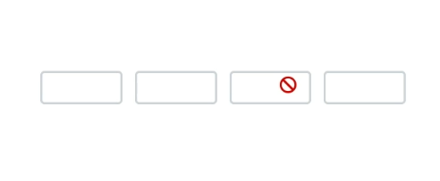

# Appearance in Blazor OTP Input component

Customize the appearance of the OTP input component, including input length, disabled state, and visual styles.

## Setting input length

Specify the length of the OTP by using the [Length](https://help.syncfusion.com/cr/blazor/Syncfusion.Blazor.Inputs.SfOtpInput.html#Syncfusion_Blazor_Inputs_SfOtpInput_Length) property. The default value is `4`. This value determines the number of input fields rendered for the OTP.

```cshtml

@using Syncfusion.Blazor.Inputs

<SfOtpInput Length=5></SfOtpInput>

```


## Disable inputs

Disable the OTP Input component by using the [Disabled](https://help.syncfusion.com/cr/blazor/Syncfusion.Blazor.Inputs.SfOtpInput.html#Syncfusion_Blazor_Inputs_SfOtpInput_Disabled) property. By default, the value is `false`. When disabled, the input fields are non-interactive and display the disabled visual style.

```cshtml

@using Syncfusion.Blazor.Inputs

<SfOtpInput Disabled="true"></SfOtpInput>

```



## CssClass

Customize the appearance of the OTP Input component by changing colors, fonts, sizes, and other visual aspects by using the [CssClass](https://help.syncfusion.com/cr/blazor/Syncfusion.Blazor.Inputs.SfOtpInput.html#Syncfusion_Blazor_Inputs_SfOtpInput_CssClass) property.

The OTP input component supports the following predefined styles that can be applied using the `CssClass` property. Replace the `CssClass` value with one of the following class names to apply the corresponding style.

| cssClass | Description |
| -------- | -------- |
| `e-success` | Used to represent a positive action. |
| `e-warning` | Used to represent an action with caution. |
| `e-error` | Used to represent a negative action. |

```cshtml

@using Syncfusion.Blazor.Inputs

<SfOtpInput Value="1234" CssClass="e-success"></SfOtpInput>

```

