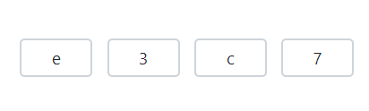
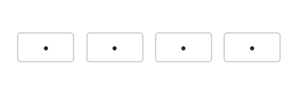

# Input Types in Blazor OTP Input component

## Types

This section explains the the various types of OTP (One-Time Password) input component, explaining their default behaviors and appropriate use cases.

### Number type

You can set the [Type](https://help.syncfusion.com/cr/blazor/Syncfusion.Blazor.Inputs.SfOtpInput.html#Syncfusion_Blazor_Inputs_SfOtpInput_Type) property to [Number](https://help.syncfusion.com/cr/blazor/Syncfusion.Blazor.Inputs.OtpInputType.html#Syncfusion_Blazor_Inputs_OtpInputType_Number) to use this input type as number. This is ideal for OTP input scenarios with numeric-only codes. By default `Type` property is `Number`.

```cshtml

@using Syncfusion.Blazor.Inputs

<SfOtpInput Value="1234" Type="OtpInputType.Number"></SfOtpInput>

```


### Text type

You can set the [Type](https://help.syncfusion.com/cr/blazor/Syncfusion.Blazor.Inputs.SfOtpInput.html#Syncfusion_Blazor_Inputs_SfOtpInput_Type) property to [Text](https://help.syncfusion.com/cr/blazor/Syncfusion.Blazor.Inputs.OtpInputType.html#Syncfusion_Blazor_Inputs_OtpInputType_Text) to use this input type as text. This is suitable when the OTP input need to include both letters and numbers.

```cshtml

@using Syncfusion.Blazor.Inputs

<SfOtpInput Value="e3c7" Type="OtpInputType.Text"></SfOtpInput>

```



### Password type

You can set the [Type](https://help.syncfusion.com/cr/blazor/Syncfusion.Blazor.Inputs.SfOtpInput.html#Syncfusion_Blazor_Inputs_SfOtpInput_Type) property to [Password](https://help.syncfusion.com/cr/blazor/Syncfusion.Blazor.Inputs.OtpInputType.html#Syncfusion_Blazor_Inputs_OtpInputType_Password) to use this input type as password in the OTP Input.

```cshtml

@using Syncfusion.Blazor.Inputs

<SfOtpInput Value="e3c7" Type="OtpInputType.Password"></SfOtpInput>

```



## Value

You can specify the value of OTP Input by using the [Value](https://help.syncfusion.com/cr/blazor/Syncfusion.Blazor.Inputs.SfOtpInput.html#Syncfusion_Blazor_Inputs_SfOtpInput_Value) property.

```cshtml

@using Syncfusion.Blazor.Inputs

<SfOtpInput Value="1234"></SfOtpInput>

```


