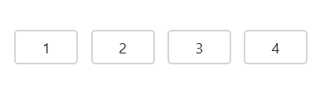

# Input Types in Blazor OTP Input component

## Types

This section explains the available types of the OTP (one-time password) input component, their default behaviors, and appropriate use cases.

### Number type

Set the [Type](https://help.syncfusion.com/cr/blazor/Syncfusion.Blazor.Inputs.SfOtpInput.html#Syncfusion_Blazor_Inputs_SfOtpInput_Type) property to [Number](https://help.syncfusion.com/cr/blazor/Syncfusion.Blazor.Inputs.OtpInputType.html#Syncfusion_Blazor_Inputs_OtpInputType_Number) to accept only numeric characters. This is ideal for OTP scenarios with digit-only codes. The default `Type` is `Number`.

```cshtml

@using Syncfusion.Blazor.Inputs

<SfOtpInput Value="1234" Type="OtpInputType.Number"></SfOtpInput>

```



### Text type

Set the [Type](https://help.syncfusion.com/cr/blazor/Syncfusion.Blazor.Inputs.SfOtpInput.html#Syncfusion_Blazor_Inputs_SfOtpInput_Type) property to [Text](https://help.syncfusion.com/cr/blazor/Syncfusion.Blazor.Inputs.OtpInputType.html#Syncfusion_Blazor_Inputs_OtpInputType_Text) to allow alphanumeric input. Use this when the OTP may include both letters and numbers.

```cshtml

@using Syncfusion.Blazor.Inputs

<SfOtpInput Value="e3c7" Type="OtpInputType.Text"></SfOtpInput>

```


### Password type

Set the [Type](https://help.syncfusion.com/cr/blazor/Syncfusion.Blazor.Inputs.SfOtpInput.html#Syncfusion_Blazor_Inputs_SfOtpInput_Type) property to [Password](https://help.syncfusion.com/cr/blazor/Syncfusion.Blazor.Inputs.OtpInputType.html#Syncfusion_Blazor_Inputs_OtpInputType_Password) to mask entered characters for privacy while typing. The underlying value remains the same; only the display is obscured.

```cshtml

@using Syncfusion.Blazor.Inputs

<SfOtpInput Value="e3c7" Type="OtpInputType.Password"></SfOtpInput>

```


## Value

Specify the initial OTP value by using the [Value](https://help.syncfusion.com/cr/blazor/Syncfusion.Blazor.Inputs.SfOtpInput.html#Syncfusion_Blazor_Inputs_SfOtpInput_Value) property. 

```cshtml

@using Syncfusion.Blazor.Inputs

<SfOtpInput Value="1234"></SfOtpInput>

```

