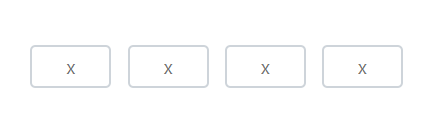
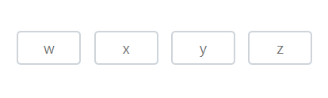

# Placeholder in Blazor OTP Input component

The placeholder in OTP Input specifies the text that is shown as a hint or placeholder until the user enters a value in the input field. It acts as a guidance for the users regarding the expected input format or purpose of the input field.

You can set the placeholder text by using the [Placeholder](https://help.syncfusion.com/cr/blazor/Syncfusion.Blazor.Inputs.SfOtpInput.html#Syncfusion_Blazor_Inputs_SfOtpInput_Placeholder) property. Additionally, when providing a single character as the placeholder value all input fields within the OTP Input component will display the same character.

```cshtml

@using Syncfusion.Blazor.Inputs

<SfOtpInput Placeholder="x"></SfOtpInput>

```



When a placeholder with multiple placeholder characters is provided each input field will display characters from the placeholder string in sequence based on the available OTP Input length.

```cshtml

@using Syncfusion.Blazor.Inputs

<SfOtpInput Placeholder="wxyz"></SfOtpInput>

```


